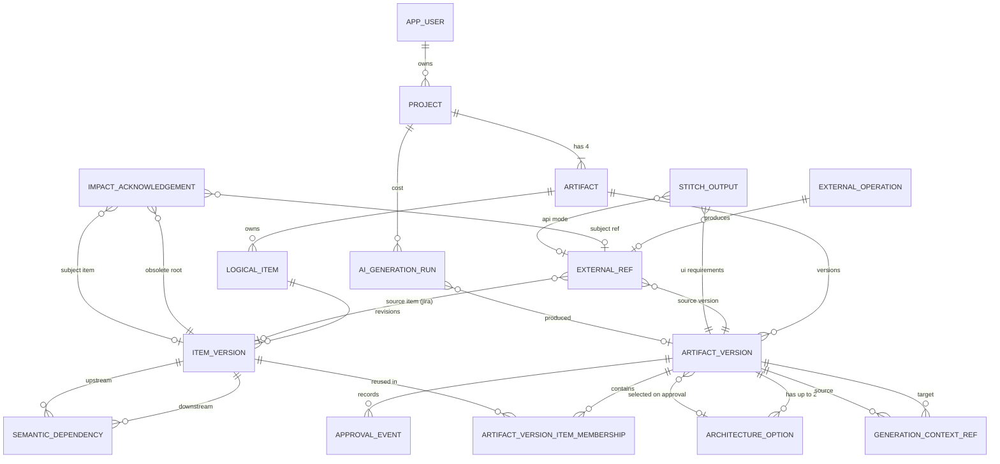

# Throughline - ERD / Data Model

**Document version:** 1.7 - **FROZEN for implementation** (see section 14 for what may still change)
**Status:** Derived from Throughline BRD v2.2 and Technical Requirements & Lineage Invariants v1.4, after ten review rounds (round 10: pinned `SET search_path = public` on all 7 Appendix A.2/6.3 functions - zero behavior change, closes a real Supabase advisor finding; all 16 tables, every trigger and `impact()` are now applied and verified against the live Supabase project, Project Setup section 13). Parent of Modules -> Project Setup -> API Contracts -> Jira Plan -> Implementation.
**Target engine:** PostgreSQL 15+ (`NULLS NOT DISTINCT` needs 15). **Verified:** the complete Appendix A DDL, all triggers, `impact()` and the Supabase hardening apply cleanly and pass the behaviour suite (Appendix C) on **PostgreSQL 15 and 17** (the versions Supabase runs), as a non-superuser table owner with Supabase's roles and default grants reproduced.
**Platform:** Supabase Auth + Supabase Postgres (sections 2 and 4.1). **ORM:** Drizzle ORM + drizzle-kit (section 2.1).
**Primary audience:** Developer, technical reviewers, and AI coding agents.

> **For AI agents:** every table, constraint and rule below exists to satisfy a specific `FR-xxx` / `INV-xxx` / `NFR-xxx` (see section 13). Do not add tables, columns or relationships that are not traced to a requirement without flagging it first. Every behavior this ERD needed beyond Technical Requirements v1.2 (approval gate, override, generation freshness, and the rest) has been absorbed into Technical Requirements v1.3; section 12 maps each one. A new behavior is a requirements change, not an implementation detail.

---

## 1. Model at a glance

### 1.1 Core question the model must answer

> Which exact current downstream items and external outputs were built from an ItemVersion that is no longer current?

The model must never: flag unchanged work; let a warning disappear after an unrelated later revision; treat drafts as authoritative; let unselected architecture options into lineage; silently duplicate external objects; let dependency edges mutate underneath an existing ItemVersion.

### 1.2 Tables (16)

| # | Table | Role |
|---|---|---|
| 1 | `app_user` | Local mirror of the Supabase Auth user (no teams/RBAC) |
| 2 | `project` | Workspace: brief + input hints |
| 3 | `artifact` | Stable slot: one per (project, type) |
| 4 | `artifact_version` | Immutable-ish historical version of an artifact |
| 5 | `approval_event` | Append-only human decision log |
| 6 | `logical_item` | Stable conceptual identity of an item (R-07, S-12...) |
| 7 | `item_version` | Immutable content version of a logical item |
| 8 | `artifact_version_item_membership` | Which ItemVersions an ArtifactVersion contains (M:N, also holds Epic->Story parent) |
| 9 | `architecture_option` | The two candidate architectures of an Architecture draft |
| 10 | `generation_context_ref` | Which approved versions the AI saw (audit only) |
| 11 | `semantic_dependency` | Exact ItemVersion -> ItemVersion lineage edges |
| 12 | `impact_acknowledgement` | Cause-specific acknowledgement of a computed warning |
| 13 | `ai_generation_run` | Per-call LLM usage/cost/failure log |
| 14 | `external_operation` | Pre-write record, one per external object |
| 15 | `external_ref` | Provenance link to a real GitHub/Jira/Stitch object |
| 16 | `stitch_output` | Stitch prompt/mode + stored asset keys |

**Removed from the reviewed draft:** `ArchitectureOptionItem`, `BacklogHierarchy`, `StoredAsset` (18 -> 16 tables). Also removed: `dependencyType`, `replacedByVersionId`, `Project.status`, `ExternalOperation.externalIds[]`, `StitchOutput.status`, `architecture_option.required_skills` (round 5: P1-only and not lineaged; team skills are read from constraint items).

### 1.3 Cardinalities

```text
app_user 1--N project
project 1--4 artifact                       (exactly one per type, created with the project)
artifact 1--N artifact_version
artifact 1--N logical_item
logical_item 1--N item_version
artifact_version N--M item_version          via artifact_version_item_membership
item_version N--M item_version              via semantic_dependency (downstream -> upstream)
artifact_version N--M artifact_version      via generation_context_ref (audit only)
architecture artifact_version 1--{0,1,2} architecture_option    (at most 2 by CHECK; exactly 2 before approval)
artifact_version 0..1--1 architecture_option                      (selected option, approval only)
artifact_version 1--N approval_event
external_operation 1--0..1 external_ref
ui_requirements artifact_version 1--0..1 stitch_output
artifact_version 1--N ai_generation_run     (artifact_version_id nullable for failed calls)
```

### 1.4 Diagram



---

## 2. Conventions

| Topic | Rule |
|---|---|
| Naming | `snake_case` tables/columns. Entity names in this document keep the technical doc's vocabulary. |
| Primary keys | `uuid` with `DEFAULT gen_random_uuid()`, except pure join tables (composite PK) and `app_user`, whose id is the Supabase user id. |
| Timestamps | `timestamptz NOT NULL DEFAULT now()`. |
| Enums | `text` + `CHECK (col IN (...))`. Easier to evolve than native enums. |
| JSONB | Validated by a schema (e.g. Zod) in the single write path. Never store anything a downstream item can depend on in `artifact_version.payload` - dependable content must be a `logical_item` (section 5.6). |
| Deletes | Append-only in P0. Every FK is written **explicitly** `ON DELETE RESTRICT` (the PostgreSQL default is `NO ACTION`, which is not identical). Project deletion is out of scope. |
| Platform | **Supabase Auth** for identity and **Supabase Postgres** for the database. The app reads and writes only through its own server (Next.js + Drizzle); the Supabase Data API is never used for data. |
| Secrets | Provider credentials (GitHub, Jira, Stitch, LLM) and the Supabase **service-role key** are **server-side configuration only**, never a column and never shipped to the browser. The Supabase anon/publishable key is public by design - which is why section A.3 exists. One configured Jira project per instance (technical doc NFR, "API credentials shall remain server-side"). No raw request headers in any column; `metadata` and `target_descriptor` hold whitelisted fields only. |
| Authentication | The session user is the Supabase user id taken from **verified** data on the server (`auth.getUser()` or verified JWT claims), never from `getSession()`, which reads an unverified cookie. Public sign-up is **open**; the access gate is mandatory email verification (Supabase `mailer_autoconfirm` off) rather than a server-side allowlist (round 9 - was invite-only + allowlist through round 8). |
| Authorization | Every API handler first loads the project by `(id, owner_user_id = session user)`. Only then may it read children, call `impact()` or start a write. `impact()` itself takes a project id and trusts its caller. Actor ids (`actor_user_id`, `acknowledged_by_user_id`) are passed explicitly; SQL never uses `auth.uid()` - the server connects as the table owner, so it would be NULL. |
| Data API exposure | Supabase publishes the `public` schema to the anon/publishable key and grants its roles access to every new table and function. Appendix A.3 revokes those grants and enables RLS with **no policies** on every table (deny-all), and revokes `EXECUTE` on functions. Every future table or function gets the same treatment in its own migration (T34 catches a miss). No RLS policies are ever written: authorization lives in the server, not in a second policy system. |
| Untrusted AI output | LLM text is rendered as escaped text or sanitized Markdown, never raw HTML. The only HTML ever rendered is stored Stitch output, and only inside the sandboxed separate-origin iframe (section 4.16). Model output is data: it never supplies ids, statuses or SQL. |
| Migrations | SQL-first. Appendix A is the complete reference DDL; the ORM schema must reproduce it exactly (section 2.1). |
| Circular FK | `artifact_version` <-> `architecture_option` is a real cycle. Create `artifact_version`, then `architecture_option`, then `ALTER TABLE ... ADD CONSTRAINT` for the selected-option FK. |

### 2.1 ORM and migrations (Drizzle)

Drizzle ORM + drizzle-kit, pinned to exact versions (`drizzle-orm` and `drizzle-kit` must match; do not upgrade during the build).

| Lives in the Drizzle schema (`drizzle-kit generate`) | Lives in hand-written migrations (`drizzle-kit generate --custom`) |
|---|---|
| All 16 tables and columns; PKs incl. composite; FKs incl. composite, self-referencing and the architecture cycle (use `(): AnyPgColumn =>` for the cyclic references); UNIQUE constraints; CHECK constraints; partial unique indexes. RLS may be enabled here with `.enableRLS()` or in A.3 - pick one place | All trigger functions and triggers (Appendix A.2); the `impact()` function (section 6.3); the Supabase hardening (A.3) **after** `impact()`; the two `NULLS NOT DISTINCT` acknowledgement indexes **if** drizzle-kit does not render them exactly as Appendix A |

Rules:
1. **Read every generated migration file** and diff it against Appendix A before applying it. Write partial-index predicates as literal SQL (`` sql`status = 'approved'` ``), never as bound parameters.
2. **Never run `drizzle-kit push`.** Only `generate` + `migrate`, so the custom SQL is always applied in order. `generate` diffs against its own snapshots, so objects created in custom migrations are never dropped by a later `generate`.
3. **Driver must support interactive transactions** on a single connection: `node-postgres` or `postgres.js` over TCP. An HTTP-only serverless driver cannot hold the advisory lock and `FOR UPDATE` across statements and must not be used.
   - **Supabase, application traffic:** the Supavisor **transaction** pooler (port 6543), connecting as `postgres` - the role that owns the tables, so RLS does not apply to it. `pg_advisory_xact_lock` is transaction-scoped, so it is safe behind this pooler; with `postgres.js`, set `prepare: false`. Nothing in the design uses session state (no session advisory locks, `LISTEN`, temp tables or plain `SET`); keep it that way.
   - **Supabase, migrations:** run `drizzle-kit migrate` over the **session** pooler or the direct connection, as `postgres`, so every object is owned by the role the app connects as.
   - Set `schemaFilter: ['public']` in the Drizzle config so drizzle-kit never touches Supabase's `auth`, `storage` or other schemas.
4. Raw SQL through the `` sql`...` `` template is expected for: the advisory lock, `SELECT * FROM impact(...)` (parse the rows with Zod), and nothing else. Use the query builder's `.for('update')` and `.onConflictDoNothing().returning()` for section 7.2.
5. `jsonb` columns are typed with `.$type<T>()`; that is compile-time only - Zod still validates at the single write path.

---

## 3. Lifecycle and transaction protocols

### 3.1 ArtifactVersion status machine

```text
draft --> approved --> superseded          (terminal)
draft --> rejected                         (terminal)
```

No other transition is legal. `status_reason` is set only on `rejected`:

| Human/system action | `approval_event.action` | Version transition | `status_reason` |
|---|---|---|---|
| Approve | `approved` | draft -> approved (previous approved -> superseded) | NULL |
| Request revision (feedback optional) | `revision_requested` | draft -> rejected | `revision_requested` |
| Reject without revision | `rejected` | draft -> rejected | `user_rejected` |
| Regenerate, or open a manual revision (section 3.6), while a draft exists | `draft_replaced` | old draft -> rejected | `replaced_by_regeneration` |
| Generation result stale at persist time | (none - system) | new version created directly as rejected | `stale_generation_context` |

A version is **born** only as `draft` (normal) or as `rejected` **with `status_reason = 'stale_generation_context'`** - the only reason that applies to a version that never existed as a draft. Conversely, a `draft -> rejected` transition may never claim `stale_generation_context`. Both directions are **[DB]** (insert guard and lifecycle guard). Draft and rejected versions never appear in impact evaluation (INV-002/003).

### 3.2 Write-path rule (serialization)

Every transaction that changes `artifact_version.status`, allocates a `version_number` / `revision_number` / `display_key`, or mints ItemVersions **first takes one project-scoped advisory lock**:

```sql
SELECT pg_advisory_xact_lock(hashtextextended(:project_id::text, 0));
```

- Per-artifact row locks are not enough: approving Requirements and approving Backlog lock different rows yet must observe each other (section 9, R2).
- Never hold the lock across an LLM or provider call. Call outside, then run one short persist transaction.
- Partial unique indexes remain as a backstop; the lock is the primary mechanism.

### 3.3 Generation persist transaction

**Prerequisites (TR FR-080):** Architecture needs an approved Requirements version; UI Requirements needs approved Requirements and Architecture; Backlog needs all three. The context sources are exactly those approved versions.

LLM calls happen **before** this transaction. At generation start, capture `context_source_ids` (the approved versions given to the model) and `base_id` (the current approved version of the artifact being generated, or NULL).

1. Take the project lock.
2. Reject as stale if `base_id` is no longer the artifact's approved version (`status_reason = 'stale_generation_context'`).
3. Bind every proposed dependency: resolve the model's logical reference (display key) **inside the `context_source_ids` versions' membership** to an exact ItemVersion. Never bind to a newer version the model did not see; never trust IDs from the model.
4. Evaluate currentness of every bound upstream ItemVersion (section 6). If any is not current -> persist one `artifact_version` with `status='rejected'`, `status_reason='stale_generation_context'`, the captured `base_id` as `base_approved_version_id`, the model output in **`raw_output`** (`payload` stays `{}`), **no items minted**, **its `generation_context_ref` rows** (they record exactly what the stale call saw), link the `ai_generation_run` rows, commit, and tell the user to regenerate.
5. Otherwise: if a draft exists, mark it rejected (`replaced_by_regeneration`) and write `approval_event(draft_replaced)`; insert the new draft (`base_approved_version_id = base_id`); mint/reuse items per section 5.3; insert edges (only for newly created ItemVersions); insert membership (Epic rows before their Stories - the parent FK is not deferrable); insert `generation_context_ref` rows (**mandatory for every AI-generated non-Requirements draft, including Architecture**; a manual revision draft has none, section 3.6); commit.

Architecture drafts at this step store `architecture_option` rows and their `candidate_decisions` JSON only. No ADR LogicalItems exist yet (section 5.5).

### 3.4 Approval transaction (canonical order)

1. Take the project lock; load the draft; assert `status = 'draft'`.
2. **Architecture only:** require a selected option belonging to this version; materialize the selected candidate decisions into ADR LogicalItems/ItemVersions/edges/membership using the same matching rules against `base_approved_version_id` (section 5.3). The version is still `draft`, so membership inserts are legal. **Stack guard:** if every materialized ADR reused its base ItemVersion, the selected option's `stack` must deep-equal the base's selected option's `stack`; otherwise refuse ("the stack changed but no decision did") - `stack` drives GitHub but carries no lineage of its own (section 5.5).
3. **Approval gate (all artifact types):** run `impact(project, candidate := this version)`. The candidate **replaces** its own artifact's approved version for the evaluation, so the result is exactly what the engine will report after approval (section 5.2). If any of the version's own items would be flagged and is not acknowledged -> rollback and return the blocking rows (section 6.5).
4. Demote the current approved version -> `superseded` (must precede promotion: partial unique indexes cannot be deferred).
5. Promote the draft -> `approved`; set `selected_architecture_option_id` for Architecture.
6. Insert `approval_event(action='approved')`.
7. Commit.

### 3.5 Approve-anyway override

The gate is "would these items be flagged right after approval?". The override does not bypass it - it satisfies it:

1. User supplies a non-empty note. **The override endpoint accepts only the note** - never row or ItemVersion ids from the client.
2. In **one** approval transaction the server runs steps 1-3 of section 3.4 itself, derives the blocking rows from that run, and inserts one `impact_acknowledgement` per blocking row (subject = the draft's ItemVersion, `root_logical_item_id` = the root's LogicalItem, obsolete = the root ItemVersion, acknowledged_against = the root's current ItemVersion **as the gate evaluated it**, or NULL if removed).
3. Re-run the gate (now passes); continue with steps 4-7, writing `approval_event(action='approved', overrode_stale_check=true, feedback=note)`.

Why ids never cross the API: Architecture ADR ItemVersions are minted **inside** the approval transaction (step 2), and a blocked attempt rolls back, so the ids the UI was shown never existed.

The override is audited, needs a note (CHECK-enforced), and creates only cause-specific acknowledgements, so a later independent change still warns. It is kept deliberately: it adds no new semantics (it is the acknowledgement mechanism), and it is the exit for cases regeneration cannot fix.

### 3.6 Manual revision draft (TR FR-081)

For Requirements, UI Requirements and Backlog, the user can open a new draft **without a model call**:

1. Take the project lock; if a draft exists, reject it and write `approval_event(draft_replaced)`, exactly as regeneration does. The reason is `replaced_by_regeneration`, which means "replaced by a newer draft" whether that draft came from the model or from a manual revision (no new status value).
2. Insert the draft with `base_approved_version_id` = the current approved version, copying its `payload` and `schema_version`.
3. Copy **every** membership row of the approved version unchanged - same `item_version_id`, `parent_logical_item_id` and `position`, Epic rows first. No ItemVersion is created and no `generation_context_ref` row is written, because the draft contains no model output.
4. Commit. The user then edits individual items (section 5.3, manual edit with visible rebinding) and approves through the normal approval transaction and gate.

This is what makes the BRD's controlled change test (10.3) measure the lineage engine rather than model noise: exactly one item changes. Architecture has no manual revision path, because its ADRs exist only after approval (section 5.5); it is revised by regeneration.

---

## 4. Table specifications

Column tables use `NN` = NOT NULL. Constraints marked **[DB]** are enforced by the database; **[APP]** are enforced by the single write path plus an integration test (section 8).

### 4.1 `app_user`

| Column | Type | Notes |
|---|---|---|
| `id` | uuid PK | **= the Supabase `auth.users.id`** (the verified JWT `sub`). No default: never generated locally. |
| `email` | text NN | Snapshot for display and audit, refreshed on login. **Not unique** (see below). |
| `display_name` | text | From the Supabase user metadata |
| `created_at` | timestamptz NN | |

Created (or refreshed) on the user's first authenticated request with `INSERT ... ON CONFLICT (id) DO UPDATE SET email = EXCLUDED.email, display_name = EXCLUDED.display_name`.

**Deliberately no foreign key to `auth.users`.** Supabase's usual `REFERENCES auth.users ON DELETE CASCADE` conflicts with this model: `approval_event`, `impact_acknowledgement` and `project` point at the user, so a cascade would either delete audit history or fail on the `RESTRICT` keys, and it would couple the Drizzle migrations to a schema Supabase owns. Without it, deleting a user in Supabase leaves their `app_user` row as history and they can no longer sign in - the right outcome for an append-only model.

**Deliberately no unique email.** Identity belongs to Supabase. A user deleted and re-created with the same email gets a **new** id; their old row must remain because history references it, so a unique email would lock them out permanently (T35).

Access gate (NFR-005, round 9): public sign-up is open in Supabase; the gate is mandatory email verification (`mailer_autoconfirm` off) rather than an allowlist. Project ownership (`project.owner_user_id`) is still the only authorization boundary between users - anyone verified can create their own project, but not read or write another user's.

### 4.2 `project`

| Column | Type | Notes |
|---|---|---|
| `id` | uuid PK | |
| `owner_user_id` | uuid NN FK `app_user` | |
| `name` | text NN | |
| `brief` | text NN | Plain-language brief, verbatim (FR-001). The seed of all lineage. |
| `input_context` | jsonb | Optional creation-time hints (team size/skills, deadline, budget, scale, tech preferences). **Input only**: once Requirements exist, read project context from the current constraint items (section 5.6), never from here. |
| `created_at`, `updated_at` | timestamptz NN | `updated_at` maintained by trigger |

Creating a project inserts its four `artifact` rows in the same transaction.

**[DB]** `project_seed_frozen` trigger: `brief` and `input_context` are frozen once **any** Requirements `artifact_version` exists (draft, rejected or approved). Requirement items are the graph's roots but were generated from the brief, and nothing outside the item graph can raise a warning - so an edited brief would silently invalidate every provenance claim. To change the brief after generating, create a new project. The UI states this before the first generation.

### 4.3 `artifact`

| Column | Type | Notes |
|---|---|---|
| `id` | uuid PK | |
| `project_id` | uuid NN FK `project` | |
| `type` | text NN | CHECK in (`requirements`,`architecture`,`ui_requirements`,`backlog`) |
| `created_at` | timestamptz NN | |

**[DB]** `UNIQUE (project_id, type)`; `UNIQUE (id, project_id)` (target of `logical_item`'s composite FK).

### 4.4 `artifact_version`

| Column | Type | Notes |
|---|---|---|
| `id` | uuid PK | |
| `artifact_id` | uuid NN FK `artifact` | |
| `version_number` | int NN | CHECK > 0, sequential per artifact, allocated under the project lock; immutable |
| `status` | text NN | CHECK in (`draft`,`approved`,`superseded`,`rejected`) |
| `schema_version` | int NN | Payload schema version (technical doc section 33) |
| `base_approved_version_id` | uuid | The artifact's approved version **when this draft was created**. NULL for the first version. |
| `selected_architecture_option_id` | uuid | Architecture only; set at approval |
| `payload` | jsonb NN default `{}` | Non-dependable structured content only (section 5.6), always conformant to `schema_version`. |
| `raw_output` | jsonb | **Only** on a `stale_generation_context` rejection: the model output exactly as returned. Kept out of `payload` so every `payload` parses against its schema. |
| `status_reason` | text | See section 3.1 |
| `created_at`, `updated_at` | timestamptz NN | |

**[DB]** constraints:
- `UNIQUE (artifact_id, version_number)`; `UNIQUE (id, artifact_id)`
- FK `(base_approved_version_id, artifact_id) -> artifact_version (id, artifact_id)` - base must be a version of the **same artifact**
- FK `(selected_architecture_option_id, id) -> architecture_option (id, artifact_version_id)` - the option must belong to **this** version (the local `id` maps to the option's `artifact_version_id`)
- `CHECK (base_approved_version_id IS DISTINCT FROM id)`
- `CHECK ((status = 'rejected') = (status_reason IS NOT NULL))`, and `status_reason` in (`revision_requested`, `user_rejected`, `replaced_by_regeneration`, `stale_generation_context`)
- `CHECK (selected_architecture_option_id IS NULL OR status IN ('approved','superseded'))`
- `CHECK ((status_reason IS NOT DISTINCT FROM 'stale_generation_context') = (raw_output IS NOT NULL))`
- Partial unique indexes: one `approved` and one `draft` per `artifact_id` (Appendix A)
- Insert guard trigger: born only as `draft`, or as `rejected` with `stale_generation_context`; never with a selected option
- Guard trigger: legal transitions; `draft -> rejected` may not claim `stale_generation_context`; `artifact_id`/`version_number` immutable; `payload`, `raw_output`, `schema_version`, `status_reason`, `base_approved_version_id` frozen once non-draft; architecture selection rules (Appendix A)
- `touch_updated_at` trigger: `updated_at` is maintained by the database

**[APP]** `base_approved_version_id` pointed at an `approved` version when the draft was created; never at a draft/rejected one.

### 4.5 `approval_event` (append-only)

| Column | Type | Notes |
|---|---|---|
| `id` | uuid PK | |
| `artifact_version_id` | uuid NN FK `artifact_version` | |
| `actor_user_id` | uuid NN FK `app_user` | |
| `action` | text NN | CHECK in (`approved`,`revision_requested`,`rejected`,`draft_replaced`) |
| `feedback` | text | |
| `overrode_stale_check` | boolean NN default false | Audit flag for the approve-anyway override |
| `created_at` | timestamptz NN | |

**[DB]**:
- `CHECK (NOT overrode_stale_check OR (action = 'approved' AND feedback IS NOT NULL AND btrim(feedback) <> ''))` - override requires a note
- Partial `UNIQUE (artifact_version_id) WHERE action = 'approved'` - one approval event per version
- Index `(artifact_version_id, created_at)`; `forbid_mutation` trigger

The selected Architecture option is **not** duplicated here. `artifact_version.selected_architecture_option_id` is the single record of the choice: the guard trigger allows it to be set only on the draft -> approved transition and never changed afterwards, so it is itself the historical record, and the version's single `approved` event points at it through `artifact_version_id`.

### 4.6 `logical_item`

| Column | Type | Notes |
|---|---|---|
| `id` | uuid PK | This is `logicalItemId`. Never LLM-generated. |
| `project_id` | uuid NN | |
| `artifact_id` | uuid NN | Owning artifact |
| `item_type` | text NN | CHECK in (`requirement`,`architecture_decision`,`ui_requirement`,`epic`,`story`) |
| `display_key` | text NN | `R-07`, `ADR-03`, `UI-04`, `E-02`, `S-12` |
| `created_at` | timestamptz NN | |

**[DB]**:
- `UNIQUE (project_id, display_key)` - project-wide (the prefix already separates types, and "R-07" is what users see)
- `UNIQUE (id, artifact_id)` (target of the membership composite FK); `UNIQUE (id, project_id)` (target of `item_version`'s composite FK)
- FK `(artifact_id, project_id) -> artifact (id, project_id)` - `project_id` cannot disagree with the artifact's project
- `CHECK` that `display_key` matches the anchored prefix for `item_type` (`^R-`, `^ADR-`, `^UI-`, `^E-`, `^S-` + 2 or more digits `$`; exact DDL in Appendix A)

**[APP]** `item_type` is consistent with `artifact.type` (requirement->requirements, architecture_decision->architecture, ui_requirement->ui_requirements, epic/story->backlog). Display keys are never reused, including keys of removed items: the allocator takes the max numeric suffix over **all** logical items of that type in the project, plus 1, under the project lock.

### 4.7 `item_version` (immutable)

| Column | Type | Notes |
|---|---|---|
| `id` | uuid PK | `itemVersionId` |
| `project_id` | uuid NN | Denormalized (immutable) so lineage edges can be project-checked by the database |
| `logical_item_id` | uuid NN | |
| `revision_number` | int NN | CHECK > 0; displayed as "S-12 v2" |
| `payload` | jsonb NN | Type-specific structured content |
| `semantic_hash` | text NN | lowercase hex SHA-256, `CHECK (semantic_hash ~ '^[0-9a-f]{64}$')` (`text`, not blank-padded `char(64)`) |
| `semantic_hash_version` | int NN | Version of the projection rules. **Frozen at `1` for P0** (section 5.4); the column exists so the product can evolve later |
| `created_at` | timestamptz NN | |

**[DB]** `UNIQUE (logical_item_id, revision_number)`; `UNIQUE (id, logical_item_id)`; `UNIQUE (id, project_id)`; FK `(logical_item_id, project_id) -> logical_item (id, project_id)`; `forbid_mutation` trigger.

**Deliberately NOT unique:** `(logical_item_id, semantic_hash)`. A revert (A -> B -> A') legitimately creates a new row with the same hash as an old one (section 5.3, rule 5).

### 4.8 `artifact_version_item_membership`

| Column | Type | Notes |
|---|---|---|
| `artifact_version_id` | uuid NN | |
| `artifact_id` | uuid NN | Denormalized so the two composite FKs below are possible |
| `logical_item_id` | uuid NN | |
| `item_version_id` | uuid NN | |
| `parent_logical_item_id` | uuid | Backlog only: the Epic a Story sits under **in this version** |
| `position` | int | Display order only |

**[DB]**:
- `PRIMARY KEY (artifact_version_id, item_version_id)`
- `UNIQUE (artifact_version_id, logical_item_id)` - one ItemVersion per LogicalItem per version
- FK `(artifact_version_id, artifact_id) -> artifact_version (id, artifact_id)`
- FK `(logical_item_id, artifact_id) -> logical_item (id, artifact_id)` - an item can only be a member of versions of its own artifact (also gives cross-project safety for memberships)
- FK `(item_version_id, logical_item_id) -> item_version (id, logical_item_id)`
- FK `(artifact_version_id, parent_logical_item_id) -> membership (artifact_version_id, logical_item_id)` (MATCH SIMPLE: a NULL parent skips the check; not deferrable, so insert Epic rows before their Stories)
- `CHECK (parent_logical_item_id IS DISTINCT FROM logical_item_id)`
- Index `(item_version_id)` - the currentness probe
- `membership_draft_only` trigger: rows are mutable only while the version is `draft`

**[APP]** parent is an `epic`, child is a `story`; only stories have parents.

The parent pointer is a **logical** id on purpose: editing an Epic creates a new Epic ItemVersion without touching any Story row. This replaces `BacklogHierarchy`.

---

### 4.9 `architecture_option`

| Column | Type | Notes |
|---|---|---|
| `id` | uuid PK | |
| `artifact_version_id` | uuid NN FK `artifact_version` | Must be an `architecture` version |
| `option_key` | text NN | CHECK in (`A`,`B`) - together with the unique below this caps options at 2 |
| `title` | text NN | |
| `summary` | text NN | |
| `stack` | jsonb NN | Structured stack descriptor (frontend, backend, database, monorepo, hosting...). Read by GitHub scaffold-vs-docs-only compatibility (FR-031). Not lineaged: guarded at approval (section 3.4 step 2). |
| `candidate_decisions` | jsonb NN | Array of candidates: `{ previousDisplayKey?, title, decision, technologyOrApproach, constraints, significantTradeoffs, upstreamRefs: [displayKey] }`. **Not lineage** until approval. |
| `tradeoffs` | jsonb NN | Array of `{ factor, assessment }` tied to the project's stated constraints (FR-020) |
| `created_at` | timestamptz NN | |

**[DB]** `UNIQUE (artifact_version_id, option_key)`; `UNIQUE (id, artifact_version_id)`; **`forbid_mutation` trigger** - options are write-once (every regeneration creates a new version with new option rows, so no flow ever updates one; after approval `stack` would otherwise change GitHub behaviour with no version and no lineage).
**[DB via guard trigger]** exactly 2 options before an Architecture version can be approved.
**[APP]** the option's version is an `architecture` version.

### 4.10 `generation_context_ref` (append-only)

| Column | Type | Notes |
|---|---|---|
| `target_artifact_version_id` | uuid NN FK | The version generated |
| `source_artifact_version_id` | uuid NN FK | An approved version the model was given |
| `created_at` | timestamptz NN | |

**[DB]** `PRIMARY KEY (target, source)`; `CHECK (target <> source)`; `forbid_mutation` trigger.

Two jobs: audit/reproducibility (section 23.1 of the technical doc), and it is the **binding scope** - dependency references are resolved only inside these source versions (section 3.3). It never drives staleness. Mandatory for every AI-generated non-Requirements draft; a manual revision draft (section 3.6) has none, because it contains no model output.

### 4.11 `semantic_dependency` (append-only)

| Column | Type | Notes |
|---|---|---|
| `project_id` | uuid NN | Both endpoints must belong to this project (composite FKs below) |
| `downstream_item_version_id` | uuid NN | The dependent item (e.g. a Story) |
| `upstream_item_version_id` | uuid NN | What it depends on (e.g. a Requirement) |
| `proposed_by` | text NN | CHECK in (`ai`,`system`,`user`); `user` = rebound by a manual draft edit (section 5.3) |
| `created_at` | timestamptz NN | |

**[DB]** `PRIMARY KEY (downstream_item_version_id, upstream_item_version_id)`; FK `(downstream_item_version_id, project_id) -> item_version (id, project_id)`; FK `(upstream_item_version_id, project_id) -> item_version (id, project_id)`; `CHECK (downstream <> upstream)`; index `(upstream_item_version_id)` (the traversal index; the PK already serves downstream lookups); `forbid_mutation` trigger (no UPDATE/DELETE).

**Why this is the one table that gets a DB-level project check:** `impact()` scopes currentness by project, so an upstream ItemVersion from another project can never be current. A single cross-project edge would therefore raise a warning on every read, forever, and no regeneration could clear it. Every other same-project rule stays **[APP]** (section 8).

**[APP]** edges are inserted only in the same transaction that creates the downstream ItemVersion, never afterwards (section 5.5). Allowed type pairs: section 5.5.

### 4.12 `impact_acknowledgement` (append-only)

| Column | Type | Notes |
|---|---|---|
| `id` | uuid PK | |
| `project_id` | uuid NN FK | |
| `subject_item_version_id` | uuid FK `item_version` | Flagged item |
| `subject_external_ref_id` | uuid FK `external_ref` | Flagged external output |
| `root_logical_item_id` | uuid NN | The LogicalItem of the root; ties the next two columns to the **same** item |
| `obsolete_upstream_item_version_id` | uuid NN | The **root cause**: the non-current ItemVersion the warning traces back to |
| `acknowledged_against_upstream_item_version_id` | uuid | The **current** ItemVersion of the root's LogicalItem at acknowledgement time; NULL if that item was removed |
| `acknowledged_by_user_id` | uuid NN FK `app_user` | |
| `acknowledged_at` | timestamptz NN | |
| `note` | text | |

**[DB]**:
- `CHECK (num_nonnulls(subject_item_version_id, subject_external_ref_id) = 1)`
- `CHECK (obsolete_upstream_item_version_id IS DISTINCT FROM acknowledged_against_upstream_item_version_id)`
- FK `(obsolete_upstream_item_version_id, root_logical_item_id) -> item_version (id, logical_item_id)` and FK `(acknowledged_against_upstream_item_version_id, root_logical_item_id) -> item_version (id, logical_item_id)` - both must be versions of one LogicalItem (MATCH SIMPLE skips the second for a removal, `against = NULL`). Without this, an app bug could write an acknowledgement that can never match: a silent no-op, and the warning returns forever.
- Two partial unique indexes with `NULLS NOT DISTINCT` (one per subject kind, Appendix A) so a removal acknowledgement (`against = NULL`) cannot be duplicated
- `forbid_mutation` trigger

**Meaning:** an acknowledgement suppresses one specific divergence `(subject, root, what-was-current-then)`. It stops matching the moment the root's current ItemVersion changes again (D -> F), so a later independent change warns again. Acknowledging never stops propagation to further downstream items (propagation barriers are P1).

**A removed item cannot "return" in P0.** The matcher only matches against the base version's members and display keys are never reused (sections 4.6, 5.3), so re-adding removed content always creates a **new** LogicalItem. An acknowledgement with `against = NULL` therefore keeps matching - correctly, since the dependency on the removed item is still obsolete.

### 4.13 `ai_generation_run`

| Column | Type | Notes |
|---|---|---|
| `id` | uuid PK | |
| `project_id` | uuid NN FK | |
| `artifact_version_id` | uuid FK | NULL for calls that failed before a version existed |
| `purpose` | text NN | CHECK in (`generation`,`semantic_mapping`,`revision`,`quality_check`) |
| `provider`, `model` | text NN | |
| `prompt_version` | text | |
| `input_tokens`, `output_tokens`, `latency_ms` | int | |
| `status` | text NN | CHECK in (`succeeded`,`failed`) - a run with no outcome is meaningless, and failed calls are why `artifact_version_id` is nullable |
| `error_message` | text | |
| `created_at` | timestamptz NN | |

Indexes: `(artifact_version_id)`, `(project_id)`. One ArtifactVersion has many runs; cost = SUM. Does not control any state.

### 4.14 `external_operation`

| Column | Type | Notes |
|---|---|---|
| `id` | uuid PK | |
| `project_id` | uuid NN FK | |
| `provider` | text NN | CHECK in (`github`,`jira`,`stitch`) |
| `operation_type` | text NN | e.g. `create_repo`, `create_issue`, `generate_ui` |
| `operation_key` | text NN | **UNIQUE**. Deterministic and **target-specific** for every provider whose target the user or configuration chooses: `github:create_repo:<project_id>:<normalized_repo_name>`, `jira:create_issue:<jira_project_key>:<item_version_id>`, `stitch:generate:<ui_version_id>` (Stitch has no chosen target). Changing the target (a new repo name, a reconfigured Jira project) is therefore a new operation, never a silent reuse of an object in the old target. |
| `status` | text NN | CHECK in (`pending`,`completed`,`failed`,`reconciliation_required`) |
| `request_hash` | text NN | sha256 of the canonical request (includes the target). Compared **before** any status decision (section 7.2): same key with a different hash is a conflict, never a resend and never a silent reuse |
| `source_artifact_version_id` | uuid NN FK `artifact_version` | Every operation has one: GitHub -> the Architecture version, Stitch -> the UI Requirements version, Jira -> the Backlog version |
| `source_item_version_id` | uuid | Jira only: the exact Epic/Story ItemVersion |
| `target_descriptor` | jsonb NN default `{}` | Whitelisted fields only (repo name, Jira project key, marker). No headers/tokens. |
| `external_id` | text | |
| `error_message` | text | |
| `created_at`, `updated_at` | timestamptz NN | `updated_at` is refreshed **by trigger on every update**; callers never set it |

**[DB]**:
- `UNIQUE (operation_key)`; `CHECK (status <> 'completed' OR external_id IS NOT NULL)`
- `CHECK ((provider = 'jira') = (source_item_version_id IS NOT NULL))` and FK `(source_artifact_version_id, source_item_version_id) -> membership (artifact_version_id, item_version_id)` - the **same provenance rules as `external_ref`**. Without them a malformed operation passes step 1, the provider creates the object, and only the `external_ref` insert at step 4 fails - leaving an orphan in Jira. With them it fails at step 1, before any side effect (T39).
- `touch_updated_at` trigger. The stale-`pending` rule (section 7.2) reads `updated_at`; a retry path that forgot to refresh it would make a freshly re-sent operation look instantly stale and send it to reconciliation while the request is in flight (T38).

`created_at`/`updated_at` are enough for P0 (no `attemptCount`: retries are user-initiated, not automatic). `external_ref` copies its source columns from its operation **[APP]**.

One row per external **object** (13 Stories = 13 rows). Protocol: section 7.

### 4.15 `external_ref`

| Column | Type | Notes |
|---|---|---|
| `id` | uuid PK | |
| `project_id` | uuid NN FK | |
| `provider` | text NN | CHECK in (`github`,`jira`,`stitch`) |
| `external_id` | text NN | Repo full name / Jira issue id / Stitch id |
| `external_key` | text | Jira key (`THR-42`) |
| `external_url` | text | |
| `source_artifact_version_id` | uuid NN FK `artifact_version` | GitHub: the selected Architecture version. Stitch: the UI Requirements version. Jira: the exact Backlog version exported. |
| `source_item_version_id` | uuid | Jira only: the exact Epic/Story ItemVersion |
| `external_operation_id` | uuid NN FK, UNIQUE | 1:1 with the operation that produced it |
| `metadata` | jsonb NN default `{}` | Whitelisted provider extras (e.g. GitHub `mode`: `scaffold`/`docs-only`, template) |
| `created_at` | timestamptz NN | |

**[DB]**:
- `UNIQUE (provider, external_id)` - an external object can be adopted at most once
- `CHECK ((provider = 'jira') = (source_item_version_id IS NOT NULL))` - Jira always carries item provenance (FR-073), the others never do
- FK `source_artifact_version_id -> artifact_version (id)` (plain)
- FK `(source_artifact_version_id, source_item_version_id) -> membership (artifact_version_id, item_version_id)` - MATCH SIMPLE skips it when the item column is NULL, so GitHub/Stitch rows pass while Jira rows must match a real membership row
- Indexes: `(source_item_version_id)`, `(source_artifact_version_id)`
- `UNIQUE (project_id) WHERE provider = 'github'` - **one repository per project in P0 (decided)**. Because the GitHub operation key is name-specific, also **[APP]**: under the project lock, refuse to start a new GitHub operation while another one for the project is `pending`, `reconciliation_required` or `completed` (otherwise two names could both succeed on GitHub and only the second `external_ref` insert would fail, after its repository already exists).

### 4.16 `stitch_output`

| Column | Type | Notes |
|---|---|---|
| `id` | uuid PK | |
| `project_id` | uuid NN FK | |
| `source_ui_requirements_version_id` | uuid NN FK `artifact_version` | **UNIQUE** - one output per UI Requirements version |
| `external_ref_id` | uuid FK `external_ref` | NULL in manual fallback |
| `mode` | text NN | CHECK in (`api`,`manual_fallback`) |
| `prompt_text` | text NN | The Stitch-ready prompt, always preserved (FR-054) |
| `html_storage_key`, `html_checksum` | text | Object-storage key + sha256 |
| `screenshot_storage_key`, `screenshot_checksum` | text | |
| `created_at` | timestamptz NN | |

**[DB]** `CHECK ((mode = 'api') = (external_ref_id IS NOT NULL))` - `api` always has a ref, `manual_fallback` never does (T37); `CHECK ((html_storage_key IS NULL) = (html_checksum IS NULL))` and the same for the screenshot. API-operation outcome lives on `external_operation.status`, not here. `stitch_output` is not append-only: a later successful API retry for the same UI Requirements version **updates** the existing `manual_fallback` row to `mode='api'` (the UNIQUE on the source version forbids a second row).

Two assets always, so no separate asset table. Bytes live in object storage - a **private Supabase Storage bucket**, written with the service-role key on the server and read through short-lived signed URLs; the storage key is the bucket path. HTML renders only in a sandboxed iframe without `allow-same-origin`. Verify how Supabase Storage serves `text/html`; if it is not served as HTML, fetch it on the server and render it via `srcdoc` in the same sandboxed iframe. Stitch is a leaf: nothing in `semantic_dependency` may reference it.

---

## 5. Identity, hashing and matching rules

### 5.1 Three identities

| Concept | Column | Owner |
|---|---|---|
| Logical identity | `logical_item.id` | Code |
| Exact historical state | `item_version.id` | Code |
| Human key | `logical_item.display_key` | Code (never a foreign key) |

The model may return hints (`previousDisplayKey`, `upstreamRefs`); code validates and decides.

### 5.2 "Current" defined once

> An ItemVersion is **current** iff it is a member of an `approved` ArtifactVersion.

Because a LogicalItem belongs to one artifact and an artifact has at most one approved version, this equals "the exact version the authoritative approved version holds for that LogicalItem". Reused ItemVersions are members of the new approved version, so they are current by construction and **cannot be flagged**. An ItemVersion is non-current when its LogicalItem now has a different version or has been removed (absent from membership). No tombstone table is needed.

An approved artifact never returns to "unapproved", and generation requires approved sources (TR FR-080), so "an artifact with no approved version yet" is unreachable for a current downstream item; add a test rather than special-casing it.

**With a candidate (approval gate only):** the candidate version **replaces** its own artifact's approved version - current = members of the candidate, plus members of the approved versions of the *other* artifacts. It is never "approved plus candidate": that would make every LogicalItem of the candidate's artifact current twice, which both under-reports and breaks any per-LogicalItem lookup (the v1.1 `impact()` raised a runtime error on exactly this; section 6.3). With this rule there is still at most one current ItemVersion per LogicalItem.

### 5.3 Matching and versioning (generation persist and Architecture approval)

Base = the artifact's approved version captured at draft creation. For each generated candidate:

1. Validate `previousDisplayKey` against the **base version's members** (same artifact, same `item_type`). A base member can be claimed by at most one candidate; two candidates claiming the same key -> validation error (otherwise the membership UNIQUE fails mid-transaction instead of with a clear message).
   - **1b. Content fallback** (after all explicit claims are resolved): a candidate whose `previousDisplayKey` is absent or invalid is compared, by its **content-only projection** (section 5.4), with the base members of its `item_type` that are still unclaimed. Exactly one identical match -> treat it as that LogicalItem. Zero or several -> new. This is the deterministic floor under Scenario F: without it, one omitted optional field on an unchanged ADR mints a new LogicalItem, marks the old one removed and flags everything downstream of it. Base content projections are recomputed from `item_version.payload`; no column is stored.
2. Bind `upstreamRefs` inside the `generation_context_ref` source versions (section 3.3). Unresolvable ref -> validation error, not a guess.
3. Compute the semantic projection (section 5.4) **including sorted upstream ItemVersion ids** and its SHA-256.
4. If matched: compare with the hash of the **base's member ItemVersion for that LogicalItem only**. Equal -> reuse that ItemVersion (its edges already exist and are identical because the edge set is in the hash). Different -> new ItemVersion, `revision_number = max + 1`, same LogicalItem.
5. Never reuse an older non-base ItemVersion, even if its hash matches (a revert A -> B -> A' creates a new revision). Downstream items built on the old A stay flagged conservatively until regenerated or acknowledged.
6. If not matched: new LogicalItem (allocated `display_key`) + ItemVersion revision 1.
7. Insert edges only for newly created ItemVersions; insert the membership row.

Order inside one transaction (section 3.2 lock held): bind -> hash -> insert `item_version` -> insert `semantic_dependency` rows. Edges are never added after the ItemVersion exists.

**Manual edit of a draft item** (legal only while `draft`): create a new ItemVersion and swap the draft's membership row. Its upstream refs are **rebound** to the *current* ItemVersion of each same upstream LogicalItem - not copied - and the new edges carry `proposed_by = 'user'`. If rebinding changes any upstream ItemVersion, the UI shows exactly which ("S-12 will now depend on R-07 v3 instead of v2") and requires confirmation, so a typo fix cannot silently clear a warning. If an upstream LogicalItem has been removed, the edit is refused with a message naming it. Why rebind: the human edited against what they see now (unlike the model, whose binding is limited to what it was shown - section 3.3); copying ItemVersion ids would preserve the obsolete binding and make manual repair impossible, leaving only regeneration or the override.

### 5.4 Semantic projections

`semantic_hash = sha256(canonicalJSON(projection))`. `canonicalJSON` = sorted keys, normalized whitespace/Unicode, sorted arrays where order is not meaningful.

| Item type | Projection (hashed) | Explicitly excluded |
|---|---|---|
| requirement | type (`functional`, `non_functional`, or `constraint` with a `dimension`), actor, behavior, constraints, normalized acceptance criteria (for `constraint` items: the structured value, e.g. `teamSkills[]`, `deadline`, `expectedScale`) | wording/explanation prose, timestamps, display metadata |
| architecture_decision | decision, technologyOrApproach, constraints, significantTradeoffs, **sorted upstream ids** | explanation prose |
| ui_requirement | screenOrFlow, interactionRequirement, responsive + accessibility constraints, **sorted upstream ids** | explanation prose |
| story | user/value statement, acceptance criteria, structured behavior, **sorted upstream ids** | epic parent (structural), priority display |
| epic | title, scope statement | (has no upstream edges) |

**Upstream ids in the hash are necessary.** Otherwise a Story regenerated against the new R-07 would reuse its old ItemVersion, whose edges still point at the obsolete version, and the warning could never clear.

**Content-only projection** = the same projection **without** the upstream ids. It is used only by the matching fallback (section 5.3 rule 1b), never stored and never used for reuse decisions.

**Regeneration must be stable.** Re-wording by the model must not change a projection, or every downstream item is flagged for nothing. Therefore: normalize aggressively (case, whitespace, punctuation, sorted criteria), give the model the base items with their display keys and instruct it to return unchanged items verbatim, keep generation temperature low, and hold T21 (section 10) green before building any UI on top.

**`semantic_hash_version` rule (P0):** the projection rules are frozen at `semantic_hash_version = 1`. There is no multi-version migration machinery. Two obligations remain:
- The matcher **asserts** that the base ItemVersion's `semantic_hash_version` equals the current one and **throws** otherwise. A rule change then fails loudly instead of silently marking every item modified (false impact everywhere).
- During development, wipe the dev database whenever a projection changes. Freeze the rules before the first evaluation run (section 14); after that, changing them requires a new `semantic_hash_version` and a migration, which is out of P0.

### 5.5 Architecture options and ADR materialization

- Draft: options hold `candidate_decisions` JSON only. No ADR LogicalItems, no ADR membership. Any "render this version's items" or deterministic quality-check code must branch for architecture drafts and read the option JSON.
- Approval (section 3.4 step 2): only the **selected** option's candidates are materialized, using section 5.3 against the base's ADR members. Unchanged ADRs reuse their ItemVersion; changed ADRs get a new revision under the same LogicalItem; genuinely new ones get a new key; base ADRs absent from the selected set become removed.
- Unselected options never mint anything, so they cannot appear in lineage - by construction, not by validation.
- Switching the selected option between versions is legitimate: the old option's ADRs are removed and downstream items depending on them are flagged.
- **`stack` guard:** `stack` drives the GitHub scaffold but is option JSON, not an item. If every ADR is reused, the approved `stack` must equal the base's; a stack change must come with a changed decision, which then flags the repository through the normal item path (section 3.4 step 2).
- **`upstreamRefs` discipline:** a candidate lists only the requirement and constraint items that actually drove that decision. Listing every constraint on every ADR would make one deadline change flag the whole architecture, which is the alert-fatigue failure this product exists to prevent. State this in the Architecture prompt and add a deterministic warning when a candidate references more than a handful of items.

**Dependency edge rules [APP]:** edges point strictly to an earlier artifact in the order requirements < architecture < ui_requirements < backlog, which makes the graph acyclic by construction. Allowed (downstream -> upstream): ADR -> requirement; UI requirement -> requirement | ADR; story -> requirement | ADR | UI requirement. Epics have no upstream edges. Source and target must be in the same project: **[DB]** through the `semantic_dependency` composite FKs (section 4.11).

### 5.6 What lives in `payload` versus items

If something downstream should be flagged when it changes, it must be a `logical_item`.

| In `artifact_version.payload` (not dependable) | As `logical_item` (dependable) |
|---|---|
| Requirements: business problem, actors, assumptions, unresolved questions, user journeys | Functional and non-functional requirements **and architecture-driving constraints** (acceptance criteria are inside the item) |
| Architecture: overall recommendation text | Selected ADRs (materialized at approval) |
| UI Requirements: cross-cutting UX priorities | Screens/flows/component requirements |
| Backlog: export settings | Epics, Stories |

**Constraints are items (decided).** Scale, deadline, budget, team skills, technology preferences and security/performance/deployment expectations are `requirement` LogicalItems with `payload.type = 'constraint'` and a `dimension`. Architecture decisions depend on them, so a change to (say) expected scale produces a new ItemVersion and flags exactly the ADRs that cite it. No schema change.
- Granularity: one item per constraint **dimension** (roughly 6-8 per project), not one per skill or per value.
- Do **not** keep a stored copy or summary of these in `payload`: that would be a second source of truth. Render any summary from the items. `project.input_context` remains creation-time input only.
- Read `teamSkills[]` (for FR-023) and other structured constraint values from the current constraint items.

---

## 6. Impact engine (one implementation)

### 6.1 Definitions

- **Edge impacted:** `downstream` is current and `upstream` is not current.
- **Active subject:** only current ItemVersions (section 5.2, including the candidate rule) are reported; historical items never flood the panel. The filter applies at **every recursion step**, so the walk never passes *through* a historical item either.
- **Nearest root:** for `R-07@A -> ADR-03@B -> S-12@C` where ADR-03@B is itself superseded, S-12@C is reported with root **ADR-03@B**, not R-07@A. This is intended - it names the nearest thing to repair and makes repair proceed top-down. Do not "fix" it.
- **Direct:** the current item has an explicit edge to a non-current ItemVersion. **Transitive:** reached through another impacted current item. **Direct wins** if both.
- Output rows are per `(subject, root)`; item-level classification is the minimum depth (0 = direct).
- **Root:** the non-current ItemVersion the warning traces to. Acknowledgement matches `(subject, root)` and requires `acknowledged_against` to equal the root's *current* ItemVersion (or NULL if removed) *now*.

### 6.2 External outputs (same engine)

An external ref's **source items** are: Jira -> its `source_item_version_id`; GitHub/Stitch -> all members of its `source_artifact_version_id`. For each source item `x`:
- `x` not current -> ref impacted, root = `x`, depth 0 (Jira: "created from a superseded Story version" - this also drives the FR-074 Skip / Create New prompt);
- `x` impacted (in the item walk) -> ref impacted, root = that item's root, depth + 1.

This makes GitHub/Stitch drift **item-level**: re-approving Architecture with no ADR change does not flag the repository; changing any ADR the repository embeds does. No artifact-level cause is ever needed, so acknowledgements stay ItemVersion-only. Output is aggregated per `(ref, root)` with the shortest path, exactly like items (a repository embedding several ADRs that trace to one obsolete Requirement yields one row, and direct wins over transitive). Manual-fallback Stitch outputs have no `external_ref` and therefore no drift warning (section 11).

**`path` for external_ref rows** is the item chain ending at the ref's source item; the ref id itself is not in it (for a depth-0 ref row it is just `[root]`). The lineage visualization appends the subject ref as the final node.

**Blind spot (accepted):** the check follows dependencies on obsolete ItemVersions. An ADR (or UI requirement) *added* to the approved version after the repository or prototype was created does not flag it, because the output depends on nothing obsolete; it is merely incomplete. FR-036 is reworded accordingly (section 12).

### 6.3 Implementation (executed on PostgreSQL 15 - Appendix C)

```sql
CREATE FUNCTION impact(p_project_id uuid, p_candidate_version_id uuid DEFAULT NULL)
RETURNS TABLE (subject_kind text, subject_id uuid, root_item_version_id uuid,
               depth int, path uuid[], acknowledged boolean)
LANGUAGE sql STABLE SET search_path = public AS $$
WITH RECURSIVE
current_m AS MATERIALIZED (              -- current = member of an approved version; a candidate REPLACES
  SELECT m.logical_item_id, m.item_version_id   -- its own artifact's approved version (section 5.2)
  FROM artifact_version_item_membership m
  JOIN artifact_version av ON av.id = m.artifact_version_id
  JOIN artifact a ON a.id = av.artifact_id
  WHERE a.project_id = p_project_id
    AND ( av.id = p_candidate_version_id
       OR ( av.status = 'approved'
            AND ( p_candidate_version_id IS NULL
                  OR av.artifact_id <> (SELECT cv.artifact_id FROM artifact_version cv
                                        WHERE cv.id = p_candidate_version_id) ) ) )
),
walk AS (
  SELECT d.downstream_item_version_id AS iv, d.upstream_item_version_id AS root, 0 AS depth,
         ARRAY[d.upstream_item_version_id, d.downstream_item_version_id] AS path
  FROM semantic_dependency d
  WHERE d.downstream_item_version_id IN (SELECT item_version_id FROM current_m)
    AND d.upstream_item_version_id NOT IN (SELECT item_version_id FROM current_m)
  UNION ALL
  SELECT d.downstream_item_version_id, w.root, w.depth + 1, w.path || d.downstream_item_version_id
  FROM walk w
  JOIN semantic_dependency d ON d.upstream_item_version_id = w.iv
  WHERE d.downstream_item_version_id IN (SELECT item_version_id FROM current_m)
    AND d.downstream_item_version_id <> ALL (w.path)      -- cycle guard
    AND w.depth < 50                                      -- hard stop
),
item_rows AS (                                            -- one row per (item, root): shortest path wins
  SELECT DISTINCT ON (iv, root) iv AS subject_id, root, depth, path
  FROM walk
  ORDER BY iv, root, depth                                -- (array_agg over paths of different length would error)
),
ref_items AS (                                            -- source items of each external ref
  SELECT r.id AS ref_id, r.source_item_version_id AS iv
  FROM external_ref r
  WHERE r.project_id = p_project_id AND r.source_item_version_id IS NOT NULL
  UNION ALL
  SELECT r.id, m.item_version_id
  FROM external_ref r
  JOIN artifact_version_item_membership m ON m.artifact_version_id = r.source_artifact_version_id
  WHERE r.project_id = p_project_id AND r.source_item_version_id IS NULL
),
ref_raw AS (
  SELECT ri.ref_id AS subject_id, ri.iv AS root, 0 AS depth, ARRAY[ri.iv] AS path
  FROM ref_items ri
  WHERE ri.iv NOT IN (SELECT item_version_id FROM current_m)
  UNION ALL
  SELECT ri.ref_id, ir.root, ir.depth + 1, ir.path
  FROM ref_items ri JOIN item_rows ir ON ir.subject_id = ri.iv
),
ref_rows AS (                                             -- one row per (ref, root): several source ADRs can
  SELECT DISTINCT ON (subject_id, root) subject_id, root, depth, path   -- trace to the same obsolete root
  FROM ref_raw
  ORDER BY subject_id, root, depth
),
all_rows AS (
  SELECT 'item_version'::text AS subject_kind, subject_id, root, depth, path FROM item_rows
  UNION ALL
  SELECT 'external_ref', subject_id, root, depth, path FROM ref_rows
),
rooted AS (                                               -- the root's CURRENT version, resolved by JOIN:
  SELECT ar.*, c.item_version_id AS root_now              -- never a scalar subquery (see below)
  FROM all_rows ar
  JOIN item_version riv ON riv.id = ar.root
  LEFT JOIN current_m c ON c.logical_item_id = riv.logical_item_id
)
SELECT rr.subject_kind, rr.subject_id, rr.root, rr.depth, rr.path,
       EXISTS (
         SELECT 1 FROM impact_acknowledgement k
         WHERE k.obsolete_upstream_item_version_id = rr.root
           AND (CASE WHEN rr.subject_kind = 'item_version'
                     THEN k.subject_item_version_id ELSE k.subject_external_ref_id END) = rr.subject_id
           AND k.acknowledged_against_upstream_item_version_id IS NOT DISTINCT FROM rr.root_now
       ) AS acknowledged
FROM rooted rr;
$$;
```

**Round-5 fix (was a runtime error in v1.1).** v1.1 used `av.status = 'approved' OR av.id = p_candidate_version_id`, so at the approval gate every LogicalItem of the candidate's artifact had two "current" rows, and the acknowledgement's scalar subquery raised `more than one row returned by a subquery used as an expression`. The planner only evaluates that subquery once an acknowledgement survives the other predicates, so the bug was invisible until a user had acknowledged anything - then every approval of that artifact failed. Both halves are fixed: the candidate now replaces its artifact's approved version, and the root's current version is joined rather than sub-selected, so a future duplicate could never become a runtime error. Regression tests: T22, T23.

**Verified behaviour:** direct/transitive depth; direct wins; one row per `(subject, root)`; exactly one row for a ref whose several source ADRs trace to one root (T17); reused ItemVersions not flagged (T2); a deliberate cycle terminates (T25); the removal case (`against = NULL`) matches by `IS NOT DISTINCT FROM`. The OUT names (`depth`, `path`, `subject_id`) coinciding with CTE aliases is **not** an ambiguity problem - checked.

**PostgreSQL function vs application code:** use this single SQL function. The recursive traversal with a visited path and depth cap is one round trip, whereas application-side traversal is one query per hop. The warning panel, dependency visualization, Jira/GitHub/Stitch warnings and the approval gate all call it and consume identical rows; nothing else may compute staleness. It is not a view, because it needs a project parameter and a candidate parameter.

### 6.4 Why warnings cannot disappear

Currentness is re-evaluated against the live approved state on every read; nothing is derived from "what changed at the last approval". Requirements v4 changing only R-20 leaves `R-07@D` current, and S-12 still points at obsolete `R-07@A`, so it stays flagged until S-12 is regenerated against `R-07@D` (a new ItemVersion, because upstream ids are in the hash) or explicitly acknowledged.

### 6.5 Approval gate

`impact(project, candidate := draft)` filtered to `subject_id IN (draft members)` and `NOT acknowledged`. Because the candidate replaces its artifact's approved version, acknowledgements are matched against what will be current *after* approval: an acknowledgement recorded against the version this approval supersedes correctly stops matching. Any row -> the approval is blocked with messages such as: "S-12 would be flagged: depends on R-07 v2 (now v3). Regenerate, revise, or approve with a note." This blocks at any depth: a new Story built on a current-but-impacted ADR would be flagged transitively the moment it is approved, so repair proceeds top-down. Overrides: section 3.5.

---

## 7. External write protocol

### 7.1 One operation per external object

13 Stories = 13 `external_operation` rows. Partial failure is then representable per object, and reconciliation runs per object.

**Every preview shows impact first (TR FR-085).** Before any GitHub, Stitch or Jira write, the preview lists the `impact()` rows for the items the write would be created from (GitHub: the Architecture version's ADRs; Stitch: the UI Requirements version's items; Jira: each exported Epic/Story). If there are any, the user must confirm explicitly; the write is not blocked. The new `external_ref` is flagged from the moment it exists, so the warning is never lost - but nothing stale leaves Throughline without the user having seen it.

### 7.2 Insert-first, lock, decide

```text
1. INSERT external_operation(status='pending', operation_key, request_hash, ...)
   ON CONFLICT (operation_key) DO NOTHING RETURNING id;
   COMMIT.                            <- step 1 is its own transaction and MUST commit
                                         before any network call
2. If a row was returned: this call owns the write -> send the request.
3. Otherwise: SELECT ... FOR UPDATE the existing row, then:
   a. request_hash differs          -> conflict, for EVERY status including completed
                                       (never a silent resend, never a silent reuse)
   b. then decide on its status:
      - completed                     -> return the existing external_ref (idempotent, no send)
      - pending, updated_at within T  -> reject as in-flight
      - pending, older than T         -> set reconciliation_required, run reconciliation
      - reconciliation_required       -> run reconciliation
      - failed                        -> user may retry; set pending, commit, resend
4. After the response: in one transaction insert external_ref and set status='completed'.
```

**Why step 1 must commit first:** if the pending row is still uncommitted when the request goes out and the process dies, the insert rolls back, no record survives that a request was sent, and the retry creates a duplicate - the exact failure this protocol exists to prevent.

**`updated_at` is the clock of this protocol** and is refreshed by the database on every update of the row (trigger); application code never writes it. "Within T" / "older than T" always compare it with `now()`.

**Choosing T:** every provider client has a hard HTTP timeout, and `T = provider_timeout + margin` (e.g. 30 s timeout -> T = 90 s). T must never be shorter than the timeout: otherwise reconciliation can run while the original request is still in flight, Jira's search legitimately returns "not found", the user confirms a re-create, and both requests succeed. Record the derivation next to the constant.

`failed` is reserved for **definitive** provider rejections (validation/4xx). Timeouts, 5xx and lost responses are **never** `failed`: they go to `reconciliation_required`. A crash between provider success and step 4 leaves a `pending` row, which step 3 picks up once it is older than T. Retries after an ambiguous outcome are **user-initiated**, never automatic. Do not hold any DB lock across the provider call.

### 7.3 GitHub

- Deterministic repository name plus an **ownership marker** written atomically at creation: the repository description carries a short token `HMAC-SHA256(server_secret, operation_key)`, truncated. The key includes the name, so one attempt can never adopt another attempt's repository; the server secret means a dev and a prod instance sharing a project id cannot adopt each other's repositories. `docs/architecture/lineage.json` repeats it as a durable second marker.
- Reconcile: `GET owner/repo`; adopt only if it exists **and** the marker matches. Existing repo without our marker -> that operation ends `failed` (`name_taken_by_other`, a definitive outcome); the user picks another name, which starts a new operation with a new key. Never adopt an unrelated repository.
- `external_ref`: `source_artifact_version_id` = the selected Architecture version, `source_item_version_id` NULL, `metadata.mode` = `scaffold` | `docs-only`.
- **Credential:** the server-side GitHub credential from configuration. If users sign in with GitHub through Supabase, do **not** reuse that login's `provider_token` to create repositories: Supabase neither stores nor refreshes it, so using it would require a new encrypted credentials table that this model deliberately does not have.

### 7.4 Jira

- Each Epic/Story is its own operation, keyed `jira:create_issue:<jira_project_key>:<item_version_id>`. Marker: a label `tl-<item_version_id>` (JQL-queryable without custom-field setup), searched **within the configured Jira project**; repeat it in the description footer as a backup. Validate the mechanism in Spike C. Create Stories with `parent` pointing at the Epic's Jira key, so export Epics before their Stories. **Parent resolution by LogicalItem:** take `parent_logical_item_id`; use the Jira ref of that Epic's current ItemVersion if it has one, otherwise the most recent Jira ref of any ItemVersion of that Epic LogicalItem in the configured project (the case where the user chose Skip for a changed Epic). A Story whose Epic has no Jira ref at all is not exported and is listed in the preview. Resolving through the Epic's *current* membership row alone would fail exactly when the Epic changed and was skipped.
- **Capture the Backlog version once** at export start and build every operation from that version's members. A Backlog re-approval during a long export then cannot mix versions within one export run.
- Reconcile: search by label; Jira search can lag, so re-query briefly (a few attempts over ~10s) before concluding "not found". After a confident not-found, the user confirms "create again". Found -> insert `external_ref`, mark `completed`.
- `external_ref`: `source_artifact_version_id` = the exported Backlog version, `source_item_version_id` = the exact Epic/Story ItemVersion, validated by the membership composite FK.
- **FR-074:** for each **Epic and Story** member of the approved Backlog, if its LogicalItem already has a Jira ref (in the configured Jira project) from a different ItemVersion and the current ItemVersion has none there -> prompt **Skip / Create New Jira Issue**. Epics are included because editing an Epic's title creates a new Epic ItemVersion, and its target-specific operation key would otherwise create a second Jira Epic silently. Never update the existing issue, never silently duplicate, never silently skip. The same predicate marks the old ref as impacted (section 6.2).

### 7.5 Stitch

- `external_operation(provider='stitch')` owns the API outcome. Success -> `external_ref` + `stitch_output(mode='api')` + asset keys. Failure -> `stitch_output(mode='manual_fallback')` with the preserved prompt; the planning workflow continues.
- Persist the useful output to object storage; never depend on remote URLs (FR-052). Serve stored HTML only inside a sandboxed iframe from a separate origin.

---

## 8. Integrity matrix

| Invariant | Where enforced |
|---|---|
| One approved / one draft per artifact (INV-001, INV-005) | **DB** partial unique indexes (+ project lock) |
| Versions born only as draft, or as rejected only for a stale generation | **DB** `artifact_version_insert_guard` trigger |
| Legal status transitions, frozen once non-draft, identity columns immutable; `draft -> rejected` never claims a stale generation | **DB** `artifact_version_guard` trigger |
| `updated_at` always current (the section 7.2 staleness clock) | **DB** `touch_updated_at` trigger on `project`, `artifact_version`, `external_operation` |
| Stitch `api` has a ref and `manual_fallback` never does | **DB** CHECK |
| An external operation's provenance is valid **before** the provider call (source version always; Jira item that is a real membership row) | **DB** NOT NULL + CHECK + composite FK |
| Supabase Data API cannot read, write or execute anything | **DB** grants revoked + RLS enabled with no policies (A.3); T34 |
| Brief and input context frozen once Requirements generation has run | **DB** `project_seed_frozen` trigger |
| Raw model output only on stale-generation rejections | **DB** CHECK |
| Architecture approval requires exactly one selected option that belongs to the version, and exactly 2 options exist | **DB** composite FK + guard trigger |
| Option key cap (max 2) | **DB** CHECK + UNIQUE |
| Base version belongs to same artifact | **DB** composite FK |
| One ItemVersion per LogicalItem per ArtifactVersion | **DB** UNIQUE on membership |
| ItemVersion belongs to declared LogicalItem; item belongs to version's artifact | **DB** composite FKs |
| Membership frozen after draft | **DB** `membership_draft_only` trigger |
| ItemVersion / edges / events / acks / context refs / architecture options immutable | **DB** `forbid_mutation` trigger (UPDATE/DELETE) |
| Jira ref matches a real membership row; provider/item provenance shape | **DB** composite FK + CHECK |
| No self-edges; ack subject exactly one; override needs a note | **DB** CHECKs |
| Acknowledgement's obsolete and acknowledged-against versions belong to one LogicalItem | **DB** composite FKs via `root_logical_item_id` |
| Display-key format per item type; hash format; positive version/revision numbers | **DB** CHECKs |
| Duplicate external objects | **DB** `UNIQUE (operation_key)`, `UNIQUE (provider, external_id)`, one GitHub ref per project |
| **Same-project lineage edges** (`semantic_dependency`) and ItemVersion/LogicalItem project agreement | **DB** composite FKs through `item_version (id, project_id)` |
| Edges inserted only at ItemVersion creation | **APP** single write path + test |
| Allowed dependency type-pairs; acyclic order | **APP** + test (traversal still has a cycle guard, T25) |
| **Same-project invariant, other tables:** every ArtifactVersion, ExternalRef and operation referenced by a row resolves to that row's `project_id` (`generation_context_ref`, `external_ref`, `external_operation`, `impact_acknowledgement`, `ai_generation_run`, `stitch_output`). Memberships are DB-safe through the artifact composite FKs | **APP** single write path + integration test (T16). Not worth denormalizing `project_id` into these tables: a mistake here is wrong but visible, whereas a cross-project *edge* is a permanently unclearable warning |
| Project ownership of every request; verified Supabase identity; email verification required (round 9) | **APP** (section 2) |
| `item_type` matches `artifact.type`; Epic/Story parent typing; option belongs to an architecture version | **APP** |
| Freshness / binding / approval gate / stack guard | **APP** transaction + `impact()` |
| Semantic hashing, matching and content fallback | **APP** (pure functions, unit-tested) |

**Keep all triggers** (about 110 lines, Appendix A.2). They protect the invariants a rushed write path is most likely to violate, and they are the cheapest correctness in the build. There is no drop order.

---

## 9. Concurrency and races

| # | Race | Handling |
|---|---|---|
| R1 | Two approvals/regenerations on one artifact | Project advisory lock; status re-checked under the lock; partial unique indexes as backstop |
| R2 | Approve Backlog while Requirements is being approved (different artifacts) | Same project lock serializes them; the second gate sees the first's committed state. An artifact-row lock would **not** |
| R3 | Regeneration or approval while an LLM call is in flight | Persist re-checks `base_id` and binding currentness under the lock (section 3.3); stale result becomes a rejected version |
| R4 | Version/revision number and display-key allocation | Allocated under the lock; UNIQUE constraints backstop; retry once on conflict |
| R5 | Double-click or concurrent retry of an external write | `INSERT ... ON CONFLICT` then `FOR UPDATE` on the operation row (section 7.2) |
| R6 | Crash after provider success, before DB update | Leftover `pending` row is reconciled, never resent |
| R7 | Jira search-index lag after an ambiguous create | Bounded re-query, then a user-confirmed retry |
| R8 | Two tabs approving the same draft | Second sees status <> draft under the lock and fails; one `approved` event per version by unique index |
| R9 | Process dies after sending an external request but before the pending row commits | Prevented: step 1 of section 7.2 commits before any network call |
| R10 | Reconciliation starts while the original request is still in flight | Prevented: T is derived from the provider timeout, so "older than T" implies the original call is over |
| R11 | Same operation key, different request (e.g. a reconfigured Jira project) | Target-specific keys make it a new operation; any remaining hash mismatch is a conflict checked before the status dispatch, including for `completed` |
| R12 | Backlog re-approved during a long Jira export | The export captures one Backlog version at start; every ref records its exact source version, so any later drift is reported by `impact()` |
| R13 | Two tabs export to Jira at once | Per-operation in-flight rejection (R5); the UI groups the loser's per-issue errors into one message |

---

## 10. Acceptance tests for the model

Each is an integration test against a real PostgreSQL instance. T1 is the core promise.

| # | Scenario | Expected |
|---|---|---|
| T1 | R-07@A -> ADR-03@B -> S-12@C -> Jira THR-42. Requirements v3 approved with R-07@D. | ADR-03 direct, S-12 transitive (path R-07@A -> ADR-03@B -> S-12@C), THR-42 impacted via S-12. |
| T1b | Requirements v4 approved changing only R-20. | **Same warnings remain** (R-07@D is current; S-12 still reaches obsolete A). |
| T1c | Regenerate Architecture (ADR-03@E -> R-07@D) then Backlog (S-12@F -> ADR-03@E). | E and F not flagged. B and C are historical, not active; THR-42 stays flagged as "created from a superseded Story version". |
| T2 | Requirements v3 changes only R-07; S-20 depends on R-15@C (reused). | S-20 not flagged. |
| T3 | R-07 removed in v3. | ADR-03@B direct with root A (removed); no tombstone row exists. |
| T4 | Acknowledge S-12/A/against D; then R-07 D -> F. Separately: acknowledge a removal (against NULL), then re-add the same content. | Warning returns (acknowledgement no longer matches). The re-added content is a **new** LogicalItem, so the removal acknowledgement still matches (section 4.12). |
| T5 | Requirements v3 draft holds R-07@D; then reject it. | No warnings while draft; none after rejection. |
| T6 | Backlog draft generated from Requirements v2; Requirements v3 changes R-07 before approval. | Approval blocked with the blocking rows; override without a note rejected by CHECK; override with a note approves, writes acknowledgements + `overrode_stale_check`; regenerate passes without override. |
| T7 | Context changes while generation is in flight. | Persisted as `rejected` / `stale_generation_context`, no items minted, tokens still recorded. |
| T8 | Architecture v3 approval: ADR-01/02 unchanged, ADR-03 changed, ADR-04 dropped. | ADR-01/02 reuse ItemVersions; ADR-03 gets a new revision under the same LogicalItem; ADR-04 removed and its downstream flagged; no ADR-05..08 minted. |
| T9 | Select an option from another version; approve Architecture with no selection; approve with 1 or 3 options. | All rejected by FK / guard trigger. Unselected option's ADRs do not exist to be referenced. |
| T10 | Approve Requirements and Backlog concurrently; double-approve one draft. | Serialized by the project lock; exactly one approved version per artifact; second gate sees first commit. |
| T11 | Lost response on repo/issue creation; unrelated repo with same name; double-click; stale `pending`. | `reconciliation_required`; marker-verified adoption only; conflict on foreign repo; one operation row; reconcile before any resend. |
| T12 | S-12 changes after THR-42 exists, then export. | Skip / Create New prompt; no update, no silent duplicate. |
| T13 | Architecture re-approved with no ADR change; then with a changed ADR. | Repository not flagged; then flagged. |
| T14 | UPDATE `item_version`; add membership to an approved version; UPDATE `semantic_dependency`. | All raise. |
| T15 | Revert R-07 A -> D -> E (E hash equals A). | E is a new revision; S-12@C (on A) stays flagged until regenerated or acknowledged. |
| T16 | Attempt each cross-project reference (edge, context ref, external ref, operation, acknowledgement, Stitch output). | Edge and ItemVersion rejected **by the database**; the rest rejected by the service layer. |
| T17 | GitHub repo embeds ADR-01/02/03, all tracing to obsolete R-07@A. | One `impact()` row for the ref with root `R-07@A` (not one per ADR); direct beats transitive. |
| T18 | Name collision on repo creation, then a different name. | First operation `failed` (`name_taken_by_other`); second is a new operation with a new key; a second concurrent GitHub operation is refused. |
| T19 | Change `expectedScale` (a constraint item) with ADRs citing it and one that does not. | Only the citing ADRs (and their descendants) are flagged. |
| T20 | Matcher meets a base ItemVersion with a different `semantic_hash_version`. | Throws; nothing is marked modified. |
| **T21** | **Regenerate an artifact with no user change** (real LLM round trip). | **Zero new ItemVersions, zero new warnings.** The most important test in the suite: if re-wording or `upstreamRefs` jitter creates revisions, every downstream item is flagged for nothing. Write it first. |
| T22 | Approval gate for a **Requirements** candidate while an acknowledgement exists whose root is an older Requirement version. | No error (regression test for the v1.1 runtime failure). Must be a Requirements candidate - a Backlog candidate does not reproduce it. |
| T23 | During that gate, an acknowledgement recorded against the currently-approved version of the root. | `acknowledged = false`: the candidate supersedes that version, so the acknowledgement stops matching. |
| T24 | Manually edit a draft Story that is bound to an obsolete upstream version; confirm the shown rebinding. | New ItemVersion with `proposed_by='user'` edges to the current upstream; no longer flagged; without confirmation, nothing is saved. |
| T25 | Insert a dependency cycle directly (bypassing the app) and call `impact()`. | Terminates; each node reported once. |
| T26 | Export the same Backlog twice with a different configured Jira project in between. | Second export creates new operations (target-specific keys); no `completed` operation is reused for the new target. |
| T27 | UPDATE an `architecture_option` after approval. | Raises. |
| T28 | INSERT an `artifact_version` with `status='approved'`. | Raises. |
| T29 | Move a Story to a different Epic in a new Backlog version. | No lineage signal - characterization of the accepted limitation (section 11). |
| T30 | Re-approve Architecture with every ADR reused but a different `stack`. | Approval refused by the stack guard. |
| T31 | Architecture regeneration where the model omits `previousDisplayKey` on an unchanged ADR. | Content fallback matches it; the ADR reuses its ItemVersion; no new key, nothing flagged. |
| T32 | Two candidates claim the same `previousDisplayKey`. | Validation error before any insert. |
| T33 | Edit the project brief before and after the first Requirements generation. | Before: allowed. After: raises. |
| **T34** | **Using the Supabase anon/publishable key (role `anon`): read any table, write any table, call `impact()`; separately, accidentally grant one table to `anon`.** | **Every call is denied; the accidental grant still exposes zero rows (RLS).** Run it against the real Supabase project as well as locally. |
| T35 | Delete a Supabase user and re-create them with the same email; log in twice. | A new `app_user` row with the new id; the old row and its history remain; the login upsert is idempotent. |
| T36 | Insert a version directly as `rejected` with a non-stale reason; move a draft to `rejected` claiming `stale_generation_context`. | Both raise. |
| T37 | `stitch_output` with `mode='manual_fallback'` and a ref; with `mode='api'` and none. | Both raise. |
| T38 | Update an `external_operation` while writing an old `updated_at`. | The stored `updated_at` is the time of the update. |
| T39 | Create a Jira operation with no item, or with an item that is not a member of its Backlog version; create any operation with no source version. | All raise at step 1 - before any provider call. |
| T40 | Open a manual revision of approved Requirements, edit only R-07, approve. | The draft initially shares every ItemVersion with the approved version and has no context refs; after approval exactly one new ItemVersion exists; only R-07's dependency chain is flagged. |
| T41 | Edit Epic E-01's title, re-approve the Backlog, re-export to Jira; choose Skip for E-01. | The Skip / Create New prompt appears for the Epic; no second Jira Epic is created; its Stories are parented to the existing Jira Epic of E-01. |
| T42 | Preview a Jira export whose Stories include a flagged Story. | The preview lists the impact rows and requires an explicit confirmation; the resulting ref is flagged immediately. |
| T43 | Try to generate UI Requirements before Architecture is approved, and a Backlog before UI Requirements is approved. | Both refused (TR FR-080). |

---

## 11. Known P0 limitations (deliberate)

1. Payload-only content (assumptions, unresolved questions, user journeys, business problem, actors) is not dependable: changing it creates no lineage warning. Architecture-driving constraints are **not** in this category - they are `requirement` items (section 5.6).
2. Manual-fallback Stitch has no `external_ref`, hence no drift warning; the UI shows "prompt generated from UI Requirements vN". Also, items **added** to Architecture/UI Requirements after a repository/prototype exists do not flag it (section 6.2 blind spot).
3. A revert creates a new revision; downstream work on the old version stays flagged conservatively.
4. Display keys have gaps (rejected drafts and removed items consume numbers); keys are never reused.
5. Acknowledging an item does not stop propagation to its descendants (propagation barriers are P1).
6. The same-project invariant is DB-enforced for lineage edges and ItemVersions only; for the other tables (section 8), and for the `item_type`/artifact match, it is application-level.
7. One GitHub repository per project (DB-enforced); no re-initialization flow.
8. `semantic_hash_version` is frozen at 1; changing projection rules after evaluation data exists is out of P0.
9. **Epic re-parenting is invisible to lineage.** The Epic parent is structural and deliberately outside the Story projection, so moving a Story between Epics creates no new Story ItemVersion and flags nothing, and the Jira issue keeps its old parent (T29).
10. **The brief is frozen** once Requirements generation has run; changing it means a new project (section 4.2).
11. **The Architecture option choice is not persisted before approval** (a selection can only exist on an approved version, by CHECK), so it is a parameter of the approve request and a reload clears it.
12. Manual-fallback Stitch output, once the API later succeeds for the same UI Requirements version, is overwritten in place rather than kept as history.
13. Architecture has no manual revision path (regeneration only), because its decisions become items only at approval (section 3.6).

---

## 12. Alignment with the Technical Requirements (applied in v1.3)

Per its section 45.1, behavior the ERD needs must be stated in the Technical Requirements first. **All rows below are applied in Technical Requirements v1.3**; the table remains as the map from each ERD behavior to its requirement. The last four rows came from the round-7 cross-document review.

| Add / change | Reason |
|---|---|
| New FR: **approval currentness gate** - approval is blocked while any of the version's own items would be flagged and unacknowledged | Prevents approving work already known to rest on obsolete sources |
| New FR: **approve-anyway override** with mandatory note, audited, implemented as acknowledgements | Exit path for edge cases; keeps the thesis (nothing stale silently) |
| New INV: **generation freshness** - dependencies bind only inside the recorded context sources; non-current binding or a changed base -> stale result | Section 23/25 of the reviewed draft |
| Section 26: acknowledgement fields become `(subject, obsolete root, acknowledged-against current)` | Old `subject/cause version` pair could not express a cause that is an ItemVersion pair without suppressing later changes |
| FR-036: GitHub/Stitch drift is item-level. Reword to "if a decision the repository embeds changed or was removed" (additions are not detected) | Avoids flagging a repository when no ADR changed; documents the blind spot |
| FR-022: the selected option is recorded on the approved Architecture ArtifactVersion (immutable after approval) and its approval event references that version, instead of the event carrying a duplicate field | Removes a redundant, divergeable copy |
| FR-010: architecture-driving context (scale, deadline, budget, team skills, technology preferences, security/performance/deployment expectations) is modeled as `constraint` requirement items, not payload fields | Architecture decisions depend on it, so it must be lineage-visible |
| FR-031/section 29: one GitHub repository per project in P0; the GitHub operation key is target-name-specific | Name-collision recovery without a false "conflict" |
| Section 29: one `ExternalOperation` per external object; GitHub adoption requires a verified marker | Partial failure and name-collision safety |
| FR-020/FR-031: Architecture options carry a structured `stack` descriptor | Scaffold-vs-docs-only needs machine-readable stack data |
| Section 22: Story/ADR/UI projections include sorted upstream ItemVersion ids; projection rules frozen at `semantic_hash_version = 1` for P0 with a fail-loud version assertion | Warnings must be clearable by regeneration; rule changes must not silently mass-flag |
| Section 21 (matching): deterministic **content-only fallback** match when the model omits `previousDisplayKey`; a base member can be claimed once | Unchanged items must keep their identity even when the model forgets a hint (Scenario F) |
| New FR: **manual draft-item edit rebinds** upstream references to current versions, shown to and confirmed by the user | Makes manual repair possible without allowing a silent warning clear |
| FR-001: the brief and creation-time context are **immutable once Requirements generation has run** | The brief is outside the item graph, so an edit could never raise a warning |
| Section 29: Jira operation key is target-specific (includes the Jira project key); the request hash is checked before any status decision; the pending operation commits before the network call; T derives from the provider timeout | Closes the silent-reuse, lost-marker and in-flight-reconciliation duplicate paths |
| FR-031: Architecture approval refuses a `stack` change when no ADR changed | `stack` drives the scaffold but is not lineaged |
| NFR-005: **Supabase Auth**, open sign-up with mandatory email verification, identity from verified claims only (round 9 - was invite-only + allowlist); Supabase Postgres with the Data API denied to the anon/authenticated roles (grants revoked, RLS deny-all, no policies) | Supabase's public key and default grants would otherwise expose every table and bypass the single write path |
| Section 29: every `ExternalOperation` carries its source version, Jira operations their exact ItemVersion; `updated_at` is database-maintained | A malformed write must fail before the provider call; the staleness clock cannot depend on caller discipline |
| FR-023 (P1): architecture options no longer carry `required_skills`. Available skills come from the team-skills constraint item; required skills are derived from the selected ADRs when FR-023 is built | Removes a non-lineaged P1 field |
| FR-080 generation prerequisites: Architecture <- Requirements; UI Requirements <- Requirements + Architecture; Backlog <- all three | Section 5.2's "no current item depends on an unapproved artifact" relied on a rule no document stated |
| FR-081 manual revision draft (Requirements, UI Requirements, Backlog) | Without it, BRD 10.3's controlled change test would run through an AI regeneration and measure model noise, not the lineage engine |
| FR-074 extended to Epics; Story parent resolved by the Epic's LogicalItem | A changed Epic otherwise created a second Jira Epic silently, and a skipped Epic left its Stories unparentable |
| FR-085 impact shown in every external-write preview, with explicit confirmation | Otherwise Jira issues or a repository could be created from items already known to be stale without the user seeing it |

---

## 13. Traceability

| Requirement | Realized by |
|---|---|
| FR-001, FR-002 | `project`, `ai_generation_run` |
| FR-011, INV-010/011/012 | `logical_item`, `item_version`, section 5.3 |
| FR-013, INV-001..007 | `artifact_version` (status machine, partial indexes, guards, `raw_output`), `approval_event`, `project_seed_frozen`, section 3 |
| FR-080..085 | Sections 3.3 (prerequisites), 3.6 (manual revision), 5.3 (manual edit), 3.4-3.5 and 6.5 (gate, override), 7.1 (preview impact) |
| INV-014..016, INV-025..026 | Sections 5.3-5.4, `semantic_dependency` (immutable, project FKs), `impact()`, `impact_acknowledgement` |
| FR-020..022, Appendix #19 | `architecture_option`, `selected_architecture_option_id`, approval-time materialization |
| FR-031, FR-033..036 | `architecture_option.stack`, `external_operation/ref`, section 6.2 |
| FR-050..054 | `stitch_output`, `external_operation/ref`, storage keys |
| FR-060..064, section 23.2 | membership (`parent_logical_item_id`), `semantic_dependency` |
| FR-070..074, section 28 | `external_ref` (composite FK), `external_operation` (provenance), section 7.4 (Epics and Stories, parent by LogicalItem) |
| Section 20 | `artifact_version_item_membership` |
| Section 23.1 | `generation_context_ref` |
| INV-013, INV-020..024, section 26 | Section 5.2, `impact()`, `impact_acknowledgement` |
| Section 29, 30 | `external_operation`, section 7 |
| NFR-002, NFR-003 | Composite FKs, triggers, RESTRICT deletes |
| NFR-004 | `ai_generation_run` |
| NFR-005 | Supabase Auth (open sign-up, mandatory email verification, verified identity), Data API deny-all (A.3), per-request project ownership check, server-side credentials, private storage bucket + sandboxed HTML, escaped AI text, HMAC repository marker, secret-free columns |

---

## 14. Build slices and risks

| Slice | Content | Notes |
|---|---|---|
| 1 | Supabase project; Drizzle schema for all 16 tables + the custom migration (triggers, `impact()`, A.3); Supabase Auth with the `app_user` upsert; load the Appendix C suite as the first integration test | Diff the generated SQL against Appendix A; T14, T27, T28, **T34** first |
| 2 | Hashing/matching module (projections, content fallback, reuse), generation persist transaction with prerequisites, manual revision draft | **T21 before anything else**, then T1-T5, T8, T15, T31, T32, T40, T43 - all before any UI |
| 3 | Approval/gate/override transactions, Architecture materialization + stack guard, draft-item edit rebinding | T6, T7, T9, T10, T22, T23, T24, T30 |
| 4 | External write protocol (GitHub, Jira, Stitch), previews with impact (FR-085), FR-074 for Epics and Stories | Spike C results decide the Jira marker; T11-T13, T18, T26, T41, T42 |

Highest implementation risks, each with its mitigation:
1. **The matching and hashing loop**, where the LLM meets deterministic identity. Its failure mode is silent (wrong warnings in a working-looking UI). Build it headless, behind T21 and T31, with low temperature and the base items in the prompt.
2. **`impact()`**, one function five features depend on. Keep the Appendix C suite running on every change; add T22/T23 to it as regression tests.
3. **The approval transaction** (materialize + gate + override), the only transaction that can roll back after creating identities. Server-side only, no client-supplied ids (section 3.5); test blocked -> override -> approved twice in a row and assert no orphan items and no duplicate acknowledgements.

Most expensive to change later: upstream ids in the semantic hash - which is why they are frozen.

**Freeze status.** Tables, columns, constraints, triggers and `impact()` are **frozen as of v1.3**. The complete DDL (Appendix A) and `impact()` (section 6.3) have been executed and pass the Appendix C behaviour suite. After this point a change is allowed only for a genuine correctness defect found by a failing test, or for a recorded decision; either way it is recorded as an Appendix B round, and this document is updated in the same step. No database exists yet, so until slice 1 creates it a change is only an edit here; afterwards it is a new migration. The visual ERD is generated from the Drizzle schema once slice 1 lands (the Mermaid diagram in section 1.4 already covers the structure).

---

## 15. Open decisions

**Decided:**
- One GitHub repository per project (DB-enforced).
- Architecture-driving constraints are `requirement` items.
- The selected option lives only on `artifact_version`.
- `semantic_hash_version` frozen at 1.
- **Triggers:** all of them are kept (section 8); there is no drop order.
- **ORM/migrations:** Drizzle ORM + drizzle-kit, SQL-first, with the rules in section 2.1.
- **PostgreSQL:** 15+ on Supabase (verified on 15 and 17; section 2.1 for connection rules).
- **Approve-anyway override:** kept (section 3.5).
- **Authentication:** Supabase Auth, open sign-up with mandatory email verification (round 9); `app_user.id` = Supabase user id, no FK to `auth.users`, no unique email (section 4.1).
- **Data API:** denied to anon/authenticated (grants revoked, RLS deny-all, no policies); the app never uses it (A.3).
- **Object storage:** private Supabase Storage bucket, signed URLs (section 4.16).
- **LLM provider:** OpenAI, strict structured outputs + local Zod re-validation in `ai-client` (round 8).
- **UI:** Tailwind CSS + shadcn/ui, components copied into the repo (round 8).
- **Tests:** Vitest; Appendix C suite against a `postgres:15-alpine` container (round 8).
- **Hosting/CI:** Vercel + GitHub Actions on every PR; layer boundaries lint-enforced (round 8).
- **Build environment:** the full setup, dependency and migration-order plan is `docs/Throughline_Project_Setup.md` (current version tracked there; v1.1 as of round 8 - it adds house code-hygiene conventions on top of the v1.0 stack decisions, no further schema/DDL impact).

**Still open:** none that affect the schema. Spike C (the Jira marker mechanism) can change only the *content* of the marker, not any table.

---

## Appendix A - Complete reference DDL (PostgreSQL 15+, executed)

This is the complete schema, not a sketch. It is the exact SQL executed by the Appendix C suite. Apply it in this order: **A.1 -> A.2 -> `impact()` (section 6.3) -> A.3**. The Drizzle schema must generate SQL equivalent to A.1 (read and diff every generated file, section 2.1); A.2, `impact()` and A.3 go verbatim into custom migrations. Constraint names are PostgreSQL's defaults; name them explicitly in Drizzle if you want stable names in error messages.

### A.1 Tables, constraints and indexes

```sql
-- ============================================================ tables
-- id = Supabase auth.users.id (the verified JWT sub). Deliberately NO foreign key to auth.users
-- and NO unique email: Supabase owns identity; this row is the local, append-only-safe mirror.
CREATE TABLE app_user (
  id            uuid PRIMARY KEY,
  email         text NOT NULL,
  display_name  text,
  created_at    timestamptz NOT NULL DEFAULT now()
);

CREATE TABLE project (
  id             uuid PRIMARY KEY DEFAULT gen_random_uuid(),
  owner_user_id  uuid NOT NULL REFERENCES app_user (id) ON DELETE RESTRICT,
  name           text NOT NULL,
  brief          text NOT NULL,
  input_context  jsonb,
  created_at     timestamptz NOT NULL DEFAULT now(),
  updated_at     timestamptz NOT NULL DEFAULT now()
);

CREATE TABLE artifact (
  id          uuid PRIMARY KEY DEFAULT gen_random_uuid(),
  project_id  uuid NOT NULL REFERENCES project (id) ON DELETE RESTRICT,
  type        text NOT NULL CHECK (type IN ('requirements','architecture','ui_requirements','backlog')),
  created_at  timestamptz NOT NULL DEFAULT now(),
  UNIQUE (project_id, type),
  UNIQUE (id, project_id)
);

CREATE TABLE artifact_version (
  id                               uuid PRIMARY KEY DEFAULT gen_random_uuid(),
  artifact_id                      uuid NOT NULL REFERENCES artifact (id) ON DELETE RESTRICT,
  version_number                   int  NOT NULL CHECK (version_number > 0),
  status                           text NOT NULL CHECK (status IN ('draft','approved','superseded','rejected')),
  schema_version                   int  NOT NULL,
  base_approved_version_id         uuid,
  selected_architecture_option_id  uuid,
  payload                          jsonb NOT NULL DEFAULT '{}'::jsonb,
  raw_output                       jsonb,
  status_reason                    text CHECK (status_reason IN
                                     ('revision_requested','user_rejected','replaced_by_regeneration','stale_generation_context')),
  created_at                       timestamptz NOT NULL DEFAULT now(),
  updated_at                       timestamptz NOT NULL DEFAULT now(),
  UNIQUE (artifact_id, version_number),
  UNIQUE (id, artifact_id),
  CHECK (base_approved_version_id IS DISTINCT FROM id),
  CHECK ((status = 'rejected') = (status_reason IS NOT NULL)),
  CHECK (selected_architecture_option_id IS NULL OR status IN ('approved','superseded')),
  CHECK ((status_reason IS NOT DISTINCT FROM 'stale_generation_context') = (raw_output IS NOT NULL)),
  FOREIGN KEY (base_approved_version_id, artifact_id)
    REFERENCES artifact_version (id, artifact_id) ON DELETE RESTRICT
);

CREATE TABLE architecture_option (
  id                   uuid PRIMARY KEY DEFAULT gen_random_uuid(),
  artifact_version_id  uuid NOT NULL REFERENCES artifact_version (id) ON DELETE RESTRICT,
  option_key           text NOT NULL CHECK (option_key IN ('A','B')),
  title                text NOT NULL,
  summary              text NOT NULL,
  stack                jsonb NOT NULL,
  candidate_decisions  jsonb NOT NULL,
  tradeoffs            jsonb NOT NULL,
  created_at           timestamptz NOT NULL DEFAULT now(),
  UNIQUE (artifact_version_id, option_key),
  UNIQUE (id, artifact_version_id)
);

-- the one real FK cycle: the selected option must belong to THIS version
ALTER TABLE artifact_version
  ADD FOREIGN KEY (selected_architecture_option_id, id)
      REFERENCES architecture_option (id, artifact_version_id) ON DELETE RESTRICT;

CREATE TABLE approval_event (
  id                    uuid PRIMARY KEY DEFAULT gen_random_uuid(),
  artifact_version_id   uuid NOT NULL REFERENCES artifact_version (id) ON DELETE RESTRICT,
  actor_user_id         uuid NOT NULL REFERENCES app_user (id) ON DELETE RESTRICT,
  action                text NOT NULL CHECK (action IN ('approved','revision_requested','rejected','draft_replaced')),
  feedback              text,
  overrode_stale_check  boolean NOT NULL DEFAULT false,
  created_at            timestamptz NOT NULL DEFAULT now(),
  CHECK (NOT overrode_stale_check OR (action = 'approved' AND feedback IS NOT NULL AND btrim(feedback) <> ''))
);

CREATE TABLE logical_item (
  id           uuid PRIMARY KEY DEFAULT gen_random_uuid(),
  project_id   uuid NOT NULL,
  artifact_id  uuid NOT NULL,
  item_type    text NOT NULL CHECK (item_type IN ('requirement','architecture_decision','ui_requirement','epic','story')),
  display_key  text NOT NULL,
  created_at   timestamptz NOT NULL DEFAULT now(),
  UNIQUE (project_id, display_key),
  UNIQUE (id, artifact_id),
  UNIQUE (id, project_id),
  FOREIGN KEY (artifact_id, project_id) REFERENCES artifact (id, project_id) ON DELETE RESTRICT,
  CHECK (
    (item_type = 'requirement'           AND display_key ~ '^R-[0-9]{2,}$')   OR
    (item_type = 'architecture_decision' AND display_key ~ '^ADR-[0-9]{2,}$') OR
    (item_type = 'ui_requirement'        AND display_key ~ '^UI-[0-9]{2,}$')  OR
    (item_type = 'epic'                  AND display_key ~ '^E-[0-9]{2,}$')   OR
    (item_type = 'story'                 AND display_key ~ '^S-[0-9]{2,}$'))
);

CREATE TABLE item_version (
  id                     uuid PRIMARY KEY DEFAULT gen_random_uuid(),
  project_id             uuid NOT NULL,
  logical_item_id        uuid NOT NULL,
  revision_number        int  NOT NULL CHECK (revision_number > 0),
  payload                jsonb NOT NULL,
  semantic_hash          text NOT NULL CHECK (semantic_hash ~ '^[0-9a-f]{64}$'),
  semantic_hash_version  int  NOT NULL,
  created_at             timestamptz NOT NULL DEFAULT now(),
  UNIQUE (logical_item_id, revision_number),
  UNIQUE (id, logical_item_id),
  UNIQUE (id, project_id),
  FOREIGN KEY (logical_item_id, project_id) REFERENCES logical_item (id, project_id) ON DELETE RESTRICT
);

CREATE TABLE artifact_version_item_membership (
  artifact_version_id     uuid NOT NULL,
  artifact_id             uuid NOT NULL,
  logical_item_id         uuid NOT NULL,
  item_version_id         uuid NOT NULL,
  parent_logical_item_id  uuid,
  position                int,
  PRIMARY KEY (artifact_version_id, item_version_id),
  UNIQUE (artifact_version_id, logical_item_id),
  FOREIGN KEY (artifact_version_id, artifact_id) REFERENCES artifact_version (id, artifact_id) ON DELETE RESTRICT,
  FOREIGN KEY (logical_item_id, artifact_id)     REFERENCES logical_item (id, artifact_id)     ON DELETE RESTRICT,
  FOREIGN KEY (item_version_id, logical_item_id) REFERENCES item_version (id, logical_item_id) ON DELETE RESTRICT,
  FOREIGN KEY (artifact_version_id, parent_logical_item_id)
    REFERENCES artifact_version_item_membership (artifact_version_id, logical_item_id) ON DELETE RESTRICT,
  CHECK (parent_logical_item_id IS DISTINCT FROM logical_item_id)
);

CREATE TABLE generation_context_ref (
  target_artifact_version_id  uuid NOT NULL REFERENCES artifact_version (id) ON DELETE RESTRICT,
  source_artifact_version_id  uuid NOT NULL REFERENCES artifact_version (id) ON DELETE RESTRICT,
  created_at                  timestamptz NOT NULL DEFAULT now(),
  PRIMARY KEY (target_artifact_version_id, source_artifact_version_id),
  CHECK (target_artifact_version_id <> source_artifact_version_id)
);

CREATE TABLE semantic_dependency (
  project_id                  uuid NOT NULL,
  downstream_item_version_id  uuid NOT NULL,
  upstream_item_version_id    uuid NOT NULL,
  proposed_by                 text NOT NULL CHECK (proposed_by IN ('ai','system','user')),
  created_at                  timestamptz NOT NULL DEFAULT now(),
  PRIMARY KEY (downstream_item_version_id, upstream_item_version_id),
  FOREIGN KEY (downstream_item_version_id, project_id) REFERENCES item_version (id, project_id) ON DELETE RESTRICT,
  FOREIGN KEY (upstream_item_version_id,  project_id) REFERENCES item_version (id, project_id) ON DELETE RESTRICT,
  CHECK (downstream_item_version_id <> upstream_item_version_id)
);

CREATE TABLE external_operation (
  id                          uuid PRIMARY KEY DEFAULT gen_random_uuid(),
  project_id                  uuid NOT NULL REFERENCES project (id) ON DELETE RESTRICT,
  provider                    text NOT NULL CHECK (provider IN ('github','jira','stitch')),
  operation_type              text NOT NULL,
  operation_key               text NOT NULL UNIQUE,
  status                      text NOT NULL CHECK (status IN ('pending','completed','failed','reconciliation_required')),
  request_hash                text NOT NULL,
  source_artifact_version_id  uuid NOT NULL REFERENCES artifact_version (id) ON DELETE RESTRICT,
  source_item_version_id      uuid,
  target_descriptor           jsonb NOT NULL DEFAULT '{}'::jsonb,
  external_id                 text,
  error_message               text,
  created_at                  timestamptz NOT NULL DEFAULT now(),
  updated_at                  timestamptz NOT NULL DEFAULT now(),   -- refreshed by trigger on EVERY update
  CHECK (status <> 'completed' OR external_id IS NOT NULL),
  -- same provenance rules as external_ref, so a malformed write fails at step 1, BEFORE the provider call
  CHECK ((provider = 'jira') = (source_item_version_id IS NOT NULL)),
  FOREIGN KEY (source_artifact_version_id, source_item_version_id)
    REFERENCES artifact_version_item_membership (artifact_version_id, item_version_id) ON DELETE RESTRICT
);

CREATE TABLE external_ref (
  id                          uuid PRIMARY KEY DEFAULT gen_random_uuid(),
  project_id                  uuid NOT NULL REFERENCES project (id) ON DELETE RESTRICT,
  provider                    text NOT NULL CHECK (provider IN ('github','jira','stitch')),
  external_id                 text NOT NULL,
  external_key                text,
  external_url                text,
  source_artifact_version_id  uuid NOT NULL REFERENCES artifact_version (id) ON DELETE RESTRICT,
  source_item_version_id      uuid,
  external_operation_id       uuid NOT NULL UNIQUE REFERENCES external_operation (id) ON DELETE RESTRICT,
  metadata                    jsonb NOT NULL DEFAULT '{}'::jsonb,
  created_at                  timestamptz NOT NULL DEFAULT now(),
  UNIQUE (provider, external_id),
  CHECK ((provider = 'jira') = (source_item_version_id IS NOT NULL)),
  -- Jira: the (version, item) pair must be a real membership row; MATCH SIMPLE skips it when the item is NULL
  FOREIGN KEY (source_artifact_version_id, source_item_version_id)
    REFERENCES artifact_version_item_membership (artifact_version_id, item_version_id) ON DELETE RESTRICT
);

CREATE TABLE impact_acknowledgement (
  id                                             uuid PRIMARY KEY DEFAULT gen_random_uuid(),
  project_id                                     uuid NOT NULL REFERENCES project (id) ON DELETE RESTRICT,
  subject_item_version_id                        uuid REFERENCES item_version (id) ON DELETE RESTRICT,
  subject_external_ref_id                        uuid REFERENCES external_ref (id) ON DELETE RESTRICT,
  root_logical_item_id                           uuid NOT NULL,
  obsolete_upstream_item_version_id              uuid NOT NULL,
  acknowledged_against_upstream_item_version_id  uuid,
  acknowledged_by_user_id                        uuid NOT NULL REFERENCES app_user (id) ON DELETE RESTRICT,
  acknowledged_at                                timestamptz NOT NULL DEFAULT now(),
  note                                           text,
  CHECK (num_nonnulls(subject_item_version_id, subject_external_ref_id) = 1),
  CHECK (obsolete_upstream_item_version_id IS DISTINCT FROM acknowledged_against_upstream_item_version_id),
  -- obsolete root and acknowledged-against must be versions of the SAME logical item
  FOREIGN KEY (obsolete_upstream_item_version_id, root_logical_item_id)
    REFERENCES item_version (id, logical_item_id) ON DELETE RESTRICT,
  FOREIGN KEY (acknowledged_against_upstream_item_version_id, root_logical_item_id)
    REFERENCES item_version (id, logical_item_id) ON DELETE RESTRICT
);

CREATE TABLE ai_generation_run (
  id                   uuid PRIMARY KEY DEFAULT gen_random_uuid(),
  project_id           uuid NOT NULL REFERENCES project (id) ON DELETE RESTRICT,
  artifact_version_id  uuid REFERENCES artifact_version (id) ON DELETE RESTRICT,
  purpose              text NOT NULL CHECK (purpose IN ('generation','semantic_mapping','revision','quality_check')),
  provider             text NOT NULL,
  model                text NOT NULL,
  prompt_version       text,
  input_tokens         int,
  output_tokens        int,
  latency_ms           int,
  status               text NOT NULL CHECK (status IN ('succeeded','failed')),
  error_message        text,
  created_at           timestamptz NOT NULL DEFAULT now()
);

CREATE TABLE stitch_output (
  id                                 uuid PRIMARY KEY DEFAULT gen_random_uuid(),
  project_id                         uuid NOT NULL REFERENCES project (id) ON DELETE RESTRICT,
  source_ui_requirements_version_id  uuid NOT NULL UNIQUE REFERENCES artifact_version (id) ON DELETE RESTRICT,
  external_ref_id                    uuid REFERENCES external_ref (id) ON DELETE RESTRICT,
  mode                               text NOT NULL CHECK (mode IN ('api','manual_fallback')),
  prompt_text                        text NOT NULL,
  html_storage_key                   text,
  html_checksum                      text,
  screenshot_storage_key             text,
  screenshot_checksum                text,
  created_at                         timestamptz NOT NULL DEFAULT now(),
  CHECK ((mode = 'api') = (external_ref_id IS NOT NULL)),          -- api <=> ref; manual_fallback never has one
  CHECK ((html_storage_key IS NULL) = (html_checksum IS NULL)),
  CHECK ((screenshot_storage_key IS NULL) = (screenshot_checksum IS NULL))
);

-- ============================================================ indexes
-- INV-001 / INV-005. A plain INDEX (artifact_id, status) would NOT enforce these.
CREATE UNIQUE INDEX one_approved_version ON artifact_version (artifact_id) WHERE status = 'approved';
CREATE UNIQUE INDEX one_draft_version    ON artifact_version (artifact_id) WHERE status = 'draft';

CREATE UNIQUE INDEX one_approval_event ON approval_event (artifact_version_id) WHERE action = 'approved';
CREATE INDEX approval_event_version_time ON approval_event (artifact_version_id, created_at);

-- a removal acknowledgement (against = NULL) cannot be duplicated
CREATE UNIQUE INDEX ack_item_unique ON impact_acknowledgement
  (subject_item_version_id, obsolete_upstream_item_version_id, acknowledged_against_upstream_item_version_id)
  NULLS NOT DISTINCT WHERE subject_item_version_id IS NOT NULL;
CREATE UNIQUE INDEX ack_ref_unique ON impact_acknowledgement
  (subject_external_ref_id, obsolete_upstream_item_version_id, acknowledged_against_upstream_item_version_id)
  NULLS NOT DISTINCT WHERE subject_external_ref_id IS NOT NULL;

CREATE UNIQUE INDEX one_github_ref_per_project ON external_ref (project_id) WHERE provider = 'github';

-- traversal / probe indexes (the only ones P0 needs)
CREATE INDEX semantic_dependency_upstream ON semantic_dependency (upstream_item_version_id);
CREATE INDEX membership_item_version      ON artifact_version_item_membership (item_version_id);
CREATE INDEX external_ref_source_item     ON external_ref (source_item_version_id);
CREATE INDEX external_ref_source_version  ON external_ref (source_artifact_version_id);
CREATE INDEX ai_generation_run_version    ON ai_generation_run (artifact_version_id);
CREATE INDEX ai_generation_run_project    ON ai_generation_run (project_id);
```

Indexes deliberately **not** created: `item_version(logical_item_id)` (covered by the leading column of `UNIQUE (logical_item_id, revision_number)`), `semantic_dependency(downstream...)` (covered by the PK), `artifact_version(base_approved_version_id)`, `logical_item(artifact_id)`, `generation_context_ref(source...)`, `external_operation(provider, status)`. Add them only when a query proves the need.

### A.2 Triggers (custom migration)

```sql
-- T1. Append-only tables
CREATE FUNCTION forbid_mutation() RETURNS trigger LANGUAGE plpgsql SET search_path = public AS $$
BEGIN
  RAISE EXCEPTION '% on % is not allowed (append-only)', TG_OP, TG_TABLE_NAME;
END $$;

CREATE TRIGGER item_version_append_only           BEFORE UPDATE OR DELETE ON item_version
  FOR EACH ROW EXECUTE FUNCTION forbid_mutation();
CREATE TRIGGER semantic_dependency_append_only    BEFORE UPDATE OR DELETE ON semantic_dependency
  FOR EACH ROW EXECUTE FUNCTION forbid_mutation();
CREATE TRIGGER generation_context_ref_append_only BEFORE UPDATE OR DELETE ON generation_context_ref
  FOR EACH ROW EXECUTE FUNCTION forbid_mutation();
CREATE TRIGGER approval_event_append_only         BEFORE UPDATE OR DELETE ON approval_event
  FOR EACH ROW EXECUTE FUNCTION forbid_mutation();
CREATE TRIGGER impact_acknowledgement_append_only BEFORE UPDATE OR DELETE ON impact_acknowledgement
  FOR EACH ROW EXECUTE FUNCTION forbid_mutation();
CREATE TRIGGER architecture_option_append_only    BEFORE UPDATE OR DELETE ON architecture_option
  FOR EACH ROW EXECUTE FUNCTION forbid_mutation();

-- T2. A version is born only as draft (normal) or rejected (stale generation, and only that)
CREATE FUNCTION artifact_version_insert_guard() RETURNS trigger LANGUAGE plpgsql SET search_path = public AS $$
BEGIN
  IF NEW.status NOT IN ('draft','rejected') THEN
    RAISE EXCEPTION 'artifact_version must be created as draft or rejected, not %', NEW.status;
  END IF;
  IF NEW.status = 'rejected' AND NEW.status_reason IS DISTINCT FROM 'stale_generation_context' THEN
    RAISE EXCEPTION 'only a stale generation may be created as rejected (got %)', NEW.status_reason;
  END IF;
  IF NEW.selected_architecture_option_id IS NOT NULL THEN
    RAISE EXCEPTION 'selected option cannot be set at insert';
  END IF;
  RETURN NEW;
END $$;
CREATE TRIGGER artifact_version_insert_guard BEFORE INSERT ON artifact_version
  FOR EACH ROW EXECUTE FUNCTION artifact_version_insert_guard();

-- T3. Lifecycle guard: legal transitions, frozen once non-draft, architecture selection rules
CREATE FUNCTION artifact_version_guard() RETURNS trigger LANGUAGE plpgsql SET search_path = public AS $$
DECLARE t text;
BEGIN
  IF NEW.artifact_id <> OLD.artifact_id OR NEW.version_number <> OLD.version_number THEN
    RAISE EXCEPTION 'artifact_version % identity columns are immutable', OLD.id;
  END IF;
  IF OLD.status <> NEW.status AND NOT (
       (OLD.status = 'draft'    AND NEW.status IN ('approved','rejected')) OR
       (OLD.status = 'approved' AND NEW.status = 'superseded')) THEN
    RAISE EXCEPTION 'illegal transition % -> %', OLD.status, NEW.status;
  END IF;
  IF OLD.status = 'draft' AND NEW.status = 'rejected'
     AND NEW.status_reason = 'stale_generation_context' THEN
    RAISE EXCEPTION 'stale_generation_context is reserved for versions created as rejected';
  END IF;
  IF OLD.status <> 'draft' AND (
          NEW.payload                  IS DISTINCT FROM OLD.payload
       OR NEW.raw_output               IS DISTINCT FROM OLD.raw_output
       OR NEW.schema_version           IS DISTINCT FROM OLD.schema_version
       OR NEW.status_reason            IS DISTINCT FROM OLD.status_reason
       OR NEW.base_approved_version_id IS DISTINCT FROM OLD.base_approved_version_id) THEN
    RAISE EXCEPTION 'artifact_version % is frozen', OLD.id;
  END IF;
  IF NEW.selected_architecture_option_id IS DISTINCT FROM OLD.selected_architecture_option_id
     AND NOT (OLD.status = 'draft' AND NEW.status = 'approved') THEN
    RAISE EXCEPTION 'selected option can only be set when approving';
  END IF;
  IF OLD.status = 'draft' AND NEW.status = 'approved' THEN
    SELECT type INTO t FROM artifact WHERE id = NEW.artifact_id;
    IF t = 'architecture' THEN
      IF NEW.selected_architecture_option_id IS NULL THEN
        RAISE EXCEPTION 'architecture approval requires a selected option';
      END IF;
      IF (SELECT count(*) FROM architecture_option WHERE artifact_version_id = NEW.id) <> 2 THEN
        RAISE EXCEPTION 'architecture approval requires exactly 2 options';
      END IF;
    ELSIF NEW.selected_architecture_option_id IS NOT NULL THEN
      RAISE EXCEPTION 'only architecture versions have a selected option';
    END IF;
  END IF;
  RETURN NEW;
END $$;
CREATE TRIGGER artifact_version_guard BEFORE UPDATE ON artifact_version
  FOR EACH ROW EXECUTE FUNCTION artifact_version_guard();

-- T4. Membership mutable only while its version is a draft
CREATE FUNCTION membership_draft_only() RETURNS trigger LANGUAGE plpgsql SET search_path = public AS $$
DECLARE s text;
BEGIN
  SELECT status INTO s FROM artifact_version
   WHERE id = COALESCE(NEW.artifact_version_id, OLD.artifact_version_id);
  IF s <> 'draft' THEN
    RAISE EXCEPTION 'membership of a non-draft artifact_version is frozen';
  END IF;
  RETURN COALESCE(NEW, OLD);
END $$;
CREATE TRIGGER membership_draft_only BEFORE INSERT OR UPDATE OR DELETE
  ON artifact_version_item_membership FOR EACH ROW EXECUTE FUNCTION membership_draft_only();

-- T5. The brief is the seed of all lineage: frozen once any Requirements version exists
CREATE FUNCTION project_seed_frozen() RETURNS trigger LANGUAGE plpgsql SET search_path = public AS $$
BEGIN
  IF (NEW.brief IS DISTINCT FROM OLD.brief OR NEW.input_context IS DISTINCT FROM OLD.input_context)
     AND EXISTS (SELECT 1 FROM artifact_version av JOIN artifact a ON a.id = av.artifact_id
                 WHERE a.project_id = OLD.id AND a.type = 'requirements') THEN
    RAISE EXCEPTION 'project % brief and input_context are frozen once Requirements generation has run', OLD.id;
  END IF;
  RETURN NEW;
END $$;
CREATE TRIGGER project_seed_frozen BEFORE UPDATE ON project
  FOR EACH ROW EXECUTE FUNCTION project_seed_frozen();

-- T6. updated_at is maintained by the database, never by callers. external_operation's stale-pending
--     rule (section 7.2) depends on it: a retry that forgot to bump it would look instantly stale.
CREATE FUNCTION touch_updated_at() RETURNS trigger LANGUAGE plpgsql SET search_path = public AS $$
BEGIN
  NEW.updated_at := now();
  RETURN NEW;
END $$;
CREATE TRIGGER project_touch            BEFORE UPDATE ON project
  FOR EACH ROW EXECUTE FUNCTION touch_updated_at();
CREATE TRIGGER artifact_version_touch   BEFORE UPDATE ON artifact_version
  FOR EACH ROW EXECUTE FUNCTION touch_updated_at();
CREATE TRIGGER external_operation_touch BEFORE UPDATE ON external_operation
  FOR EACH ROW EXECUTE FUNCTION touch_updated_at();
```

### A.3 Supabase hardening (custom migration, after `impact()`)

```sql
-- Supabase publishes the public schema through its Data API (PostgREST / GraphQL) to anyone holding the
-- anon/publishable key, which ships to the browser by design, and its default privileges grant the
-- anon and authenticated roles access to every new table and function. Two independent layers close that:
--   1. revoke those grants  -> the Data API gets "permission denied";
--   2. RLS with NO policies -> even a later accidental GRANT exposes zero rows.
-- The server is unaffected: Drizzle connects as the table owner (postgres), and RLS does not apply to it.
-- Run this AFTER impact() exists. Every future table/function needs the same two lines (T34 catches a miss).

REVOKE ALL     ON ALL TABLES    IN SCHEMA public FROM anon, authenticated;
REVOKE EXECUTE ON ALL FUNCTIONS IN SCHEMA public FROM PUBLIC, anon, authenticated;

ALTER TABLE app_user                          ENABLE ROW LEVEL SECURITY;
ALTER TABLE project                           ENABLE ROW LEVEL SECURITY;
ALTER TABLE artifact                          ENABLE ROW LEVEL SECURITY;
ALTER TABLE artifact_version                  ENABLE ROW LEVEL SECURITY;
ALTER TABLE architecture_option               ENABLE ROW LEVEL SECURITY;
ALTER TABLE approval_event                    ENABLE ROW LEVEL SECURITY;
ALTER TABLE logical_item                      ENABLE ROW LEVEL SECURITY;
ALTER TABLE item_version                      ENABLE ROW LEVEL SECURITY;
ALTER TABLE artifact_version_item_membership  ENABLE ROW LEVEL SECURITY;
ALTER TABLE generation_context_ref            ENABLE ROW LEVEL SECURITY;
ALTER TABLE semantic_dependency               ENABLE ROW LEVEL SECURITY;
ALTER TABLE external_operation                ENABLE ROW LEVEL SECURITY;
ALTER TABLE external_ref                      ENABLE ROW LEVEL SECURITY;
ALTER TABLE impact_acknowledgement            ENABLE ROW LEVEL SECURITY;
ALTER TABLE ai_generation_run                 ENABLE ROW LEVEL SECURITY;
ALTER TABLE stitch_output                     ENABLE ROW LEVEL SECURITY;
```

Ordering rules the triggers and constraints impose on the write path:
- **Architecture approval:** ADR membership is inserted while the version is still `draft` (section 3.4 step 2); the version is promoted afterwards.
- **Demote before promote:** set the old approved version to `superseded` before promoting the new one - the partial unique indexes are not deferrable.
- **Epics before Stories:** the membership parent FK is not deferrable.
- **Operations before refs:** the `external_operation` row (with its provenance) exists and is committed before the provider call; the `external_ref` is inserted with the completion.

---

## Appendix B - Changes from the reviewed draft

| Ref | Change | Note |
|---|---|---|
| B1 | Approval gate covers **every** artifact type and runs after Architecture materialization | **Refined:** my first proposal ("block if any context source was superseded") would have flagged unchanged work. The gate is edge-level currentness after binding inside the recorded context sources. `generation_context_ref` is mandatory for Architecture drafts because it defines the binding scope |
| B2 | Project-scoped advisory lock replaces artifact-row lock | Cross-artifact race (R2) |
| B3 | Acknowledgements stay ItemVersion-only | **Resolved differently than proposed:** making GitHub/Stitch drift item-level (source version's members) removed the need for artifact-level causes. This also reverses my earlier "version-level is enough" answer, which over-flagged a repository when no ADR changed |
| B4 | Display keys never reused; allocator = max suffix over all logical items | **Reframed:** the failure was the allocator, not the matcher. Matcher candidates stay limited to the base version's members |
| B5 | `semantic_hash_version` guard | **Simplified in round 4:** frozen at 1 with a fail-loud assertion; the original "recompute old projections under the current rule" machinery is not built in P0 |
| I1 | Insert-first + `FOR UPDATE` on the operation row | Section 7.2 |
| I2 | `logical_item (artifact_id, project_id)` composite FK | Project id cannot disagree |
| I3 | Composite FK on `approval_event` selected option | **Superseded in round 4:** the field was removed from `approval_event` (see below) |
| I4 | Documented the `artifact_version` <-> `architecture_option` cycle | Section 2 |
| I5 | `status_reason` constrained | |
| I6 | `ON DELETE RESTRICT` everywhere | |
| I7 | Whitelisted `metadata` / `target_descriptor` | |
| I8 | Separate-origin sandboxed HTML | |
| I9 | Visited-path check plus depth cap | |
| I10 | Stale generation persisted as rejected version, tokens kept | |
| Tables | `StoredAsset` folded into `stitch_output`; `BacklogHierarchy` folded into membership | 18 -> 16 |
| Parent | Membership uses `parent_logical_item_id`, not my earlier `parent_item_version_id` | Editing an Epic then never touches Story rows |
| Index correction | `membership(logical_item_id)` is **not** needed | The currentness probe is "is this ItemVersion a member of an approved version" (index on `item_version_id`). Six other proposed indexes dropped as redundant |
| `logical_item.artifact_id` | Kept | Not needed for the currentness query (the membership formulation makes it unnecessary) but it powers the membership composite FKs |
| New | `architecture_option.stack`; `option_key` in (`A`,`B`); `required_skills text[]` | FR-031 needs machine-readable stack data |
| New | `approval_event.overrode_stale_check` with note CHECK | Section 3.5 |
| New | `external_ref.external_operation_id` NOT NULL UNIQUE; `UNIQUE (provider, external_id)`; provider/item CHECK | I earlier said provider CHECKs were not worth it; this one-line CHECK is |
| New | `ai_generation_run.status` kept | Failed calls are why `artifact_version_id` is nullable |


### Round 4 (external review of v1.0)

| Ref | Change | Note |
|---|---|---|
| R4-1 | Architecture-driving constraints are `requirement` items (`payload.type = 'constraint'` + `dimension`), one per dimension; no stored summary in `payload` | Closes the lineage blind spot; new ADR rule: cite only constraints that drove the decision (T19) |
| R4-2 | `impact()` external rows aggregated per `(ref, root)` with shortest path | Several source ADRs tracing to one obsolete root produced duplicate rows (T17) |
| R4-2b | `array_agg(path ORDER BY depth)[1]` replaced by `DISTINCT ON ... ORDER BY` | **Bug found in review of my own SQL:** `array_agg` over arrays of different lengths raises an error in PostgreSQL |
| R4-3 | GitHub `operation_key` includes the normalized repo name; at most one non-failed GitHub operation per project; `UNIQUE (project_id) WHERE provider = 'github'` now mandatory | Name-collision recovery (T18) |
| R4-4 | Same-project invariant documented for every table that carries `project_id` | Service layer + T16; no denormalization |
| R4-5 | Stale-generation path also persists `generation_context_ref` rows and the captured base | Audit of exactly what the stale call saw |
| R4-6 | `approval_event.selected_architecture_option_id` removed (with its composite FK and CHECK) | The version's selection is already frozen by the guard trigger, so the event copy was a divergeable duplicate. FR-022 wording amended |
| R4-7 | `semantic_hash_version` frozen at 1; mismatch assertion; dev DB wiped on projection change (T20) | Removes migration machinery not needed for 8 days |
| R4-8 | Documented blind spot: additions to Architecture/UI Requirements do not flag an existing repo/prototype | The output depends on nothing obsolete; FR-036 reworded |
| R4-9 | Freeze criterion made executable (section 14) | Reference SQL/DDL unrun until slices 1-2 pass |

### Round 5 (executed review of v1.1 -> v1.2, frozen)

| Ref | Change | Note |
|---|---|---|
| R5-1 | **`impact()` candidate semantics fixed**: a candidate replaces its own artifact's approved version; the root's current version is joined, not sub-selected | **Blocker.** v1.1 raised `more than one row returned by a subquery` at the approval gate once any acknowledgement existed, and under-reported the gate's preview. Reproduced and fixed on PostgreSQL (T22, T23) |
| R5-2 | Content-only fallback match; one claim per base member | Scenario F no longer depends on the model remembering `previousDisplayKey` (T31, T32) |
| R5-3 | Manual draft-item edit rebinds upstream refs to current versions (`proposed_by='user'`), with visible confirmation | v1.1 copied edges, so a manual edit could never repair a stale binding (T24) |
| R5-4 | Section 7.2: request-hash check before the status dispatch; step 1 commits before the network call; T derived from the provider timeout; Jira key includes the Jira project key | Closes the silent-reuse, lost-pending-row and in-flight-reconciliation duplicate paths (R9-R11, T26) |
| R5-5 | `artifact_version_insert_guard` trigger; guard also freezes `raw_output`, `status_reason` and makes `artifact_id`/`version_number` immutable | v1.1 allowed inserting a version directly as `approved`, bypassing every architecture rule (T28) |
| R5-6 | `forbid_mutation` on `architecture_option` | `stack` could change after approval with no version or lineage (T27) |
| R5-7 | `project_seed_frozen` trigger | The brief is the root of all provenance but sat outside the item graph (T33) |
| R5-8 | `project_id` on `item_version` and `semantic_dependency` with composite FKs; `logical_item UNIQUE (id, project_id)` | A cross-project edge would have been a permanently unclearable warning. Only these two tables are denormalized |
| R5-9 | `impact_acknowledgement.root_logical_item_id` + two composite FKs | An acknowledgement whose two versions belong to different items could never match - a silent no-op |
| R5-10 | `artifact_version.raw_output` + CHECK; `payload` always schema-conformant | v1.1 stored raw model output in `payload` for stale rejections |
| R5-11 | Stack guard at Architecture approval | `stack` drives GitHub but is not lineaged (T30) |
| R5-12 | Override endpoint takes only the note; blocking rows recomputed server-side | Architecture ADR ids are minted inside the rolled-back transaction, so client ids would dead-end |
| R5-13 | `architecture_option.required_skills` removed | P1, derived, not lineaged |
| R5-14 | Appendix A is now the complete executed DDL; missing constraints added (`lower(email)` expression index, explicit `ON DELETE RESTRICT`, positive number CHECKs, anchored display-key regexes, `semantic_hash text`) | Several constraints declared in section 4 were absent from the v1.1 sketch |
| R5-15 | Security rules: per-request ownership check, server-side credentials, escaped AI text, HMAC repository marker | Previously implicit |
| R5-16 | Decisions closed: Drizzle (section 2.1), all triggers kept, PostgreSQL 15 verified, override kept | Section 15 |
| R5-17 | Documented: nearest-root reporting, removal acknowledgements after re-adding content, Epic re-parenting blind spot, `stitch_output` fallback-to-API update, option selection not persisted before approval | Sections 4.12, 4.16, 6.1, 11 |


### Round 6 (v1.2 -> v1.3: Supabase decision + external review)

| Ref | Change | Note |
|---|---|---|
| R6-1 | **Supabase Auth + Supabase Postgres** adopted; `app_user.id` = Supabase user id (no default), refreshed by an upsert on login | Auth is orthogonal to lineage: no lineage table, column or rule changed |
| R6-2 | No FK to `auth.users`; `lower(email)` unique index **removed** | A cascade would delete or block audit history; a unique email would permanently lock out a user re-created with the same email (T35) |
| R6-3 | **A.3 Supabase hardening:** revoke anon/authenticated grants, RLS enabled with no policies on all 16 tables, `EXECUTE` revoked on functions | Supabase's public key and default grants would otherwise expose every table and bypass the single write path (T34). Verified with a non-superuser owner: the app is unaffected |
| R6-4 | Identity from verified claims only; invite-only sign-up + server-side allowlist; no `auth.uid()` in SQL; Supabase connection, migration and `schemaFilter` rules | Sections 2, 2.1 |
| R6-5 | Insert guard: born `rejected` only with `stale_generation_context`; lifecycle guard: `draft -> rejected` may not claim it | External review found the first half; the mirror half closes the same hole from the update side (T36) |
| R6-6 | `stitch_output`: `CHECK ((mode = 'api') = (external_ref_id IS NOT NULL))` | External review. The `api` half existed; `manual_fallback` with a ref was still allowed (T37) |
| R6-7 | `touch_updated_at` trigger on `project`, `artifact_version`, `external_operation` | External review proposed documenting it; enforced instead, because the section 7.2 staleness clock must not depend on every retry path remembering it (T38) |
| R6-8 | `external_operation`: `source_artifact_version_id` NOT NULL; provider/item CHECK and membership composite FK, mirroring `external_ref` | External review marked this optional; adopted because it moves the failure from after the provider call (orphan in Jira) to before it (T39) |
| R6-9 | Private Supabase Storage bucket + signed URLs for Stitch assets; do not reuse the Supabase GitHub `provider_token` | Sections 4.16, 7.3 |
| R6-10 | Freeze policy: recorded decisions may change the frozen document, always as an Appendix B round | Section 14 |

### Round 7 (v1.3 -> v1.4: final cross-document review of BRD v2.2, Technical Requirements, ERD)

No DDL, trigger or `impact()` change; Appendix A and the Appendix C results stand as executed. Technical Requirements v1.3 was written in the same step and now states every behavior in this ERD.

| Ref | Change | Note |
|---|---|---|
| R7-1 | Generation prerequisites (section 3.3, TR FR-080) | No document defined which approved artifacts each generation needs, yet section 5.2 relied on it (T43) |
| R7-2 | Manual revision draft (section 3.6, TR FR-081); `generation_context_ref` mandatory only for AI-generated drafts | The BRD's controlled change test needs exactly one deterministic change; an AI regeneration would confound it with model noise (T40) |
| R7-3 | FR-074 covers Epics; Story parent resolved by the Epic's LogicalItem (section 7.4) | A changed Epic silently created a second Jira Epic; a skipped Epic left its Stories unparentable (T41) |
| R7-4 | Impact shown in every external-write preview, with explicit confirmation (section 7.1, TR FR-085) | Nothing stale leaves Throughline without the user seeing it (T42) |
| R7-5 | Technical Requirements v1.3 corrected where v1.2 contradicted this ERD - most importantly its section 30.1, which adopted an existing GitHub repository by name alone | Section 12 now maps every ERD behavior to a TR requirement |
| R7-6 | BRD v2.2 reviewed: no change needed | Every business requirement, P0 capability and exclusion is consistent with the ERD and TR v1.3 |

---

### Round 8 (v1.4 -> v1.5: build-environment decisions, Project Setup plan v1.0)

No DDL, trigger or `impact()` change - the freeze holds. These close the last four open build choices left by TR section 5.1 and Module Boundaries v1.0, and are recorded here so this document stays the single current source of truth. They are captured in full in `docs/Throughline_Project_Setup.md` v1.0.

| Ref | Change | Note |
|---|---|---|
| R8-1 | **LLM provider: OpenAI**, via the official `openai` SDK using strict structured outputs (`zodResponseFormat`), with a second Zod parse inside `ai-client` | TR 5.1 required "one LLM provider" without naming it. Provider-side schema enforcement plus local re-validation keeps Module Boundaries §4.1's contract intact; model output remains untrusted data (NFR-005) |
| R8-2 | **UI: Tailwind CSS + shadcn/ui** (components copied into the repo, no UI runtime dependency) | Covers the review/diff/impact/approval screens without a component-library runtime; NFR-008 |
| R8-3 | **Tests: Vitest**, unit tests headless for the lineage core, Appendix C suite against a throwaway `postgres:15-alpine` container | Matches the engine Appendix A was executed on; ERD section 14 risk 1 ("build it headless") and risk 2 ("keep the suite running on every change") |
| R8-4 | **Hosting/CI: Vercel + GitHub Actions** running typecheck, lint, unit and the Appendix C suite on every PR; layer boundaries enforced by `eslint-plugin-boundaries` | Makes the section 14 regression net automatic rather than a matter of discipline; T34 additionally runs once manually against the real Supabase project |

---

### Round 9 (v1.5 -> v1.6: auth access gate changed from invite-only + allowlist to open sign-up + mandatory email verification)

No DDL, trigger or `impact()` change - the freeze holds. `app_user` already had no unique-email constraint and no FK to `auth.users` (section 4.1, decided round 6 for an unrelated reason - re-created users after deletion), so this round needed no schema edit at all; it is purely NFR-005 and its downstream references.

| Ref | Change | Note |
|---|---|---|
| R9-1 | **Public sign-up enabled** in Supabase (`disable_signup: false`), superseding the invite-only decision from round 6 (R6-1/R6-4) | User decision: "I'll let anyone create an account and signup" |
| R9-2 | **Server-side email allowlist removed** from `getVerifiedUser` (Module Boundaries §4.1) and from NFR-005/section 2/section 4.1 here | Keeping an allowlist that blocks a verified, signed-up user contradicts open sign-up - a user could complete sign-up and email verification and then be denied by the allowlist on every subsequent request. Confirmed with the user rather than assumed (the alternative - keep the allowlist empty by default - was offered and declined) |
| R9-3 | **Mandatory email verification is now the sole access gate** (Supabase `mailer_autoconfirm: false`, verified live against the project's `/auth/v1/settings` endpoint) | Preserves NFR-005's actual goal ("an unknown public visitor cannot use stored credentials to trigger external actions or spend API budget") - an unverified email still cannot get a usable session - while dropping the pre-approval requirement |
| R9-4 | **Accepted-risk note added to NFR-005** (TR v1.4): any verified user, not only a pre-approved one, can create a project and spend the shared LLM/GitHub/Jira credentials on it. Project ownership still isolates users from each other's data | Not a schema or invariant change; a stated tradeoff the user should see written down, not discover later |

`ALLOWLISTED_EMAILS` is removed from `.env.example`/`.env.local` and from `src/lib/env.ts`'s Zod schema (Project Setup document, updated in the same step this round was made).

---

### Round 10 (v1.6 -> v1.7: pin `search_path` on all 7 functions; slice 2 schema applied and verified live)

No behavior change - every function's body is untouched; `SET search_path = public` only removes the theoretical risk of an attacker-controlled schema earlier in a session's search_path shadowing an unqualified table/function reference inside these bodies. All 7 `CREATE FUNCTION` statements in Appendix A.2 and section 6.3 above now read `LANGUAGE plpgsql SET search_path = public AS $$`/`LANGUAGE sql STABLE SET search_path = public AS $$` so a fresh deployment from this document gets the hardening from the start, not just this project's live instance.

| Ref | Change | Note |
|---|---|---|
| R10-1 | `SET search_path = public` added to `forbid_mutation`, `artifact_version_insert_guard`, `artifact_version_guard`, `membership_draft_only`, `project_seed_frozen`, `touch_updated_at`, `impact` | Closed the Supabase advisor's `function_search_path_mutable` WARN (`get_advisors(security)`), found while verifying slice 2 against the live project. Applied live via `ALTER FUNCTION ... SET search_path = public` (a new migration, `0007_pin_function_search_path.sql`), not `CREATE OR REPLACE`, so no function body was touched |
| R10-2 | Slice 2's schema (the 15 tables beyond `app_user`, all triggers, `impact()`) applied to the live `throughline` Supabase project and verified: `list_tables` shows all 16 tables with RLS enabled; `get_advisors(security)` returns exactly the expected 16 `rls_enabled_no_policy` INFO findings after R10-1, nothing else; a real transactional test (rolled back) confirmed the append-only trigger fires with the ERD's exact error text; `impact()` runs cleanly against a nonexistent project | This is DDL **application**, not a decision - the tables/triggers/`impact()` text itself did not change from what Appendix A/A.2/6.3 already specified. Recorded here because it's the same "verified, not just generated" bar every other round in this appendix holds itself to. Full detail: Project Setup document section 13 |

---

## Appendix C - Verification suite

Round 7 changed no DDL, so these results still apply unchanged. T40-T43 are application-level integration tests (they exercise service code, not new constraints) and belong to slices 2 and 4.

The suite runs the canonical flow through the real triggers - Requirements v1 -> Architecture v1 (two options, ADR materialized) -> Backlog v1 (Epic, Stories) -> Jira export -> Requirements v2 (one item changed, one reused) -> acknowledgement -> Requirements v3 draft - then attempts every forbidden write, and finally switches to Supabase's `anon` role.

**How it was run (round 6):** Appendix A.1 + A.2 + `impact()` + A.3, applied and exercised by a **non-superuser, non-`BYPASSRLS` table owner** standing in for Supabase's `postgres` role, with Supabase's `anon`/`authenticated` roles and default grants reproduced. A superuser ignores RLS, so testing as one would prove nothing about A.3; testing as the owner proves both that the app is unaffected and that the Data API is shut. Result on PostgreSQL 15.19 and 17.11: every check passed, no errors, identical `impact()` output on both. Keep the suite as the first integration test of slice 1, and run T34 against the real Supabase project once it exists.

**`impact()` results**

| Case | Result |
|---|---|
| T1 + T2 after Requirements v2 | ADR-03 v1 depth 0, S-12 v1 depth 1, THR-42 depth 2, all rooted at R-07 v1; S-20 (built on the **reused** R-01 v1) absent |
| After acknowledging ADR-03 | ADR-03 acknowledged; S-12 and THR-42 still flagged (acknowledgements do not stop propagation) |
| T22 / T23 - gate for Requirements v3 with an acknowledgement present | No error (v1.1 raised one here); ADR-03 `acknowledged = false`, because the acknowledgement was against the version the candidate supersedes |
| T5 - a draft exists | Warning panel unchanged |
| T17 - one ref, three ADRs, one obsolete root | Exactly one ref row, depth 1 |
| T25 - deliberate cycle among current items | Terminates, each node once, rooted at the removed item |

**Rejected writes (each raised for the intended reason)**

T14 UPDATE `item_version` / UPDATE `semantic_dependency` / DELETE `impact_acknowledgement` / membership added to a superseded version; T27 UPDATE `architecture_option`; T28 INSERT an approved version; frozen payload; immutable `version_number`; illegal `superseded -> approved`; second draft per artifact; base version from another artifact; override without a note; display key not matching item type; cross-project edge; ItemVersion whose project disagrees with its LogicalItem; acknowledgement across two LogicalItems; duplicate removal acknowledgement (`NULLS NOT DISTINCT`); Jira ref whose `(version, item)` is not a membership row; GitHub ref with item provenance; brief edited after Requirements generation; stale rejection without `raw_output`; `raw_output` on a normal draft; T36 born rejected with a non-stale reason / draft -> rejected claiming stale; T37 manual fallback with a ref / api without one; T39 Jira operation without an item / with a non-member item / any operation without a source version; T9 architecture approval with one option, with no selection, with another version's option, and a third option; **T34** `anon` reading, writing, or calling `impact()` - all denied, and an accidental grant still shows zero rows.

**Accepted writes (positive controls)** - a brief edited before any Requirements version; a stale-generation version inserted directly as `rejected` with `raw_output`; an Architecture approval with a valid own-option selection and exactly two options; T35 a re-created Supabase user with the same email, and an idempotent login upsert; T38 `updated_at` refreshed by the database even when a caller writes a stale value.
