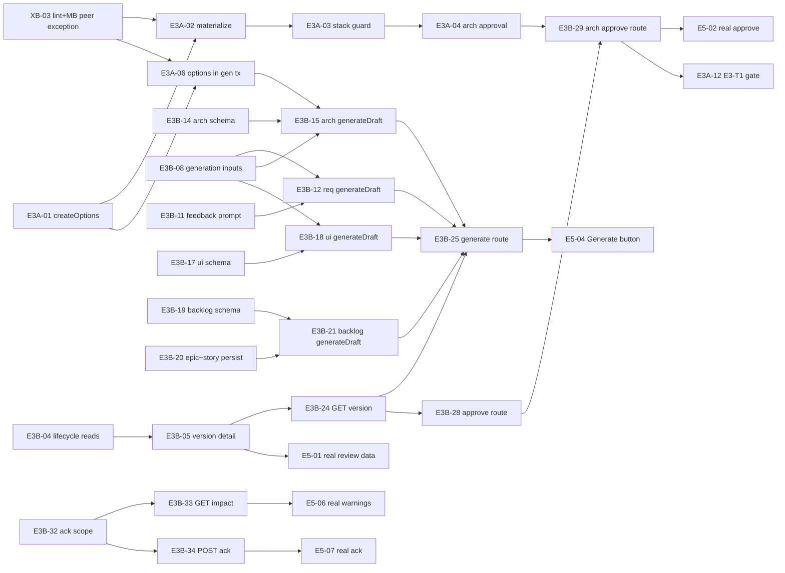

# Throughline - E2..E5 Code Review and Fix Plan

**Date:** 2026-09-26 · **Reviewed commit:** `b61c971` (main) · **Method:** static code review only. No tests, builds, browsers or environments were run.
**Checked against:** `docs/Throughline_ERD.md`, `Throughline_Technical_Requirements_Lineage_Invariants.md` (TR), `Throughline_Module_Boundaries.md` (MB), `Throughline_API_Contracts.md` (API), `Throughline_Jira_Plan.md`, and the project skills in `.claude/skills/`.
**Doc precedence used when the docs disagree:** ERD > TR > MB > API > Jira Plan. Where two docs contradict each other, the conflict is filed as a `doc-conflict` task. Reviewers did not pick a side silently.

---

## 1. Summary

| Epic | Verdict | One line |
|---|---|---|
| **E2 Lineage core** | Mostly met | Matching, hashing, `impact()`, stale path and manual revision are solid. `createDraftFromGeneration` can't persist a mixed Epic+Story Backlog. It also doesn't capture or validate its context sources itself. |
| **E3 Approval / Architecture / Generation** | **Largely missing** | E3-S1/S2/S4/S5 (approve, override, reject, item edit) are real. **Not built:** E3-S3 (materialization), E3-S6..S9 (only stubs and read helpers), E3-S10/S11 (no artifact, item-edit or impact API routes exist), and E3-T1 (the gate). **Every Architecture approval throws**, which blocks everything downstream of Architecture. |
| **E4 External integrations** | Partial | The protocol core is sound: insert-first, hash-before-status, no lock held across provider calls, server-side FR-085. But: an op stuck in `reconciliation_required` can never be re-sent (blocker); an ambiguous send returns 500 without an `operationId`; the Jira retry re-exports the whole backlog; scaffold mode has no template; there are no HTTP timeouts. |
| **E5 UI** | **Epic DoD not met** | Project creation and the GitHub/Jira/Stitch screens call real routes. The review, warnings, dependency and item-edit screens render **hard-coded `fixtures.ts` data**. Their buttons only change local state or are disabled, and there is no Generate button. A user cannot get from brief to Jira export in the UI. |
| **Cross-cutting boundaries** | Clean code, weak lint | Table ownership and `withProjectLock` usage are correct everywhere. The ESLint config has gaps: the lock rule can be bypassed via `@/db`, there is no deep-import ban, and the lifecycle-to-materialization call that E3-S3 needs is blocked. |

**Root cause of most blockers:** E3-S3 and E3-S6..S11 were never implemented, but E4 and E5 were built on top of them anyway. E4 pulled forward the read helpers it needed. E5 used fixtures. Commit history confirms there is no commit for E3-S3, S6, S7, S8, S9, S10, S11 or T1. If these tickets show In Review or Done in Jira, that status is wrong.

**Totals after de-duplication:** 107 tasks = **36 blocker · 32 major · 39 minor**. Every task is at most about 2h (S = under 1h, M = 1-2h).

---

## 2. Story status (E2..E5)

| Story | Status | Note |
|---|---|---|
| E2-T1 Spike A | Met | Ran at the model's default temperature (see E2-10). |
| E2-S1 `withProjectLock`/`withTx` | Met | Lock SQL matches ERD 3.2. Tested with mocks only. |
| E2-S2 `ai-client` | Met | `prompt_version` is never recorded (E2-05). |
| E2-S3 matching + hashing | Met | Projection sort is locale-dependent (E2-03). |
| E2-S4 content-only fallback | Met | T31/T32 real. |
| E2-S5 dependency-binding | Met | Pure. INV-006 respected. |
| E2-S6 `createDraftFromGeneration` | **Partial** | No mixed Epic+Story Backlog (E3B-20). Context not validated (E2-02). |
| E2-S7 manual revision + `copyMembership` | Met | T40 pre-approval half passes. |
| E2-S8 impact module | Met | `impact()` SQL matches ERD 6.3. `acknowledge` doesn't re-check that the warning is still flagged (E3B-32). |
| E2-S9 slice-2 gate | **Partial** | T20/T25 are still `it.todo` in Appendix C (E2-07). T1/T1c assertions are incomplete (E2-08). The real-LLM T21 result was never recorded. |
| E3-S1 `approveVersion` + gate | **Partial** | Correct for non-architecture types. Architecture always throws (E3A-04). |
| E3-S2 `approveWithOverride` | Met | Minor test gaps (E3A-09). |
| E3-S3 architecture materialization | **Missing** | No `createOptions`/`materialize`/stack guard. T8/T9/T30 are `it.todo`. |
| E3-S4 request revision / reject | Met | T5 real. |
| E3-S5 rebind + item edit | Met | T24 stub was deleted from the shared suite (E3A-11). |
| E3-S6 requirements module | **Partial** | No `qualityGate`, FR-010 payload fields, feedback prompt or production entry point. |
| E3-S7 architecture module | **Missing** | Only re-exported readers. |
| E3-S8 ui-requirements module | **Missing** | `generate` always throws. |
| E3-S9 backlog module | **Missing** | `generate` always throws. |
| E3-S10 artifact/item-edit routes | **Missing** | None of the 11 routes exist. |
| E3-S11 impact routes | **Missing** | Neither route exists. |
| E3-T1 slice-3 gate | **Missing** | T6-T10, T22, T23, T30, T40 are `it.todo`. T24 was removed. |
| E4-S1 `runOperation` | **Partial** | `reconciliation_required` is terminal. No real timeout behind T. Ref provenance comes from the caller. |
| E4-T1 / E4-T2 Spike C | Met | Marker mechanisms match TR 30.2. Both spikes ran against fakes. |
| E4-S2 github | **Partial** | No scaffold template (FR-032). ADRs lack `depends_on` (FR-034). Preview ignores the repo name. |
| E4-S3 jira | **Partial** | Preview marks every Story of a new Epic as skipped. |
| E4-S4 stitch | **Partial** | No fallback on ambiguous failure. URLs can't be re-signed. |
| E4-S5 Spike B | **Partial** | Stitch endpoint shape still unverified (ran against fakes). |
| E4-S6 routes | **Partial** | Ambiguous send returns 500 with no `operationId`. Jira retry is broken after any Skip. |
| E4-T3 slice-4 gate | **Partial** | T37/T38/T39 are `it.todo`. The Jira half of T11 is not route-level. |
| E5-S1 project creation | Met | No brief-edit (PATCH) UI (E5-16). |
| E5-S2..S5 review screens | **Partial** | UI is built but fixture-backed. Approve is a `setTimeout`. Revise is disabled. There is no Generate or Reject. |
| E5-S6 warning panel | **Partial** | Fixture data. Acknowledge only changes local state. External-ref rows are mislabelled. |
| E5-S7 dependency view | **Partial** | Fixture data. Shows the longest path only. |
| E5-S8 item edit UI | **Partial** | Correct UX, but the preview is computed from fixtures and Save is local-only. |
| E5-S9 external preview screens | Met | Real routes, real FR-085 gate. Duplicate React key (E5-13). |
| E5-S10 sandboxed Stitch preview | **Partial** | Sandbox attribute is correct. The ERD 4.16 `text/html` check was never done, and the preview is viewable only once. |

---

## 3. How to hand a task to an agent

Every task below is self-contained. Give the agent **this preamble plus one task block**:

> You are working in the Throughline repo. Read `AGENTS.md` and `CLAUDE.md` first. This Next.js version differs from your training data: check `node_modules/next/dist/docs/` before using Next APIs. Load the project skill(s) named in the task (`.claude/skills/<name>/SKILL.md`). Any edit under `docs/` must follow `throughline-doc-sync`. Any new file or import under `src/` must follow `throughline-module-boundaries`. Lineage code must follow `throughline-lineage-invariants`. UI code must follow `throughline-screen-kit`. Implement **only** the task below. Don't widen scope. Add or adjust the tests named in "Done when". Run typecheck, lint and the relevant unit/integration tests before finishing. Put the task id (e.g. `E3B-08`) in the commit message.
>
> *(Claude Code only: `src/` edits must go through the `feature-implementer` agent inside a worktree, and test runs through `feature-verifier`. See `.claude/hooks/gate.mjs` and `CLAUDE.md`.)*

**Task block legend:** `severity · size · category · story` · **Deps** = task ids (or Jira stories) that must merge first. "—" means it can start now.

---

## 4. Execution plan

### 4.1 Critical path to the E5 DoD (brief → Jira export by clicking): E2/E3/E5 waves

Tasks in the same wave are independent of each other and can run in parallel, one agent or worktree each.

| Wave | Tasks |
|---|---|
| **W1** (no deps) | XB-03, E3B-01, E3B-02, E3B-03, E3B-04, E3B-06, E3B-07, E3B-08, E2-03, E3A-01, E3B-20, E3B-09, E3B-11, E3B-14, E3B-19 |
| **W2** | E3B-05, E2-02, E3B-10, E3B-17, E3B-12, E3A-02, E3A-06, E3B-32, E3B-16, E3B-21, E3B-22 |
| **W3** | E3A-03, E3B-13, E3B-15, E3B-18, E3B-23, E3B-24, E3B-31, E3B-33, E3B-34, E5-01 |
| **W4** | E3A-04, E3B-25, E3B-26, E3B-27, E3B-28, E3B-30, E5-06, E5-08 |
| **W5** | E3B-29, E3A-14, E5-03, E5-04, E5-05, E5-07, E5-10, E5-11, E2-11 |
| **W6** | E3A-12 (E3-T1 gate), E5-02 |

### 4.2 Parallel track (independent of the critical path; start any time)

- **E4 integrations:** E4-01 → E4-02 → E4-07 → E4-23. E4-05 + E4-01 → E4-08. E4-09 → E4-12. E4-25 → E5-14. All other E4 tasks have no deps. **Do first:** E4-01, E4-05, E4-07, E4-06, E4-03, E4-04.
- **Lint hardening:** XB-01 first, then XB-02, XB-04..08 (independent of each other), then XB-12 after XB-07.
- **Tests with no code deps:** E2-07, E2-08, E2-09, E3A-07, E3A-09, E3A-11, E3A-13, E4-21, E4-22.
- **Small UI fixes:** E5-09, E5-12, E5-13, E5-15, E5-16, E5-17.
- **Docs only:** E2-10, E4-24, XB-10, XB-11.
- **Out-of-scope check (E1):** X-01 (middleware location). Do it early: if confirmed, sign-in sessions silently expire.

### 4.3 Critical-path dependency graph

---

## 5. Tasks

### A. Unblockers: shared plumbing and doc decisions (start here)

#### XB-03 · Allow and document the `artifact-lifecycle → architecture-materialization` call
`major · S · doc-conflict · cross-cutting (blocks E3-S3)` · **Deps:** — · *(merges E3A-05)*
- **Issue:** MB 4.3 has `approveVersion` call `materialize()`, which is a layer-2 peer import. MB §2 and `eslint.config.mjs:89-104` name "architecture-materialization ↔ identity" as the only exception, and that isn't an exception at all. Lifecycle's allow list omits `layer2-architecture-materialization`, so E3-S3's first import fails lint.
- **Fix:** Make the single peer exception one-way: `artifact-lifecycle → architecture-materialization`, called inside lifecycle's locked tx, never the reverse. Add it to the eslint allow list.
- **Agent brief:** Load `throughline-doc-sync`. In `docs/Throughline_Module_Boundaries.md` §2 (and principle 2), replace the peer-exception sentence with "artifact-lifecycle → architecture-materialization (one-way), called inside lifecycle's locked tx". Bump the version and add a changelog line. In `eslint.config.mjs`, add `'layer2-architecture-materialization'` to the `layer2-artifact-lifecycle` allow list and fix the comment at lines 90-91. Also document that lifecycle resolves bindings via identity + dependency-binding and passes them into `materialize`.
- **Done when:** `pnpm lint` passes. A lint test (see XB-01's `tests/unit/eslint-boundaries.test.ts`) shows lifecycle→materialization passes and materialization→lifecycle errors.

#### E3B-01 · Decide which layer the API §4-6 routes may call (MB 4.7 vs API Contracts)
`major · S · doc-conflict · E3-S10/S11` · **Deps:** —
- **Issue:** MB 4.7 says non-project routes reach layer 2 only through layer 3/4/5. API Contracts §4-5 route straight to `artifact-lifecycle.*`, and §6 routes to `impact.*`, which is layer 1. ESLint forbids layer6 → layer1.
- **Fix:** Documented exception: the type-agnostic §4-5 routes (approve, request-revision, reject, revise, item-edit, version reads) call `artifact-lifecycle` directly. Generate and quality-gate dispatch through the `:type` module. The §6 routes call artifact-lifecycle delegators (added by E3B-32). ESLint is not widened.
- **Agent brief:** Load `throughline-doc-sync`. Amend MB 4.7 with that exception and its reason (no type-specific logic; eslint already allows layer6 → layer2). In API Contracts §6 and §12, replace `→ impact.getWarnings` / `impact.acknowledge` with the artifact-lifecycle delegator names. Mirror this in `src/app/api/README.md` and bump the doc versions. Docs only.
- **Done when:** `doc-chain-checker` reports no contradiction between MB 4.7, API §4-6/§12 and the README.

#### E3B-02 · Add the missing API §11 error codes
`major · S · missing · E3-S10/S11` · **Deps:** —
- **Issue:** `src/lib/errors.ts:14-37` has 10 codes. These are missing: DRAFT_EXISTS, NO_APPROVED_VERSION, MANUAL_REVISION_UNSUPPORTED, VERSION_NOT_DRAFT, ITEM_NOT_IN_VERSION, UPSTREAM_REMOVED, CONFIRMATION_REQUIRED, APPROVAL_BLOCKED, STACK_UNCHANGED_DECISIONS, OPTION_NOT_SELECTED, OPTION_COUNT_INVALID, NOT_CURRENTLY_FLAGGED.
- **Agent brief:** Extend `ErrorCode` and `STATUS_BY_CODE` in `src/lib/errors.ts` with every missing code from API Contracts §11. Use 422 for MANUAL_REVISION_UNSUPPORTED, OPTION_NOT_SELECTED and OPTION_COUNT_INVALID, and 409 for the rest. Update the header comment.
- **Done when:** A table test in `tests/unit/lib/errors.test.ts` asserts each status and the `{error:{code,message,details?}}` body.

#### E3B-03 · Typed artifact-lifecycle errors, and re-export `ItemEditError`
`major · S · missing · E3-S1/S2/S4/S10` · **Deps:** — · *(merges E3A-08)*
- **Issue:** Not-found, not-draft, no-approved-version and architecture-unsupported are plain `Error`s (`approval.ts:35,52,72`, `rejection.ts:34,49`, `manual-revision.ts:39-43,54-62`). Routes would have to match on message text. `item-edit.ts:22-27` reports a missing version as VERSION_NOT_DRAFT instead of NOT_FOUND. `ItemEditError` lives in identity, which routes can't import.
- **Agent brief:** Create `src/artifact-lifecycle/errors.ts` with `VersionNotFoundError`, `VersionNotDraftError`, `NoApprovedVersionError` and `ManualRevisionUnsupportedError`, each setting `name`. Also add a validation error for a blank override note. Throw them at the lines above, keeping the messages. Re-export them, plus `ItemEditError` and `type RebindDiff` from `@/lineage/identity`, through `src/artifact-lifecycle/index.ts` (follow the `BriefFrozenError` pattern).
- **Done when:** The approval, rejection, manual-revision and item-edit integration tests assert on the error class, and a missing version gives NotFound.

#### E3B-04 · Lifecycle read exports: version scope, version list, current approved id
`blocker · S · missing · E3-S10` · **Deps:** —
- **Issue:** Every `/api/artifact-versions/:versionId` route must resolve the version's project before `requireProjectOwner` (API 1.4). No exported read does this, and nothing lists versions.
- **Agent brief:** Add `src/artifact-lifecycle/read.ts`, re-exported through `index.ts`, with three plain reads (no lock):
  - `getVersionScope(versionId)` returns `{versionId, projectId, artifactId, artifactType, status} | null`. `artifactType` uses the `ArtifactType` union from `@/lib/serialize`.
  - `listVersionSummaries(projectId, type)` is ordered by `version_number desc`.
  - `getApprovedVersionIdForType(projectId, type)`.

  artifact-lifecycle owns `artifact` and `artifact_version` (MB §5).
- **Done when:** Integration tests cover: an unknown id returns null; ordering is correct; a foreign-project version still resolves (the route maps it to 404).

#### E3B-06 · Expose a version's architecture options
`blocker · S · missing · E3-S7/S10` · **Deps:** —
- **Issue:** Only `getSelectedOption` exists, and only after approval. Nothing can serve both options of a draft for the FR-022 selection screen.
- **Agent brief:** In `src/architecture-materialization/index.ts`, add `getOptionsForVersion(artifactVersionId)`, ordered by `optionKey`; this module owns the table. Re-export it from `src/artifact-types/architecture/index.ts`, because routes can import layer 3 but not the materialization module. Don't build `createOptions` here (that is E3A-01).
- **Done when:** An integration test shows a version with options returns [A, B], and any other version returns [].

#### E3B-07 · ArtifactVersion / Item / Option DTO serializers and a shared impact-DTO helper
`major · S · missing · E3-S10/S11` · **Deps:** —
- **Issue:** `src/lib/serialize.ts:144-209` has DTO types but no `to…DTO` functions. The "`rawOutput` only when stale" rule isn't implemented. `toImpactRowDTOs` is stuck in `src/app/api/_shared/external.ts`.
- **Agent brief:** In `src/lib/serialize.ts`, add hand-mirrored `…Input` interfaces and pure serializers following API Contracts 1.8: `toArtifactVersionDTO`, `toArtifactVersionSummaryDTO`, `toItemVersionDTO` and `toArchitectureOptionDTO`. Rules:
  - dates as ISO strings;
  - `rawOutput` is null unless `statusReason='stale_generation_context'`;
  - `options` is null unless the version is architecture;
  - item `impact` goes through the existing `toImpactRowDTO`.

  Move `collectItemVersionIds` and `toImpactRowDTOs` into a new `src/app/api/_shared/impact.ts` and fix the imports.
- **Done when:** There are unit tests in `tests/unit/lib/serialize.test.ts`, and the existing external route tests still pass.

#### E3B-08 · Generation-input resolver and typed `PrerequisiteNotApprovedError` (one FR-080 table)
`blocker · S · missing · E3-S6..S10` · **Deps:** —
- **Issue:** Nothing maps (projectId, type) to an artifactId (the T21 script uses raw SQL). The FR-080 prerequisite checks are duplicated in the ui-requirements and backlog stubs as plain Errors, and architecture has none.
- **Agent brief:** In artifact-lifecycle, export `getGenerationInputs(projectId, type)` returning `{artifactId, brief, approved, missing, contextSourceVersionIds}`, built from one static map:
  - requirements: []
  - architecture: [requirements]
  - ui_requirements: [requirements, architecture]
  - backlog: all three

  `contextSourceVersionIds` holds the approved version ids of those prerequisites. Export `PrerequisiteNotApprovedError(missing: ArtifactType[])`. Switch the ui-requirements and backlog stubs to throw it, keeping T43 (`appendix-c.test.ts:3016`) green.
- **Done when:** Tests cover `missing` for each type, and T43 still passes.

#### X-01 · Verify `middleware.ts` is actually picked up by Next 16 (E1 check)
`major · S · bug · E1-S6 (outside E2-E5; found incidentally)` · **Deps:** — · **Confidence: medium**
- **Issue:** `middleware.ts` is at the repo root while the app lives in `src/app`, and the project is on `next@16.3.5`. When a `src/` directory is used, Next expects the file next to `app/`, and Next 16 renamed middleware to `proxy`. If the file is ignored, `updateSession` never runs, Supabase cookies never refresh, and users are bounced to sign-in once their token expires.
- **Agent brief:** Read `node_modules/next/dist/docs/` for the middleware/proxy file location and name in this Next version. If the root file is ignored, move it to the documented location and name (e.g. `src/proxy.ts`), keeping the matcher and `updateSession` call. Update MB line ~128 ("project root") through `throughline-doc-sync`.
- **Done when:** A `next build` output or route manifest lists the middleware/proxy. If it can't be verified offline, record the verification steps in the PR.

---

### B. E2 lineage-core fixes

#### E3B-20 · Persist a mixed Epic+Story Backlog draft and resolve the Story → Epic parent
`blocker · M · spec-mismatch · E2-S6 / E3-S9` · **Deps:** — · *(merges E2-01)*
- **Issue:** `createDraftFromGeneration` (`generation.ts:36, 193-201`) takes one `itemType` and calls `matchAndPersistItems` once. The matcher (`matcher.ts:240-266`) resolves `parentDisplayKey` only against keys already in the draft. The model's keys for brand-new Epics never match, because identity allocates the display keys. So a Backlog can hold only Epics, or only orphan Stories. T43 works around this by passing `itemType:'epic'`. MB 4.4's "toCandidates resolves the parent via `identity.resolveDisplayKeys`" can't be implemented.
- **Agent brief:** Let the `generate` callback return `groups: {itemType, candidates}[]`, keeping the single-group shorthand so existing callers still work. Inside the same `withProjectLock` tx:
  1. Bind and check freshness over the union of groups.
  2. Call `matchAndPersistItems` for `epic`, then `story` (ERD 3.3 step 5).
  3. Map each model Epic key to the returned `logicalItemId` (results come back in candidate order).
  4. Add an optional `Candidate.parentLogicalItemId` that the matcher prefers, still validating that the parent is an Epic in this draft.

  Include all groups in the stale `raw_output`. Fix MB line ~405 through doc-sync.
- **Done when:** Integration tests in `artifact-lifecycle-generation.test.ts` cover: 2 new Epics and 3 Stories get the correct `parent_logical_item_id`, with Epic membership inserted first; a regeneration that reuses E-01 keeps the linkage; an unknown Epic key throws with no rows written.

#### E2-02 · Capture and validate generation context sources inside `createDraftFromGeneration`
`major · M · spec-mismatch · E2-S6` · **Deps:** E3B-08, E3B-20
- **Issue:** `contextSourceVersionIds` (`generation.ts:28-49, 114-141`) is an arbitrary caller array. It is written to `generation_context_ref` without checking that each id is an approved FR-080 prerequisite in the same project, or that the list is non-empty for non-Requirements drafts (ERD 3.3, 4.10, T16). A test (`artifact-lifecycle-generation.test.ts:411-416`) persists an AI `ui_requirements` draft with `[]`. The lock is taken on `projectId` without checking that the `artifactId` belongs to it.
- **Agent brief:** In `src/artifact-lifecycle/generation.ts`, before `generate()`:
  1. Load the artifact and assert it belongs to `opts.projectId`.
  2. Derive the context sources via `getGenerationInputs` (E3B-08).
  3. Throw `PrerequisiteNotApprovedError` if any prerequisite is missing, and reject caller-supplied ids that differ.

  Pass the captured ids to `generate()`, bind against them, and record them as `generation_context_ref`. Fix the "replaces an existing draft" test so it no longer relies on an empty context.
- **Done when:** Tests cover: a missing prerequisite throws with no rows written; the correct refs are recorded; a mismatched project/artifact throws before any write.

#### E2-03 · Make semantic-projection canonicalization locale-independent and sort UI constraint arrays
`minor · S · bug · E2-S3` · **Deps:** — · **Land before real data exists (hash stability)**
- **Issue:** `projection.ts:31, 38, 87-94, 117-131` sorts keys and arrays with `localeCompare`, which depends on ICU and locale and can return 0 for strings that differ byte-wise. A runtime or locale change could silently flip every stored hash to "modified". `responsiveConstraints` and `accessibilityConstraints` aren't sorted, so a reorder by the model mints new revisions and flags every downstream Story (ERD 5.4, INV-016, T21).
- **Agent brief:** In `src/lineage/identity/projection.ts`, replace every `localeCompare` with a code-point comparator (`a < b ? -1 : a > b ? 1 : 0`). Add `responsiveConstraints` and `accessibilityConstraints` to the sorted-array keys for `ui_requirement`.
- **Done when:** `tests/unit/identity-projection.test.ts` has a test that two ui_requirement payloads differing only in `accessibilityConstraints` order hash equal, plus one golden hard-coded SHA-256 for a fixed payload so future drift fails loudly.

#### E2-05 · Record `prompt_version` on every `ai_generation_run`
`minor · S · missing · E2-S2` · **Deps:** —
- **Issue:** `src/ai-client/generate-structured.ts:11-17, 85-120` never sets `prompt_version` (ERD 4.13, NFR-004), so a T21 regression can't be traced to a prompt change.
- **Agent brief:** Add an optional `promptVersion` to `generateStructured` and write it on both the succeeded and failed inserts. Export a `PROMPT_VERSION` constant from each artifact-type module that has a prompt (start with requirements) and pass it through. Pass it from `scripts/verify-real-generation-t21.ts`.
- **Done when:** `tests/unit/ai-client/generate-structured.test.ts` asserts both paths write it, and that it is null when omitted.

#### E2-07 · Flip the Appendix C T20, T25 (and T7) stubs that already have real coverage
`minor · S · test-gap · E2-S9` · **Deps:** —
- **Issue:** `tests/integration/appendix-c.test.ts:2230` (T20), `:2338` (T25) and `:1432` (T7) are `it.todo`, although real tests exist at `artifact-lifecycle-generation.test.ts:464/:181` and `lineage/impact.test.ts:224`. The canonical suite that every gate re-runs under-reports what E2 delivered.
- **Agent brief:** Replace these todos with real tests named exactly "T20", "T25" and "T7", mirroring the existing passing tests and using this file's helpers (`generateRequirements`, `approveItemsVersion`, `fx.*`). Assert the ERD §10 expectations:
  - T20 throws and nothing is modified;
  - T25 terminates with each node reported once;
  - T7 ends rejected/`stale_generation_context`, with no items and the run row linked.
- **Done when:** All three tests pass in the Appendix C suite.

#### E2-08 · Tighten T1 and T1c assertions to the full ERD expectation
`minor · S · test-gap · E2-S9` · **Deps:** —
- **Issue:** T1 (`appendix-c.test.ts:784-789`) checks only `rootItemVersionId`, not depth or path. T1c (`:1001-1003`) never asserts that historical ADR-03@B and S-12@C are absent from the warnings (INV-022).
- **Agent brief:** In "T1", extend the `getExternalDrift` expectation with `depth: 2` and `path: [r.item_version_id, adr.itemVersionId, s.itemVersionId]`. In "T1c", assert that neither `adr.itemVersionId` nor `s.itemVersionId` appears as a `subjectId` in `impact.getWarnings(projectId)`. If an assertion fails, report it rather than weakening it.
- **Done when:** Both tests pass, or a failure is reported as a new bug.

#### E2-09 · Cover T8's matching half (dropped ADR, no spurious keys)
`minor · M · test-gap · E2-S9` · **Deps:** —
- **Agent brief:** In `tests/integration/identity-matching.test.ts`, add "T8 (matching half)", modelled on the existing T31 test. Set up ADR-01..04, each depending on one Requirement, plus a UI requirement depending on ADR-04. Re-match with ADR-01/02 unchanged, ADR-03 changed and ADR-04 omitted. Assert:
  - ADR-01/02 reuse their base `itemVersionId`;
  - ADR-03 keeps its `logicalItemId` at revision 2;
  - the `architecture_decision` logical_item count stays at 4;
  - after a fixture approval, `impact()` flags the UI requirement with root = ADR-04 at depth 0.
- **Done when:** The test passes.

#### E2-10 · Resolve the "low temperature" requirement that the configured model can't honour
`minor · S · doc-conflict · E2-T1/E2-S2` · **Deps:** — · **Needs a human decision (§7)**
- **Issue:** ERD 5.4 and ERD 14 risk 1 list low temperature as a stability mitigation. `generate-structured.ts:36-41, 60-64` omits `temperature` because the reasoning-tier model rejects non-default values. This is recorded only in code comments.
- **Agent brief:** Load `throughline-doc-sync`, then do one of:
  - (a) add an optional `temperature` passthrough and document the required model family in `.env.example`;
  - (b) add an ERD Appendix B round and a TR INV-016 note stating that the model runs at the default temperature and stability rests on verbatim base items plus ERD 5.4 normalization.

  Record the date and result of a real `scripts/verify-real-generation-t21.ts` run.
- **Done when:** The doc change is merged and the T21 run is recorded.

#### E2-11 · Sync Module Boundaries signatures with the shipped code
`minor · S · doc-conflict · E2-S6/S7, E3-S1/S5` · **Deps:** E2-02, E3B-20, E3A-04 · *(merges E3A-10)*
- **Issue:** MB 4.2/4.3 still document the old shapes of:
  - `createDraftFromGeneration`: the code uses `artifactId`, `itemType`, `actorUserId` and a stale `reason`, plus whatever groups/context shape E3B-20 and E2-02 settle on;
  - `createManualRevisionDraft` (`actorUserId`);
  - `evaluateGate`'s `candidateItemVersionIds`, where an empty set silently returns [];
  - `rebindDraftItem`'s `currentApprovedVersionIds`;
  - `Candidate.parentDisplayKey`, `position` and `parentLogicalItemId`.
- **Agent brief:** Load `throughline-doc-sync` and update MB 4.2/4.3 to the final shipped signatures, explaining why each extra parameter exists. Note that `evaluateGate` callers must pass the full member set. Optionally make `evaluateGate` throw on an empty set when the candidate has members. Also drop the redundant `selectOption` from MB 4.3 (selection is a field on the approve request).
- **Done when:** `doc-chain-checker` is clean.

---

### C. E3-S3: Architecture materialization (not built)

#### E3A-01 · Implement `createOptions` (exactly two write-once options)
`blocker · M · missing · E3-S3` · **Deps:** —
- **Issue:** Nothing inserts into `architecture_option`, so no Architecture draft can have options (TR FR-020/021, ERD 4.9). `src/architecture-materialization/index.ts:9-18` says it "does NOT exist yet".
- **Agent brief:** Add and export `createOptions(tx, draftVersionId, [optA, optB])` in `src/architecture-materialization/index.ts`. It inserts exactly two `architecture_option` rows (keys A and B) for an Architecture draft, and refuses with a typed error when the version is not a draft, is not architecture, or the input length is not 2. It takes the caller's `tx` and has no lock of its own. Structurally validate `candidate_decisions` (`{previousDisplayKey?, title, decision, technologyOrApproach, constraints, significantTradeoffs, upstreamRefs[]}`). Add a deterministic warning when `upstreamRefs` exceeds 5 (ERD 5.5).
- **Done when:** A new `tests/integration/architecture-materialization.test.ts` covers the happy path and each refusal.

#### E3A-02 · Implement `materialize(tx, …)`: match the selected option's ADRs against the base ADRs
`blocker · M · missing · E3-S3` · **Deps:** E3A-01, XB-03
- **Issue:** `generation.ts:~97-110` refuses to mint `architecture_decision` items and defers to `materialize`, which doesn't exist. So no ADR item can ever be created (ERD 3.4 step 2, 5.3, 5.5, FR-022, INV-010..014, INV-016).
- **Agent brief:** Implement `materialize(tx, {draftVersionId, selectedOptionId, boundRefs})` in `src/architecture-materialization`. It runs inside the caller's locked tx and has no lock of its own. It takes the selected option's `candidate_decisions` and calls `identity.matchAndPersistItems(itemType='architecture_decision')` against the base version's ADR members, so unchanged ADRs are reused, changed ones get a new revision, and dropped ones become removed. Upstream refs arrive already bound from artifact-lifecycle, resolved inside the draft's `generation_context_ref` sources (INV-006).
- **Done when:** `it.todo('T8')` (`appendix-c.test.ts:~1440`) is replaced with the ERD scenario: ADR-01/02 reused, ADR-03 at a new revision, ADR-04 removed with its downstream flagged, and no ADR-05..08 minted. The approval half runs once E3A-04 lands.

#### E3A-03 · Stack guard with a typed error (T30)
`major · S · missing · E3-S3` · **Deps:** E3A-02
- **Agent brief:** In `materialize`, when every ADR was reused, none removed, and a base exists, deep-compare the selected option's `stack` with the base selected option's `stack` using canonical JSON. On a mismatch, throw an exported `StackUnchangedDecisionsError` (API `409 STACK_UNCHANGED_DECISIONS`; ERD 3.4 step 2, 5.5).
- **Done when:** `it.todo('T30')` (`appendix-c.test.ts:~2476`) asserts the refusal: no new `item_version`, no `approval_event`, and the version stays `draft`.

#### E3A-04 · Wire Architecture into `approveVersion` / `approveWithOverride`
`blocker · M · missing · E3-S1/S3` · **Deps:** E3A-02, E3A-03, XB-03 · *(merges the module half of E3B-29)*
- **Issue:** `approval.ts:22-27` has no option parameter. `:75-80` throws `ArchitectureMaterializationUnavailableError` unconditionally, and `:108-111` never sets `selected_architecture_option_id`. So Architecture can never be approved, which transitively blocks UI Requirements, Backlog and GitHub (FR-080). The DB guard trigger (`0004_triggers.sql:69-75`) requires the selected option.
- **Agent brief:** Add optional `selectedArchitectureOptionId` to both approve functions: required for architecture, rejected for other types. Inside the lock:
  1. Bind upstream refs.
  2. Call `materialize` (a direct import, allowed by XB-03) **before** `getSourceVersionMembers` / `evaluateGate`.
  3. Set `selectedArchitectureOptionId` in the promote UPDATE.

  Map the guard-trigger errors to typed `OptionNotSelectedError` / `OptionCountInvalidError`. Delete `ArchitectureMaterializationUnavailableError` and its test (`artifact-lifecycle-approval.test.ts:505-513`).
- **Done when:** Tests cover: the architecture approval happy path; a blocked architecture approval leaves no orphan ADR rows (ERD 14 risk 3); an override acknowledges ADRs minted in the same transaction; T8's approval half passes.

#### E3A-06 · Persist Architecture options inside the generation transaction and freshness-check their `upstreamRefs`
`major · M · doc-conflict · E3-S3 (with E2-S6)` · **Deps:** E3A-01, XB-03 · *(merges the lifecycle half of E3B-15)*
- **Issue:** Architecture passes `candidates=[]` (`generation.ts:~97-110, 125-140`), so ADR `upstreamRefs` are never bound or freshness-checked (INV-006). A mid-flight Requirement change still persists a normal draft, and an unresolvable ref isn't rejected. MB line ~346 says `createOptions` is called "right after createDraftFromGeneration returns", which is a separate transaction. ERD 3.3 (higher precedence) says the options are written in the persist tx.
- **Agent brief:** In `src/artifact-lifecycle/generation.ts`, let the `generate()` result carry optional `architectureOptions`. Bind and freshness-check the union of the options' `upstreamRefs` inside the persist tx. On the non-stale path call `createOptions(tx, …)`; on the stale path keep the options only in `raw_output`. Update MB 4.3/4.9 through doc-sync.
- **Done when:** Tests cover: a stale architecture generation produces zero option rows and a rejected version; an unresolvable ref gives a validation error with nothing inserted; the happy path gives 2 options and 0 ADR items.

#### E3A-07 · Write T9 now (DB-level option guards)
`major · S · test-gap · E3-S3` · **Deps:** —
- **Agent brief:** Replace `it.todo('T9')` (`appendix-c.test.ts:~1447`) with SQL-fixture cases, asserting the draft stays `draft` each time:
  - an option from another version is rejected by the composite FK;
  - no selection is rejected by the guard;
  - 1 option is rejected by the guard;
  - a third option is rejected by the CHECK/UNIQUE constraint.

  Once E3A-04 lands, extend it to go through `approveVersion`.
- **Done when:** T9 passes.

---

### D. E3-S6..S9: Artifact-type modules

#### E3B-09 · FR-010's non-dependable Requirements fields go in the payload
`major · S · spec-mismatch · E3-S6` · **Deps:** —
- **Issue:** `src/artifact-types/requirements/index.ts:81-84` payload is `{summary}` only. ERD 5.6 / FR-010 / FR-002 require business problem, actors, assumptions, unresolved questions and user journeys. Without them, FR-012's "unresolved assumption" check has nothing to read.
- **Agent brief:** Change `outputSchema.payload` to the required fields `{businessProblem, actors[], assumptions[], unresolvedQuestions[], userJourneys[]}` (OpenAI strict mode: all present, nullable where optional). Align with `src/components/review/fixtures.ts:46-51`. Update RULES: inferred assumptions go in `assumptions` and are not stated as facts, and the payload never copies constraint items. The payload isn't hashed, so T21 is unaffected.
- **Done when:** A unit test shows the schema rejects a missing field.

#### E3B-10 · One constraint item per dimension, with a structured `value`
`major · M · spec-mismatch · E3-S6` · **Deps:** E2-03 · *(merges E2-04)*
- **Issue:** `requirements/index.ts:83` caps items at `.max(8)`, and `:94-106` asks for "3-6 software requirements". That can't hold the 6-8 constraint items plus the FR/NFR items FR-010 needs. `value` is free text (`:53-54`), so "React, Node" and "Node, React" hash differently, and `teamSkills[]` (ERD 5.4/5.6) can't be stored.
- **Agent brief:**
  1. Raise `items.max` to 30 or more.
  2. Add a `dimension` enum (expectedScale, deadline, budget, teamSize, teamSkills, technologyPreferences, securityExpectations, performanceExpectations, deploymentExpectations), nullable for non-constraint items. Make RULES require exactly one item per stated dimension.
  3. Change `value` to `z.union([z.string(), z.array(z.string())]).nullable()`, with `teamSkills` as an array.
  4. Verify that projection.ts canonicalizes array values sorted. If not, **stop and escalate**, because `semantic_hash_version` is frozen at 1.
- **Done when:** Schema tests pass, and a test shows two constraint candidates with `teamSkills` in a different order produce the same `semanticHash`.

#### E3B-11 · Support `feedback` (AI revision) in `requirements.buildPrompt`
`major · S · missing · E3-S6` · **Deps:** —
- **Issue:** API §4 generate takes `{feedback?}` (FR-013), but `requirements/index.ts:87-152` has no feedback. Its regenerate prompt says "Nothing about the brief has changed… return the SAME items", which contradicts a revision request.
- **Agent brief:** Add `feedback?: string` to `RequirementsGenerationContext`. When feedback is set and base items exist, emit a third prompt variant: return the items the feedback doesn't touch verbatim with `previousDisplayKey` set (ERD 5.4, T21 stability), and change, add or remove only what the feedback requires. Keep the no-feedback regenerate prompt byte-identical.
- **Done when:** Unit tests cover all three prompt branches.

#### E3B-12 · Requirements production entry point `generateDraft`
`blocker · M · missing · E3-S6` · **Deps:** E3B-08, E3B-11
- **Issue:** No `src/` code calls `createDraftFromGeneration` for requirements. Only the T21 script and tests do.
- **Agent brief:** Add `generateDraft({projectId, actorUserId, feedback?})` to `src/artifact-types/requirements`:
  1. Use `getGenerationInputs` (E3B-08) to get the artifactId and brief.
  2. Call `createDraftFromGeneration({itemType:'requirement', contextSourceVersionIds:[], generate})`.
  3. Inside the `generate` callback, which runs before the lock (ERD 3.2), load the base items via `withTx(tx => getSourceVersionMembers(tx,[baseVersionId]))` when a base exists.
  4. Then call `ai-client.generateStructured` (the only LLM entry point, MB 4.1) with purpose `'revision'` when feedback is present, otherwise `'generation'`, using `outputSchema` and `buildPrompt`.
  5. Return `{payload, candidates: toCandidates(items), runId}`.
- **Done when:** An integration test with `@/ai-client` mocked shows a draft with N requirement items and a linked `ai_generation_run`.

#### E3B-13 · `requirements.qualityGate` (FR-012)
`blocker · M · missing · E3-S6` · **Deps:** E3B-09, E3B-05
- **Agent brief:** Add a read-only, deterministic `qualityGate(versionId): Promise<{code, message, logicalItemId|null}[]>` in `src/artifact-types/requirements`. It reads the members via `getSourceVersionMembers` and the payload via E3B-05, and emits:
  - `MISSING_ACCEPTANCE_CRITERIA`
  - `MALFORMED_ITEM` (fails `RequirementItemSchema`)
  - `REQUIRED_FIELD_MISSING` (e.g. a constraint with no dimension or value)
  - `DUPLICATE_ITEM` (equal `contentOnlyProjection`)
  - `UNRESOLVED_ASSUMPTION` (non-empty `payload.assumptions` / `unresolvedQuestions`; `logicalItemId` null)
- **Done when:** An integration test has one violation per rule, and a clean draft returns [].

#### E3B-14 · Architecture `outputSchema` and `buildPrompt` (exactly two options)
`blocker · M · missing · E3-S7` · **Deps:** —
- **Issue:** `src/artifact-types/architecture/index.ts:1-31` has no schema or prompt (FR-020/021, ERD 4.9/5.4/5.5). `external/github` already reads `option.stack.{frontend, backend, database, hosting, repositoryLayout}`.
- **Agent brief:** Keep the existing re-exports. Add `outputSchema` = `{payload:{recommendation}, options: z.tuple([opt,opt])}`, with a refine that the keys are {A, B}. Each option has:
  - `title` and `summary`;
  - `stack` with exactly those five keys;
  - `tradeoffs: {factor, assessment}[]`;
  - `candidateDecisions: {previousDisplayKey|null, title, decision, technologyOrApproach, constraints[], significantTradeoffs[], upstreamRefs[]}`.

  All fields must be required or nullable (strict mode). `buildPrompt(approved R items, base selected option, feedback?)` must say:
  - each decision's `upstreamRefs` list only the R- keys that drove it (ERD 5.5);
  - trade-offs cite the stated constraints;
  - unchanged base decisions come back verbatim with `previousDisplayKey`;
  - feedback is folded in.
- **Done when:** Unit tests cover the schema, including rejecting 1 or 3 options.

#### E3B-15 · `architecture.generateDraft`
`blocker · M · missing · E3-S7` · **Deps:** E3B-14, E3B-08, E3A-06
- **Agent brief:** In `src/artifact-types/architecture`, add `generateDraft({projectId, actorUserId, feedback?})`:
  1. Call `getGenerationInputs` (throws `PrerequisiteNotApprovedError(['requirements'])`).
  2. Load the approved R items.
  3. Call `generateStructured` with the E3B-14 schema.
  4. Return `candidates: []` (generation.ts forbids ADR candidates; ADRs come from `materialize`) and `architectureOptions` for E3A-06 to persist in the tx.
- **Done when:** An integration test with a mocked ai-client shows 2 option rows, 0 ADR items, and one context ref pointing to the approved Requirements version.

#### E3B-16 · `architecture.qualityGate`, including ERD 5.5's over-referencing warning
`minor · S · missing · E3-S7` · **Deps:** E3B-06 · **Needs a human decision (§7)**
- **Issue:** API §4 says architecture's gate is "empty" in P0, while ERD 5.5 (higher precedence) asks for a deterministic warning when a decision references too many items.
- **Agent brief:** Add `qualityGate(versionId)` that reads the options (E3B-06) and emits `TOO_MANY_UPSTREAM_REFS` (with `logicalItemId: null`) when any decision has more than 5 `upstreamRefs`. Cite ERD 5.5 in a comment. Update API §4's "empty for architecture" note through doc-sync.
- **Done when:** Unit tests pass.

#### E3B-17 · ui-requirements `outputSchema`, `buildPrompt` and `toCandidates` (FR-040)
`blocker · M · missing · E3-S8` · **Deps:** E2-03 (soft)
- **Issue:** `src/artifact-types/ui-requirements/index.ts:9-17, 59-78` has no schema, prompt or mapping. `external/stitch` already reads `screenOrFlow`, `interactionRequirement` and the list-typed constraint arrays. The E5 fixture field names (`fixtures.ts:117-131`) differ; follow ERD 5.4.
- **Agent brief:** Following the layout of `requirements/index.ts`:
  - Item: `{displayKey UI-xx, previousDisplayKey, screenOrFlow, interactionRequirement, responsiveConstraints[], accessibilityConstraints[], explanation, upstreamRefs[]}`. These names must match ERD 5.4 exactly, because identity hashes them and stitch reads them.
  - Payload (cross-cutting FR-040): `{targetUsers[], navigationExpectations, keyComponents[], localization, uxPriorities[]}`.
  - `upstreamRefs` may name only R- and ADR- keys.
  - `buildPrompt` receives the approved R and ADR items, the base items (returned verbatim when unchanged) and feedback.
  - `toCandidates` passes the refs through.
- **Done when:** Unit tests cover the schema and `toCandidates`.

#### E3B-18 · ui-requirements `generateDraft` and a P0 `qualityGate`
`blocker · M · missing · E3-S8` · **Deps:** E3B-17, E3B-08
- **Agent brief:** Replace the always-throwing stub (`ui-requirements/index.ts:59-78`) with `generateDraft`:
  1. Call `getGenerationInputs('ui_requirements')`.
  2. Load the R and ADR context via `getSourceVersionMembers`.
  3. Call `generateStructured`.
  4. Call `createDraftFromGeneration({itemType:'ui_requirement', contextSourceVersionIds:[req, arch]})`.

  Binding must stay inside those versions (INV-006). Add `qualityGate(_versionId)` returning []. Update T43 in `appendix-c.test.ts` to call `generateDraft`; the refusal must still fire.
- **Done when:** A test with a mocked ai-client shows the `semantic_dependency` edges point to the exact approved R and ADR item versions.

#### E3B-19 · Backlog `outputSchema`, `buildPrompt` and `toCandidates` (FR-060..062)
`blocker · M · missing · E3-S9` · **Deps:** —
- **Agent brief:** In `src/artifact-types/backlog/index.ts` (keep `getBacklogVersionMembers`):
  - Schema: `{payload, epics:[{key, previousDisplayKey, title, scopeStatement}], stories:[{key, previousDisplayKey, epicKey, title, description, userValueStatement, acceptanceCriteria (min 1), structuredBehavior, priority|null, upstreamRefs[]}]}`. The hashed names must match ERD 5.4.
  - Epics get `upstreamRefs: []`; projection.ts throws otherwise.
  - Story refs may name only R-, ADR- and UI- keys.
  - `toCandidates` returns `{epics, stories}`, with Story `parentDisplayKey` = the model's `epicKey` and `position` = the index.
  - The prompt supplies the approved R/ADR/UI items by key, returns the base backlog verbatim when unchanged, requires at least one R- ref per story (FR-063), and folds in feedback.
- **Done when:** Unit tests cover the schema and `toCandidates`.

#### E3B-21 · Backlog `generateDraft`
`blocker · S · missing · E3-S9` · **Deps:** E3B-19, E3B-20, E3B-08
- **Agent brief:** Replace the stub at `backlog/index.ts:38-56` with `generateDraft`:
  1. Call `getGenerationInputs('backlog')`.
  2. Load the three context versions.
  3. Call `generateStructured` (purpose `'revision'` when feedback is present).
  4. Pass Epic and Story groups (E3B-20) to `createDraftFromGeneration`.

  Update T43 (`appendix-c.test.ts:3016-3100`) to call `generateDraft`; the refusal must still fire.
- **Done when:** Tests with a mocked ai-client show the edges point to the exact approved R/ADR/UI item versions (INV-006), and an unknown upstream key fails with no rows written.

#### E3B-22 · `backlog.qualityGate` (FR-063) with an identity edge read
`blocker · M · missing · E3-S9` · **Deps:** E3B-19, E3B-08
- **Agent brief:**
  1. Add `identity.getUpstreamEdges(tx, itemVersionIds)` (identity owns `semantic_dependency`) and export it.
  2. In `src/artifact-types/backlog`, add a read-only `qualityGate(versionId)` emitting, with `logicalItemId` set:
     - `STORY_NO_SOURCE_REQUIREMENT`
     - `REQUIREMENT_NO_STORY` (against the current approved Requirements)
     - `STORY_NO_ACCEPTANCE_CRITERIA`
     - `SOURCE_ITEM_MISSING`
     - `SOURCE_INVALID_PROJECT_OR_VERSION` (via `getCurrentItemVersionIds`)
- **Done when:** An integration test has one case per violation, and a clean backlog returns [].

#### E3B-05 · Full version-detail read (items with revision/position and embedded impact)
`blocker · M · missing · E3-S10` · **Deps:** E3B-04
- **Issue:** `getSourceVersionMembers` (`src/lineage/identity/references.ts:46-82`) lacks `revision_number` and `position`, and nothing assembles a version with its items and each item's impact (API 1.8 `ItemVersionDTO.impact`).
- **Agent brief:**
  1. Additively select `revisionNumber` and `position` in `getSourceVersionMembers`, then re-run the identity, jira and stitch tests.
  2. In artifact-lifecycle, add `getVersionDetail(versionId)` returning `{version, artifactType, projectId, items:[...member, impact: ImpactRow|null]} | null`:
     - order members by position, Epics first;
     - drop the all-null LEFT JOIN row that appears for empty versions;
     - call `impact.getWarnings(projectId)` once and pick per item: unacknowledged first, then smallest depth (mirror `src/lineage/impact/index.ts:137-149`; INV-023/026).
- **Done when:** An integration test with a superseded upstream root asserts the item's impact row, `revisionNumber` and ordering.

---

### E. E3-S10/S11: API routes (none exist)

All routes follow the skeleton in `src/app/api/projects/[projectId]/route.ts`:

1. `getVerifiedUser` (401).
2. `requireProjectOwner` (404, never 403).
3. zod body.
4. One domain call.
5. `ApiError` mapping via `src/lib/errors.ts`.

Unit tests follow `tests/unit/api/projects-id-route.test.ts` (mock `@/auth` and the domain module). Share the DTO assembly in `src/app/api/_shared/artifact-version.ts`, created by E3B-24.

#### E3B-24 · `GET /api/artifact-versions/:versionId`
`blocker · S · missing · E3-S10` · **Deps:** E3B-01, E3B-04, E3B-05, E3B-06, E3B-07
- **Agent brief:** Create `src/app/api/artifact-versions/[versionId]/route.ts`:
  1. `getVersionScope`; null returns 404.
  2. `requireProjectOwner`.
  3. `getVersionDetail`, plus `getOptionsForVersion` when the type is architecture.
  4. Batched `toImpactRowDTOs`, then `toArtifactVersionDTO`.

  Put the assembly in `_shared/artifact-version.ts` for reuse. The route must not import db or identity (MB 4.7).
- **Done when:** Unit tests cover: 401; 404 for an unknown or foreign version; architecture includes options; `rawOutput` is null unless stale.

#### E3B-23 · `GET /api/projects/:projectId/artifacts/:type/versions` and `/current`
`blocker · S · missing · E3-S10` · **Deps:** E3B-01, E3B-04, E3B-05, E3B-06, E3B-07
- **Agent brief:** Create `.../artifacts/[type]/versions/route.ts` and `.../current/route.ts`. Validate `:type` against `ARTIFACT_TYPES`; anything else is a 404 (API 1.7).
  - `versions` → `listVersionSummaries` → `{versions: summary DTO[]}`.
  - `current` → `getApprovedVersionIdForType`: null gives `{version:null}`, otherwise the shared assembly from E3B-24.
- **Done when:** Unit tests cover: 401; 404 for a foreign project; 404 for a bad `:type`; the response shapes.

#### E3B-25 · `POST /api/projects/:projectId/artifacts/:type/generate`
`blocker · M · missing · E3-S10` · **Deps:** E3B-01, E3B-02, E3B-07, E3B-08, E3B-24; per type E3B-12 / E3B-15 / E3B-18 / E3B-21 (can ship incrementally)
- **Agent brief:** Create `.../artifacts/[type]/generate/route.ts`:
  - Body: `z.object({feedback: z.string().trim().min(1).optional()}).strict()`. Bad JSON is a 400.
  - Dispatch through a const map to `{requirements|architecture|uiRequirements|backlog}.generateDraft({projectId, actorUserId:user.id, feedback})`.
  - `PrerequisiteNotApprovedError` → `409 PREREQUISITE_NOT_APPROVED {details:{missing}}`.
  - Both `{status:'ok', version}` and `{status:'stale', version, reason}` return 200 (API §4).
  - If a type's `generateDraft` hasn't merged yet, omit it from the map (that type returns 404) and note this in the PR.
- **Done when:** Unit tests cover 401, 404, 400, 409 with `missing`, and the ok and stale shapes.

#### E3B-26 · `POST /api/projects/:projectId/artifacts/:type/revise`
`blocker · S · missing · E3-S10` · **Deps:** E3B-01, E3B-02, E3B-03, E3B-24
- **Agent brief:** Short-circuit `architecture` with `422 MANUAL_REVISION_UNSUPPORTED` (ERD 3.6), keeping `ManualRevisionUnsupportedError` as a backstop mapping. Call `createManualRevisionDraft(projectId, type, user.id)`. `NoApprovedVersionError` → `409 NO_APPROVED_VERSION`. Return `{version}` via the shared helper. PREREQUISITE_NOT_APPROVED is unreachable, because an approved artifact implies approved prerequisites; add a comment saying so.
- **Done when:** Unit tests cover 401, 404, 422, 409 and 200.

#### E3B-27 · `GET /api/artifact-versions/:versionId/quality-gate`
`blocker · S · missing · E3-S10` · **Deps:** E3B-01, E3B-04, E3B-13, E3B-16, E3B-18, E3B-22
- **Agent brief:**
  1. `getVersionScope` (404), then `requireProjectOwner`.
  2. Dispatch on the version's **stored** `artifactType` to that module's `qualityGate`.
  3. Return `{issues: QualityIssueDTO[]}`.
- **Done when:** Unit tests cover dispatch for each type, 401 and 404.

#### E3B-28 · `POST /api/artifact-versions/:versionId/approve` (gate and override)
`blocker · M · missing · E3-S10` · **Deps:** E3B-01, E3B-02, E3B-03, E3B-04, E3B-07, E3B-24
- **Agent brief:** Create `.../[versionId]/approve/route.ts`:
  1. `getVersionScope` (404), then `requireProjectOwner`.
  2. zod body `{selectedArchitectureOptionId?, overrideNote?}`:
     - `selectedArchitectureOptionId` is required if and only if the type is architecture, otherwise 400;
     - a blank note is a 400.
  3. With a note, call `approveWithOverride`; otherwise `approveVersion` (the note is the only override input, ERD 3.5).
  4. Map the results:
     - `ok:false` → `409 APPROVAL_BLOCKED {details:{blocking: toImpactRowDTOs(rows)}}`;
     - `VersionNotDraftError` → 409;
     - success → `{version}`.

  Until E3B-29 lands, return a documented placeholder error for architecture versions and say so in the PR.
- **Done when:** Unit tests cover every 400 rule, 409 blocked with DTO rows, 409 not-draft, and 200 with an override.

#### E3B-29 · Architecture branch of the approve route
`blocker · S · missing · E3-S7/S10` · **Deps:** E3B-28, E3A-04
- **Agent brief:** In the approve route, pass `selectedArchitectureOptionId` to `approveVersion` / `approveWithOverride` for architecture versions. Map the errors:
  - `StackUnchangedDecisionsError` → `409 STACK_UNCHANGED_DECISIONS`;
  - `OptionNotSelectedError` → `422 OPTION_NOT_SELECTED`;
  - `OptionCountInvalidError` → `422 OPTION_COUNT_INVALID`, including the guard-trigger P0001 errors.

  Remove the placeholder from E3B-28.
- **Done when:** Unit tests cover each mapping plus a 200 architecture approval.

#### E3B-30 · `POST /api/artifact-versions/:versionId/request-revision` and `/reject`
`blocker · S · missing · E3-S10` · **Deps:** E3B-01, E3B-02, E3B-03, E3B-04, E3B-24
- **Agent brief:** Build one shared handler:
  1. `getVersionScope` (404), then `requireProjectOwner`.
  2. zod `{feedback?}`.
  3. `requestRevision` / `rejectVersion` (`src/artifact-lifecycle/rejection.ts`) with `user.id`.
  4. `VersionNotDraftError` → 409.
  5. Re-read the version and return `{version}`.

  Through doc-sync, add `409 VERSION_NOT_DRAFT` to these routes in API §4, which currently lists no errors.
- **Done when:** Unit tests cover 401, 404, 409 and 200 for both routes.

#### E3B-31 · Item-edit routes: `POST …/items/:logicalItemId/edit/preview` and `PUT …/items/:logicalItemId`
`blocker · M · missing · E3-S10` · **Deps:** E3B-01, E3B-02, E3B-03, E3B-04, E3B-05, E3B-07
- **Issue:** `item-edit.ts:16-29` maps an unknown version to VERSION_NOT_DRAFT, so the route must return 404 first. `commitItemEdit` returns a raw row without `displayKey`, `itemType` or `parentLogicalItemId`. `editedPayload` is never schema-validated anywhere.
- **Agent brief:**
  1. `getVersionScope` (404), then `requireProjectOwner`.
  2. Validate the zod body and `payload` against the version type's item schema.
  3. Call `proposeItemEdit` → `{changedRefs}`, or `commitItemEdit` → `{item: ItemVersionDTO (built from getVersionDetail), changedRefs}`.
  4. Map `ItemEditError` 1:1 to `new ApiError(err.code, err.message, err.details)`: CONFIRMATION_REQUIRED, VERSION_NOT_DRAFT, ITEM_NOT_IN_VERSION, UPSTREAM_REMOVED (API §5, FR-082).
- **Done when:** Unit tests cover 404 for a foreign version, each 409 with its details, 400 for an invalid payload, and 200 for both routes.

#### E3B-32 · Project-scoped acknowledgement with a "still flagged" re-check, plus layer-6-reachable delegators
`blocker · M · missing · E3-S11 (and E2-S8)` · **Deps:** E3B-01 · *(merges E2-06)*
- **Issue:** `impact.acknowledge` (`src/lineage/impact/index.ts:150-237`) inserts any (subject, root) pair. It doesn't check that `impact(projectId)` currently flags the pair or that both belong to the project (INV-026, API §6, T16). A duplicate hits a unique index and returns 500. It needs a tx, and layer 6 can't import db or impact.
- **Agent brief:** In impact, add:
  - `resolveAcknowledgementScope({subject, obsoleteUpstreamItemVersionId})`: returns the shared `projectId`, or null.
  - `acknowledgeCurrentWarning({projectId, subject, obsoleteUpstreamItemVersionId, userId, note})`: in one `withTx`, filter `impact(projectId)` to that pair. No row → `NotCurrentlyFlaggedError`. Already acknowledged → idempotent no-op. Otherwise insert through an internal helper.

  Keep `acknowledgeGateBlockers` on that internal helper, unchanged. Don't take `withProjectLock` (ERD 3.2 doesn't list acknowledgement writes). Re-export `getWarnings` and both new functions through `src/artifact-lifecycle/index.ts` as delegators.
- **Done when:** Integration tests cover: a flagged pair acknowledges; a repeat is a no-op; an unflagged pair throws; a cross-project root returns null; a later independent cause still warns (INV-026).

#### E3B-33 · `GET /api/projects/:projectId/impact`
`blocker · S · missing · E3-S11` · **Deps:** E3B-01, E3B-07, E3B-32
- **Agent brief:** Create `src/app/api/projects/[projectId]/impact/route.ts`: auth, then `requireProjectOwner`, then the lifecycle `getWarnings` delegator, then batched `toImpactRowDTOs`, returning `{warnings}`. No staleness logic in the route (one engine, INV-025).
- **Done when:** Unit tests cover 401, 404, and conversion of `path` and `rootDisplayKey` to display keys.

#### E3B-34 · `POST /api/impact/acknowledgements`
`blocker · S · missing · E3-S11` · **Deps:** E3B-01, E3B-02, E3B-32
- **Agent brief:** Create `src/app/api/impact/acknowledgements/route.ts`:
  1. Auth.
  2. zod body with exactly one of `subjectItemVersionId` / `subjectExternalRefId`, plus `obsoleteUpstreamItemVersionId` and an optional `note` (400 otherwise).
  3. `resolveAcknowledgementScope` (null → 404).
  4. `requireProjectOwner`.
  5. `acknowledgeCurrentWarning`; `NotCurrentlyFlaggedError` → 409.
  6. Return 201 `{acknowledged:true}`.

  Never accept `acknowledged_against` from the client (ERD 4.12).
- **Done when:** Unit tests cover 400 for zero or both subjects, 404 for unknown or foreign, 409, and 201.

---

### F. E3 gate and test tasks

#### E3A-11 · Restore T24 in the shared Appendix C suite
`minor · S · test-gap · E3-S5` · **Deps:** —
- **Agent brief:** Commit 8987e1d replaced `it.todo('T24')` (`appendix-c.test.ts:~2330`) with a comment. Re-add it so the suite lists T1-T43 again (Jira Plan E1-S5). Keep it as a todo that cross-references `artifact-lifecycle-item-edit.test.ts:164` until the routes exist. Add the same cross-reference comments on the T6/T10/T22/T23 stubs.
- **Done when:** The suite lists T24 again.

#### E3A-09 · Cover the rest of T6 and ERD 14 risk 3 for the override path
`minor · S · test-gap · E3-S2` · **Deps:** —
- **Agent brief:** In `tests/integration/artifact-lifecycle-approval.test.ts`, add three tests:
  - the DB CHECK rejects a blank-note override `approval_event`;
  - a Backlog regenerated (stub `generate`) against the current Requirement approves without an override;
  - two block → override → approve cycles create no duplicate `impact_acknowledgement` rows.
- **Done when:** All three pass.

#### E3A-13 · Write the T40 post-approval half (the BRD 10.3 controlled-change test)
`major · M · test-gap · E3-T1` · **Deps:** —
- **Agent brief:** Replace `it.todo` T40 (`appendix-c.test.ts:~2778`) at module level:
  1. Seed approved R-07 and R-08, each with a downstream item.
  2. Run `createManualRevisionDraft`, then `commitItemEdit` on R-07, then `approveVersion`.
  3. Assert:
     - the draft initially shares every ItemVersion and has no context refs;
     - afterwards there is exactly one new `item_version`;
     - there are zero `ai_generation_run` rows;
     - warnings appear only on R-07's descendants.

  Switch it to the HTTP routes once E3A-12 lands.
- **Done when:** T40 passes.

#### E3A-14 · Route-level T7 in Appendix C
`minor · S · test-gap · E3-T1` · **Deps:** E3B-25, E3B-12
- **Agent brief:** Using a stubbed ai-client that races an approval, drive `POST …/generate`. Assert the version is rejected with `stale_generation_context`, there are no items, the context refs are kept, the run is linked, and the response is `{status:'stale'}`. Add an Architecture case after E3A-06.
- **Done when:** The test passes.

#### E3A-12 · E3-T1 slice-3 gate: T6, T10, T22, T23, T24 through the API routes
`blocker · M · missing · E3-T1` · **Deps:** E3B-28, E3B-29, E3B-31, E3B-33, E3B-34, E3A-11
- **Agent brief:** Rewrite the Appendix C stubs as route-driven tests, following the existing T11/T12/T41 pattern. Assert:
  - `409 APPROVAL_BLOCKED` with `details.blocking`, then 200 on resubmit with `overrideNote` (T6);
  - lock serialization and `409 VERSION_NOT_DRAFT` on double-approve (T10);
  - the gate semantics (T22/T23);
  - `409 CONFIRMATION_REQUIRED` with `details.changedRefs` (T24);
  - 404 on cross-project calls.

  Also run T8, T9 and T30 through the approve route.
- **Done when:** Every E3-T1 test id passes with 0 `it.todo` left for E3.

---

### G. E4: External integrations

#### E4-01 · User-confirmed "create again" path out of `reconciliation_required`
`blocker · M · missing · E4-S1 (affects S2/S3/S4)` · **Deps:** —
- **Issue:** `src/external/operations/index.ts:351-353, 440-442` always reconciles a `reconciliation_required` row. A `found:false` result keeps it there forever, so a request lost before it reached the provider can never be re-sent (ERD 7.2 3.b, 7.4, TR 30.1 step 4, 30.2 step 3). For GitHub, the stuck row counts as active, so `insertOperationRow` (:254-272) refuses every new repo name for that project, permanently.
- **Agent brief:** Add `confirmResend?: boolean` to `RunOperationOptions`. When it is set, first run `reconcile()` with **no lock held**. If that returns `found:true`, adopt the object. If it returns `found:false`, `SELECT … FOR UPDATE`, set the row to `pending`, commit, then call `send()`. Never hold a DB lock across `reconcile()` or `send()`. Thread the flag through `github.initRepo`, the Jira per-item path and `stitch.generate`.
- **Done when:** Three tests in `tests/integration/external/operations.test.ts` pass: without the flag the row is unchanged and `send()` isn't called; with the flag `send()` is called exactly once; with the flag and a found reconcile, the object is adopted and `send()` is never called.

#### E4-02 · Expose "create again" on the retry route and in API Contracts §7
`major · S · doc-conflict · E4-S6` · **Deps:** E4-01
- **Agent brief:** Accept an optional zod-validated body `{confirmCreateAgain: boolean}` on `POST /api/external-operations/:operationId/retry` (400 `VALIDATION_ERROR` when malformed). Pass it to `initRepo`, the Jira single-item retry (E4-07) and `stitch.generate`. Document the field in API §7 through doc-sync.
- **Done when:** Retry-route unit tests assert the flag reaches the provider, and that without it the response stays 200 `{status:'reconciliation_required'}`.

#### E4-05 · Return 202 `{status:'pending', operationId}` when `send()` fails ambiguously
`major · M · spec-mismatch · E4-S6` · **Deps:** —
- **Issue:** A timeout, 5xx or lost response is rethrown from `runOperation` (`operations/index.ts:396-408`), and the routes (`github/init/route.ts:79-124`, `stitch/generate/route.ts:77-137`) return 500 `INTERNAL_ERROR` with no `operationId`. The client can't poll or retry the exact case this protocol exists for (API §8, §10, 1.5, 13.3). Three T11 assertions (`appendix-c.test.ts:1498, 1555, 1599`) encode the 500.
- **Agent brief:** In `sendAndFinalize`, catch errors that aren't definitive rejections: log them, leave the row `pending`, and return `{status:'pending', operationId}`. Include `operationId` in the `reconciliation_required` and `in_flight` results too, and remove the `getOperationsForVersion` fallback lookup. Map the result to 202 in both routes.
- **Done when:** The three T11 assertions expect 202 with a string `operationId`.

#### E4-07 · Jira retry re-runs only the operation's own item
`major · M · bug · E4-S6` · **Deps:** E4-01 (confirmed resend only)
- **Issue:** `retry/route.ts:114-159` calls `exportBacklog(op.sourceArtifactVersionId, new Map())`, which re-exports every item with no preview and no FR-085 confirmation. After any Skip (the T41 state), every Jira retry throws `MissingExportDecisionError` and returns 500. A superseded Backlog version also returns 500.
- **Agent brief:** Add `jira.retryOperation(operationId, {confirmResend?})`. It rebuilds the single-item call from the stored `target_descriptor` (including `parentKey`), uses the same operation key, and never re-evaluates FR-074 decisions or touches other items. Map a hash conflict to `409 REQUEST_CONFLICT` via a new `JiraOperationConflictError`. Replace the `exportBacklog` call in `retryJira`.
- **Done when:** After a T41-style Skip on an Epic, a test shows retrying a failed Story operation succeeds and creates no other issues.

#### E4-06 · Jira preview/export must not list Stories of a to-be-created Epic as skipped
`major · M · bug · E4-S3` · **Deps:** —
- **Issue:** On a first export no Epic has a Jira ref yet, so `previewExport` (`jira/index.ts:371-384`) marks every Story `skipped: epic_has_no_jira_ref`. The export then creates them anyway. `export/route.ts:71, 97-102, 143` copies the preview's skipped list, so Stories show up in both `created` and `skipped`, and the UI says "export the Epic first" (FR-070, API §9).
- **Agent brief:** In the preview, treat a parent Epic that is a member of the captured Backlog version as resolvable. In the export route, build `skipped` from what was actually not attempted, not from the preview.
- **Done when:** A test in `tests/integration/external/jira.test.ts` and the T42 block shows a first export of 1 Epic and 1 Story has no skipped items in the preview, and the export response doesn't list the Story as skipped.

#### E4-03 · Hard HTTP timeouts per provider, with T derived from them
`major · M · spec-mismatch · E4-S1` · **Deps:** —
- **Issue:** T is 90s on an "assumed 30s HTTP timeout" (`operations/index.ts:136-148`), but no client sets a timeout: Node's fetch waits about 300s. GitHub's `send()` makes 2+N sequential calls, and Stitch takes minutes. A request older than T can still be in flight when reconcile starts, which is the ERD 7.2 race.
- **Agent brief:** Add per-provider timeout constants in `src/external/{github,jira,stitch}/index.ts`. Apply `AbortSignal.timeout` to every fetch, including the Stitch asset downloads, and give GitHub one shared deadline covering create plus all file writes. Compute T in `operations` as at least the whole-`send()` budget plus a margin, e.g. from a caller-supplied `sendTimeoutMs` (MB 4.5).
- **Done when:** A test shows a hung fake fetch aborts within the timeout and leaves the row `pending`.

#### E4-04 · `finalizeCompleted` copies provenance from the locked operation row and is idempotent
`major · S · bug · E4-S1` · **Deps:** —
- **Issue:** `operations/index.ts:461-492` inserts the `external_ref` with the caller's source ids, not the stored row's (ERD 4.14, FR-073). The request hashes don't include the source version. So an op left pending under Architecture v1 and retried after v2 is recorded as v2, and drift (T13, FR-036) compares against the wrong ADRs. Two concurrent reconcile-found finalizes also hit the unique constraint and return 500.
- **Agent brief:** In the finalize transaction, `SELECT … FOR UPDATE` the operation row. If it is already completed, return its existing ref. Otherwise insert the ref using the row's `project_id`, `source_artifact_version_id` and `source_item_version_id`.
- **Done when:** Tests show: a stale pending row with source A, retried with the same key and hash but source B and a found reconcile, records A; two concurrent found-finalizes both return the same ref.

#### E4-08 · Fall back to manual mode on an ambiguous Stitch failure
`major · S · spec-mismatch · E4-S4` · **Deps:** E4-05, E4-01
- **Issue:** Only a definitive 4xx writes `manual_fallback` (`stitch/index.ts:380-382, 534-537`). A timeout or 5xx, which is the normal case per the spike, leaves no `stitch_output` row and no preserved prompt (FR-054, ERD 7.5, TR 31).
- **Agent brief:** In `generate`, on an ambiguous outcome, upsert `stitch_output(mode='manual_fallback')` with the prompt before returning, leaving the operation row as it is. A later confirmed resend that succeeds upgrades it to `api`, which `upsertStitchOutput` already supports.
- **Done when:** The "honest not-found stub" test in `tests/integration/external/stitch.test.ts` asserts a `manual_fallback` row exists.

#### E4-09 · Implement scaffold mode from one pinned starter template
`major · M · missing · E4-S2` · **Deps:** — · **Needs a human decision (which starter repo, §7)**
- **Issue:** Both modes create an empty repo with the same README, ADRs and lineage.json (`github/index.ts:243-280, 371-375`). "scaffold" is only a label (FR-031/032; TR 36 P0 "one pinned starter"). The code comment cites an exclusion that TR 37/38 don't contain.
- **Agent brief:** Add `GITHUB_TEMPLATE_OWNER`, `GITHUB_TEMPLATE_REPO` and `GITHUB_TEMPLATE_REF` to the env schema and `.env.example`. In scaffold mode create the repo via `repos.createUsingTemplate`, keeping the HMAC marker in the description. Record the template in the ref metadata and lineage.json, and include it in the request hash.
- **Done when:** A fake-GitHub test shows scaffold mode hits the template endpoint and docs-only mode doesn't.

#### E4-10 · Cite upstream item versions in the ADR files and lineage.json
`major · M · spec-mismatch · E4-S2` · **Deps:** —
- **Issue:** `github/index.ts:500-562` deliberately omits `depends_on: [R-07 v3, …]` and `requirements_version` (FR-034/035).
- **Agent brief:** Add `getAdrUpstreams(architectureVersionId)` to `src/artifact-types/architecture`, reading the edges through identity (see E3B-22's `getUpstreamEdges` if it has landed, otherwise add a read there). Emit `depends_on` and `requirements_version` in `buildAdrDoc` and `buildLineageJson`.
- **Done when:** A test asserts the written file contents via the fake GitHub's captured `createOrUpdateFileContents` bodies.

#### E4-11 · GitHub preview shows the repo name that init will create
`minor · S · spec-mismatch · E4-S2/S6` · **Deps:** —
- **Agent brief:** `github/preview/route.ts:25-33, 72` validates `repoName` and then discards it. `previewInit` (`github/index.ts:295-321`) shows `throughline-project-<uuid>`. Add an optional `repoName` to `previewInit` that returns `normalizeRepoName(repoName)`, and pass it from the route.
- **Done when:** A unit test shows `"My Repo!"` previews as `my-repo`.

#### E4-12 · Add visibility, template and files to the GitHub preview (FR-030 vs API §8)
`minor · S · doc-conflict · E4-S2/S6` · **Deps:** E4-09
- **Agent brief:** FR-030 requires the preview to show visibility, base template and the files to be added, but API §8 returns only `{mode, repoName, impact}`. Through doc-sync, add `visibility`, `template` and `files[]` to API §8. Compute them in `previewInit` from the same inputs `writeProvenanceFiles` uses.
- **Done when:** The preview route unit tests are updated.

#### E4-13 · Classify GitHub 4xx correctly and require `GITHUB_TOKEN`
`minor · S · bug · E4-S2` · **Deps:** —
- **Agent brief:** In `github/index.ts:176-178, 382-395`:
  - add `requireToken()`;
  - treat every 4xx as definitive;
  - report `name_taken_by_other` only when GitHub says the name already exists (not for other 422s).

  In the route, map other definitive failures to 400.
- **Done when:** Fake-GitHub tests show a 401 ends `failed` (not `pending`), and an invalid-name 422 isn't `name_taken_by_other`.

#### E4-14 · Create and reconcile under the same GitHub owner
`minor · S · bug · E4-S2` · **Deps:** — · **Confidence: medium**
- **Agent brief:** Creation always uses `createForAuthenticatedUser` (`github/index.ts:371`), while reconcile looks under `GITHUB_OWNER` (:622, :645). If that owner is an org, reconcile never adopts the repo. Use `createInOrg` when `GITHUB_OWNER` is an org, or fail fast at boot when it differs from the token's login.
- **Done when:** A fake-GitHub org-owner test shows a lost-response reconcile adopts the repo.

#### E4-15 · Re-check GitHub project exclusivity when retrying a `failed` op
`minor · S · bug · E4-S1` · **Deps:** —
- **Agent brief:** In the failed → pending branch (`operations/index.ts:355-380`), take the same GitHub advisory lock and run the active-operation check, and refuse if another GitHub op is completed or active (ERD 4.15, T18). This stops an orphan second repo.
- **Done when:** A test shows that when A fails, B completes, and A is retried, the retry is refused and `send()` is not called.

#### E4-16 · Complete the provenance files when adopting a repo via reconcile
`minor · M · bug · E4-S2` · **Deps:** —
- **Agent brief:** If a file write fails after the repo was created, a later reconcile adopts on the description marker alone, leaving README, ADRs or lineage.json missing (`github/index.ts:404-465`). After a marker match in `reconcileRepo`, write any missing files idempotently.
- **Done when:** A test where the fake GitHub fails the lineage.json write once shows the file exists after reconcile.

#### E4-17 · Verify the complete Jira marker on search hits and never adopt an ambiguous match
`minor · S · spec-mismatch · E4-S3` · **Deps:** — · **Confidence: medium**
- **Agent brief:** `jira/index.ts:197-206, 477-512` adopts the first JQL hit from a fuzzy `text ~` search without checking the exact marker. Fetch the labels and description, keep only exact `tl-<id>` label or footer matches, and adopt only when exactly one remains (TR 30.2 / ERD 7.4).
- **Done when:** Fake-Jira tests show a near-miss marker isn't adopted, and two matching issues aren't adopted.

#### E4-18 · Report every non-created Jira item in the export response
`minor · M · bug · E4-S3/S6` · **Deps:** — · **Confidence: medium**
- **Agent brief:** An unchanged Story keeps its operation row from an earlier Backlog version. If that row is conflict, failed or in flight, the item shows up in none of `created`, `skipped` or `failures`, and a bare `catch {}` swallows DB errors (`jira/index.ts:565-585`, `export/route.ts:117-139`). This breaks FR-074's "never silently skip". Add `getOperationsByKeys(keys)`. In the route, report any member whose key maps to a non-completed row as a failure, and narrow the `catch` to provider and network errors.
- **Done when:** A test shows a Story unchanged across a re-approval, whose v1 op failed, is listed in `failures`.

#### E4-19 · Return 404 for a non-UUID `operationId`
`minor · S · bug · E4-S6` · **Deps:** —
- **Agent brief:** In `external-operations/[operationId]/route.ts:23` and `retry/route.ts:174`, reject a non-UUID id with 404 before querying (API 1.4), reusing the UUID check from `requireProjectOwner`.
- **Done when:** Unit tests with `'not-a-uuid'` get a 404, and the lookup is never called.

#### E4-20 · Close the retry route's "KNOWN GAP" 500s
`minor · S · doc-conflict · E4-S6` · **Deps:** —
- **Agent brief:** `retry/route.ts:29-43, 70-89, 155-158` returns 500 when a retry ends failed (including Stitch manual fallback) or when the source is no longer approved. Through doc-sync:
  - add `{status:'failed', errorMessage}` to the API §7 retry response;
  - add `409 PREREQUISITE_NOT_APPROVED` and `409 NAME_TAKEN_BY_OTHER` to its errors.

  Map these in the route.
- **Done when:** The three "KNOWN GAP … 500" unit tests are replaced with assertions on the new shapes.

#### E4-21 · Compute pending staleness against the DB clock
`minor · S · spec-mismatch · E4-S1` · **Deps:** —
- **Agent brief:** `operations/index.ts:333-336` uses `Date.now() - row.updatedAt`, which mixes the app clock with the DB clock. Compute `updated_at < now() - interval` in SQL inside the `FOR UPDATE` query (ERD 7.2). Change the tests that fake `Date` to age the row in the DB instead. The trigger overwrites `updated_at` on UPDATE, so insert the row with an old value or disable the trigger in that test.
- **Done when:** The T11 helpers and operations tests pass using DB-aged rows.

#### E4-22 · Implement T37, T38 and T39 (still `it.todo`)
`minor · S · test-gap · E4-T3` · **Deps:** —
- **Agent brief:** In `appendix-c.test.ts:~2753-2769`, using the existing `fx` fixtures:
  - T37: insert invalid `stitch_output` rows and expect the `stitch_output_api_requires_ref_check` constraint to reject them.
  - T38: an UPDATE that writes an old `updated_at` stores approximately `now()`.
  - T39: `runOperation` with a malformed source throws, and `send()` is never called.
- **Done when:** All three pass.

#### E4-23 · Jira half of T11 and confirmed resend through the routes
`minor · S · test-gap · E4-T3` · **Deps:** E4-01, E4-02, E4-07
- **Agent brief:** Add route-level Jira cases to the T11 block (`appendix-c.test.ts:1467-1618`), reusing the existing Jira response-dropper helpers:
  - a lost Story response appears in `failures`;
  - a retry after T adopts it via the label marker, leaving exactly one issue;
  - a confirmed resend sends exactly once.
- **Done when:** All three pass.

#### E4-24 · Record the GitHub-operation advisory lock in ERD 4.15 and MB §6
`minor · S · doc-conflict · E4-S1` · **Deps:** — · *(merges XB-09)*
- **Agent brief:** ERD 4.15 says "under the project lock", but MB §6 forbids external-operations from taking it. The code uses a separate advisory lock (`projectId||':external:github'`, salt 1, `operations/index.ts:239-242`). Through doc-sync:
  - name this lock in ERD 4.15 (with an Appendix B entry) and in MB 4.5/§6;
  - update the MB 4.5 result types (`'foreign'`, `failed`, `refused`).

  Optionally move the raw lock into a `withGithubOperationLock(projectId, fn)` export in `src/db/lock.ts`.
- **Done when:** `doc-chain-checker` is clean, and the tests covering `github_operation_already_active` still pass.

#### E4-25 · Read route that re-signs the Stitch asset URLs
`minor · S · missing · E4-S4/S6` · **Deps:** —
- **Agent brief:** Signed URLs last 300s and are issued only in the one successful generate response. A second generate returns `409 ALREADY_GENERATED`. Add `stitch.getOutput(projectId)`, which returns the mode plus fresh URLs via `getSignedAssetUrls` (`stitch/index.ts:~561`), and a new `GET /api/projects/:projectId/stitch/output` route, owner-checked, returning 404 when no output exists. Document it in API §10 through doc-sync.
- **Done when:** Unit tests cover 404-never-403, and URLs are signed fresh on each call.

---

### H. E5: UI (wire the screens to real data)

#### E5-01 · Review page loads the real artifact version instead of fixtures
`blocker · M · missing · E5-S2..S5` · **Deps:** E3B-04, E3B-05, E3B-06; field names from E3B-09/E3B-14/E3B-17/E3B-19
- **Issue:** `src/app/projects/[projectId]/artifacts/[type]/page.tsx:64` calls `getFixtureArtifactVersion(type)`, which returns the same hard-coded R-01..R-06 / ADR / S-01 for every project, with no "sample data" label.
- **Agent brief:**
  1. Pick `draftVersionId ?? approvedVersionId` from `project.artifacts[type]` (already loaded at page.tsx:61).
  2. Load the version detail through the layer-2 `artifact-lifecycle` read (`getVersionDetail`, plus `getOptionsForVersion` from `@/artifact-types/architecture` for architecture). Pages may read layer-2 exports directly (MB 4.8).
  3. Serialize it with E3B-07's helper.
  4. If both ids are null, render an explicit "not generated yet" empty state; the button comes from E5-04.
  5. Adapt `ArtifactReviewScreen`'s payload field names to the ERD 5.4 schemas, which differ from the fixtures (e.g. `drivenBy`/`rationale`, `sourceRefs`).
  6. Remove the `fixtures.ts` import from this page.
- **Done when:** A test rendering the page for a seeded project shows the seeded display keys, not R-01..R-06.

#### E5-06 · Warnings page reads `GET /api/projects/:projectId/impact`
`blocker · S · missing · E5-S6` · **Deps:** E3B-33
- **Agent brief:** Replace `getFixtureImpactWarnings(projectId)` (`warnings/page.tsx:7, 42`) with a client-side fetch of `GET /api/projects/:projectId/impact` (API §6). Include explicit loading and error states, and keep the "No impact issues found" success state (screen-kit). Don't import `@/lineage/impact` into the page, since it is layer 1 (MB 4.8).
- **Done when:** A component test with mocked fetch covers 0 rows, 1 direct row and 1 transitive row.

#### E5-02 · Approve calls the real route and the approval dialog is driven by `409 APPROVAL_BLOCKED`
`blocker · M · missing · E5-S2..S5` · **Deps:** E3B-28, E3B-29, E5-01
- **Issue:** `artifact-review-screen.tsx:222-266` approves with a `setTimeout` and local state, and decides blocking on the client. The override note is never sent. `ApprovalDialog` takes `ItemVersionDTO[]` (`approval-dialog.tsx:9`), not the server's `ImpactRowDTO[]` (FR-083, FR-084, INV-025).
- **Agent brief:** Wire Approve to `POST /api/artifact-versions/:versionId/approve`, following the fetch pattern of `new-project-form.tsx` (401 → /sign-in, `error.message` shown inline). Send `selectedArchitectureOptionId` only when `version.options !== null`. On `409 APPROVAL_BLOCKED`, open `ApprovalDialog` with `error.details.blocking` (change the prop to `ImpactRowDTO[]`). Confirm re-POSTs with a non-empty `overrideNote`. Map `VERSION_NOT_DRAFT`, `STACK_UNCHANGED_DECISIONS`, `OPTION_NOT_SELECTED` and `OPTION_COUNT_INVALID` inline. On 200 call `router.refresh()`. Remove the `setTimeout` and the local acknowledgement.
- **Done when:** A component test with mocked fetch covers: 200 → refresh; 409 opens the dialog with the server rows; confirm sends `overrideNote`.

#### E5-03 · Wire Request AI revision, Revise manually and Reject
`blocker · M · missing · E5-S2..S5` · **Deps:** E3B-26, E3B-30, E3B-25, E5-01
- **Issue:** Both revision buttons are hard-coded `disabled` (`artifact-review-screen.tsx:683-698`), and there's no Reject button. "Revise manually" also shows for Architecture, which returns 422. Without it, the BRD 10.3 controlled-change path can't be reached from the UI.
- **Agent brief:** Add a labelled optional feedback `<textarea>`.
  - "Request AI revision" POSTs `request-revision` with the feedback, then `generate` with the feedback.
  - "Reject" POSTs `reject` with the feedback.
  - "Revise manually" POSTs `/api/projects/:projectId/artifacts/:type/revise`. It is shown only for non-architecture types with an approved version.

  Handle `NO_APPROVED_VERSION` and `PREREQUISITE_NOT_APPROVED`, and call `router.refresh()` on success (TR FR-013, FR-081; API §4).
- **Done when:** A component test asserts each call's URL and body, and that manual revise is absent for architecture.

#### E5-04 · Generate action, so a project can get its first artifact version
`blocker · M · missing · E5-S2..S5 (epic DoD)` · **Deps:** E3B-25, E5-01
- **Agent brief:** Add a Generate button to the empty state of `artifacts/[type]/page.tsx` (a small client component). Show each type's none / draft / approved state on `src/app/projects/[projectId]/page.tsx` from `project.artifacts[type]`. Handle the generate response:
  - POST to `.../generate` and disable the button with a spinner while in flight, since generation is a slow model call.
  - `{status:'stale'}` → success with a notice offering Regenerate.
  - `409 PREREQUISITE_NOT_APPROVED` → name and link `details.missing` (API §4, FR-080).
- **Done when:** A component test with mocked fetch covers the ok, stale and 409 cases.

#### E5-05 · Show real quality-gate issues
`major · S · missing · E5-S2/S5` · **Deps:** E3B-27, E5-01
- **Agent brief:** Replace `fixture.qualityIssues` (`artifacts/[type]/page.tsx:80`) with the result of `GET /api/artifact-versions/:versionId/quality-gate`, or the layer-3 `qualityGate` read, for the displayed version. Keep `ArtifactReviewScreen`'s rendering unchanged. Delete the fixture generators (FR-012, FR-063).
- **Done when:** A test on a seeded backlog story with no acceptance criteria shows the FR-063 issue rendered.

#### E5-07 · Acknowledge via `POST /api/impact/acknowledgements`, keyed per (subject, root)
`major · S · missing · E5-S6` · **Deps:** E3B-34, E5-06
- **Agent brief:** In `src/components/review/warning-panel.tsx:38-45, 128-165`, make Confirm POST a body that uses `row.subjectKind` to choose `subjectItemVersionId` or `subjectExternalRefId`, plus `obsoleteUpstreamItemVersionId: row.rootItemVersionId` and the optional `note`. Re-read the warnings on success, and handle 409 `NOT_CURRENTLY_FLAGGED` and 404 inline. Change the React key and the match predicate to `subjectId + ':' + rootItemVersionId`, because `impact()` emits one row per (subject, root) and acknowledgements are cause-specific (ERD 4.12).
- **Done when:** A component test asserts the request body, and that two rows with the same subject and different roots are acknowledged independently.

#### E5-08 · Label external-ref warning rows by the ref, not by the last path entry
`major · M · doc-conflict · E5-S6/S7/S9` · **Deps:** E3B-07, E3B-33
- **Issue:** `warning-panel.tsx:158, 190-195` and `impact-gate.tsx:121` name the subject `path[path.length-1]`. For `external_ref` rows, the real path holds only item display keys (`0005_impact_function.sql:52-56`), so a Jira drift row reads "R-04 is potentially affected" (INV-023). The fixture only works because it adds `'GitHub: README.md'` to the path. API 1.8 ("root to subject") and the ERD SQL disagree.
- **Agent brief:** Add `subjectLabel` to `ImpactRowDTO` in `src/lib/serialize.ts` and API 1.8 (through doc-sync). For refs it is the provider plus `externalKey`/`externalId`; for items it is the display key. Fill it in the shared `toImpactRowDTOs` and render it in both components.
- **Done when:** A unit test on `toImpactRowDTOs` covers an external_ref row, and a component test shows the ref named as the subject.

#### E5-09 · Dependency view renders every impact row, not only the longest path
`major · M · bug · E5-S7` · **Deps:** —
- **Agent brief:** `dependency-graph.tsx:328-343` reduces the warnings to one `longestPath` and silently drops every other root and branch, including from the text caption (TR §27: "same data as the warning engine"). Group by `rootItemVersionId` and draw one chain per row path, keeping inline SVG and no chart library. The plain-text caption must cover all rows. Past about 30 nodes, show a truncation notice linking to `/projects/:id/warnings`.
- **Done when:** A unit test with 2 roots and a fan-out asserts every subject appears in the caption.

#### E5-10 · Dependency page uses real version data across all four types
`major · M · missing · E5-S7` · **Deps:** E3B-04, E5-06, E5-09
- **Agent brief:** Replace `getFixtureArtifactVersion('requirements')` and `getFixtureImpactWarnings` in `dependencies/page.tsx:7, 49-50` with `listVersionSummaries` for all four types and the same impact source as the warning panel (INV-025, one source). Render the chain in TR §27 order, each version with its `StatusBadge`. In `buildCaption` (`dependency-graph.tsx:436-442`), resolve the base version via `baseApprovedVersionId` instead of `versionNumber - 1`, because rejected drafts also consume version numbers.
- **Done when:** A test with a history that includes a rejected draft shows the caption names the correct base.

#### E5-11 · Item edit calls the preview and commit routes
`major · M · missing · E5-S8` · **Deps:** E3B-31, E5-01
- **Agent brief:** In `src/components/review/item-edit-dialog.tsx`:
  - Replace the fixture `previewItemEdit` (which diffs the *original* item) with `POST /api/artifact-versions/:versionId/items/:logicalItemId/edit/preview`, sending the *edited* payload.
  - Replace the local `onSave` with `PUT .../items/:logicalItemId {payload, confirmed}` (API §5, FR-082).
  - On `409 CONFIRMATION_REQUIRED`, show `details.changedRefs` and require fresh confirmation.
  - Show `UPSTREAM_REMOVED`, `VERSION_NOT_DRAFT` and `ITEM_NOT_IN_VERSION` inline.
  - Reset the preview when the text changes.
  - After success, call `router.refresh()`, because the server mints a new ItemVersion.
- **Done when:** A component test with mocked fetch covers an empty diff, a non-empty diff with `confirmed:true`, and a 409 re-prompt.

#### E5-12 · Verify Supabase Storage serves Stitch HTML as `text/html`, or fall back to `srcdoc`
`major · M · spec-mismatch · E5-S10` · **Deps:** — · **Confidence: low (needs a live check)**
- **Agent brief:** ERD 4.16 requires verifying how Supabase Storage serves the uploaded HTML (uploaded as `text/html; charset=utf-8` at `stitch/index.ts:~355`). If it isn't served as HTML, fetch it server-side and render it via `srcdoc`. `sandboxed-html-preview.tsx:21-38, 97-104` assumes `text/html` with no evidence. Check the `Content-Type` of a real signed URL. If it isn't `text/html`, add an owner-checked route returning the HTML and render it via `srcdoc`, keeping `sandbox="allow-scripts"` exactly (never `allow-same-origin`, FR-053). Record the verified behaviour in ERD 4.16 through doc-sync.
- **Done when:** A unit test asserts the exact sandbox attribute string, and the verification result is recorded in the ERD.

#### E5-14 · Stitch preview is viewable after the first response; fix the dead iframe error fallback
`minor · S · missing · E5-S10` · **Deps:** E4-25
- **Agent brief:** In `stitch-generate-panel.tsx`, when an output already exists, load it from `GET /api/projects/:projectId/stitch/output` on mount and render `SandboxedHtmlPreview`. In `sandboxed-html-preview.tsx:102`, replace the unreachable iframe `onError` (it doesn't fire for an HTTP 4xx or an expired URL) with a "Refresh preview" button that re-fetches the URLs.
- **Done when:** A component test shows an existing output renders without clicking Generate.

#### E5-13 · Unique React key per impact row in `ImpactGate`
`minor · S · bug · E5-S9` · **Deps:** —
- **Agent brief:** In `src/components/external/impact-gate.tsx:108`, change the key to `` `${row.subjectId}:${row.rootItemVersionId}` ``, because `impact()` emits one row per (subject, root).
- **Done when:** A component test with two rows sharing a subjectId shows both paths in the DOM.

#### E5-15 · Don't open generated HTML unsandboxed in a new tab
`minor · S · spec-mismatch · E5-S10` · **Deps:** —
- **Agent brief:** Remove the `<a href={result.htmlUrl} target="_blank">Open generated HTML</a>` link at `stitch-generate-panel.tsx:289-296`. It loads the generated HTML as a top-level document with scripts enabled (FR-053; ERD §2: "only inside the sandboxed separate-origin iframe"). Keep the screenshot link. If a larger view is wanted, open an app page that embeds the same sandboxed iframe.
- **Done when:** A component test asserts no anchor `href` equals `htmlUrl`.

#### E5-16 · Brief editing (PATCH), as the creation form promises
`minor · S · missing · E5-S1` · **Deps:** —
- **Agent brief:** Add a client form to `src/app/projects/[projectId]/page.tsx` that edits `name` and `brief` via `PATCH /api/projects/:projectId` (API §3), following `new-project-form.tsx`. Show the brief as frozen when `project.artifacts.requirements` has any version id (INV-007), show `409 BRIEF_FROZEN` inline, and call `router.refresh()` on success.
- **Done when:** A component test covers success and 409.

#### E5-17 · `loading.tsx` / `error.tsx` for the project routes
`minor · S · missing · E5-S2..S7` · **Deps:** —
- **Agent brief:** Add `src/app/projects/[projectId]/loading.tsx` and a client `error.tsx` with a Retry button that calls `reset()`, styled like `preview-shell.tsx:54-64` (screen-kit's four states). Check the error-boundary props in `node_modules/next/dist/docs/` first.
- **Done when:** A render test asserts `role="alert"` and that Retry calls `reset`.

---

### I. Module boundaries and lint hardening

Each task adds cases to one shared lint test, `tests/unit/eslint-boundaries.test.ts` (created by XB-01), which runs `new ESLint().lintText(code, {filePath})`.

#### XB-01 · Make the "withProjectLock only from artifact-lifecycle" rule actually fire
`major · S · boundary · cross-cutting` · **Deps:** —
- **Issue:** `eslint.config.mjs:175-180` matches only `**/db/lock`, but `src/db/index.ts:9` re-exports `withProjectLock`, and every caller imports it from `@/db`. The rule never fires (latent; no violation today).
- **Agent brief:** Add a `paths` entry `{name:'@/db', importNames:['withProjectLock']}` to the global rule and to every per-folder override except `src/artifact-lifecycle/**`, because flat config replaces rule options per block. Create `tests/unit/eslint-boundaries.test.ts`.
- **Done when:** The lint test shows the import errors from `src/lineage/impact/x.ts` and passes from `src/artifact-lifecycle/x.ts`.

#### XB-02 · Encode the deep-import ban (index.ts-only entry points)
`major · S · boundary · cross-cutting` · **Deps:** XB-01
- **Agent brief:** Add `boundaries/entry-point`, using the v5 syntax from the plugin README in node_modules. Allow only `index.ts` for the `layer0-*`, `layer1-*`, `layer2-*`, `layer3-artifact-types`, `layer4-external-operations` and `layer5-external-provider` elements (MB §7, Project Setup 5.3). Leave `app`, `layer6-api`, `components` and `lib` unrestricted. Run `pnpm lint` to confirm the tree passes.
- **Done when:** The lint test shows `@/lineage/identity/matcher` imported from `src/artifact-lifecycle/x.ts` errors.

#### XB-04 · Narrow the layer-1 allow list
`minor · S · boundary` · **Deps:** XB-01
- **Agent brief:** Split `eslint.config.mjs:86-89` so that identity and impact allow `['layer0-db','lib']` and dependency-binding allows `['lib']` (MB §3 rows 4-6, 4.2).
- **Done when:** The lint test shows `@/ai-client` imported from `src/lineage/impact/x.ts` errors.

#### XB-05 · Restrict each provider to its paired layer-3 module
`minor · S · boundary` · **Deps:** XB-01 · **Confidence: medium (matcher syntax)**
- **Agent brief:** Replace the layer-5 rule (`eslint.config.mjs:130-143`) with three per-provider rules using captured-element syntax: github ↔ architecture, jira ↔ backlog, stitch ↔ ui-requirements. Each also allows `layer0-db`, `layer0-auth`, `layer1-impact`, `layer4-external-operations` and `lib`. Drop `ai-client` (MB 4.6).
- **Done when:** The lint test shows github → backlog errors and github → architecture passes.

#### XB-06 · Encode MB 4.8's page rule instead of `app → everything`
`minor · S · boundary` · **Deps:** XB-01
- **Agent brief:** Change `eslint.config.mjs:157` to `{from:['app'], allow:['layer0-auth','layer2-artifact-lifecycle','layer3-artifact-types','components','lib']}`. Through doc-sync, update MB 4.8's sentence saying lint doesn't catch this.
- **Done when:** The lint test shows `@/db` imported from `src/app/projects/page.tsx` errors.

#### XB-07 · Per-folder overrides must not drop the `@supabase/*` restriction
`minor · S · boundary` · **Deps:** XB-01
- **Agent brief:** Flat-config overrides at `eslint.config.mjs:221-252` replace rule options, so ai-client and artifact-lifecycle can import `@supabase/*` freely. Refactor the openai, lock and supabase restrictions into shared constants, and build each override as "all restrictions minus its own allowed entry".
- **Done when:** The lint test shows `@supabase/supabase-js` errors from both `src/ai-client/x.ts` and `src/artifact-lifecycle/x.ts`.

#### XB-08 · Guard server-only modules against client-component import
`minor · M · boundary` · **Deps:** XB-01
- **Agent brief:** `components` may import `lib/env` (service-role key, DATABASE_URL), and `lib` may import `db`. Nothing uses `server-only`.
  1. Add a boundaries element `lib-server` for `src/lib/env.ts`, listed before `lib`. Allow it from every module layer and `app`, but not from `components`.
  2. Delete `{from:['lib'], allow:['layer0-db']}`, which is unused.
  3. If you also add the `server-only` package, first check that it is compatible with `middleware.ts` using the Next docs in node_modules.
- **Done when:** The lint test shows `@/lib/env` imported from `src/components/review/x.tsx` errors.

#### XB-12 · Record `auth.getStorageServiceClient` (service role) in MB and restrict who imports it
`minor · S · doc-conflict/boundary · E4-S4` · **Deps:** XB-07
- **Agent brief:** Through doc-sync, add `getStorageServiceClient` and `getAppUserById` to MB 4.1's export list, stating that the storage client is for stitch only because it bypasses RLS. In eslint, add a `paths` entry for `@/auth` with `importNames:['getStorageServiceClient']`, plus a stitch override that carries the other restrictions.
- **Done when:** The lint test shows the import errors from `src/app/projects/page.tsx` and passes from `src/external/stitch/x.ts`.

---

### J. Doc-only reconciliations

#### XB-10 · Split MB 4.2's identity rule into write functions and read functions
`minor · S · doc-conflict · E4-S2/S3/S4` · **Deps:** —
- **Agent brief:** Through doc-sync, amend MB 4.2:
  - identity **write** functions (`matchAndPersistItems`, `rebindDraftItem`, `copyMembership`) are called only inside lifecycle's locked tx (or from `materialize`);
  - **read** functions (`getSourceVersionMembers`, etc.) may be called from any layer-2/3 caller's tx.

  This matches the current unlocked reads at `architecture-materialization/index.ts:99`, `backlog/index.ts:74` and `ui-requirements/index.ts:115` (ERD 3.2 locks writes only). Grep to confirm there are no write calls outside lifecycle.
- **Done when:** The doc is merged and `doc-chain-checker` is clean.

#### XB-11 · Document direct reads of tables a module does not own
`minor · S · doc-conflict · E2-S3/S5/S8, E4-S2` · **Deps:** —
- **Agent brief:** Through doc-sync, add a "Documented cross-owner reads" table to MB §5 listing module, table and reason:
  - identity reads `artifact` / `artifact_version` (`matcher.ts:67-101`, `references.ts:51-101`);
  - impact reads others' tables (`impact/index.ts:186-217`);
  - architecture-materialization reads `artifact_version` (`:57-73`).
- **Done when:** The doc is merged.

---

## 6. De-duplication map (raw reviewer ids → canonical task)

| Raw | Canonical | Note |
|---|---|---|
| E2-01 | E3B-20 | Mixed Epic+Story persistence |
| E2-04 | E3B-10 | Structured constraint `value` |
| E2-06 | E3B-32 | Acknowledge re-check |
| E3A-05 | XB-03 | Lifecycle → materialization peer import (chose the doc exception over E3B's callback workaround) |
| E3A-08 | E3B-03 | Typed lifecycle errors |
| E3A-10 | E2-11 | MB signature sync |
| E3B-15 (lifecycle half) | E3A-06 | Options inside the generation tx. E3B-15 keeps the `architecture.generateDraft` half. |
| E3B-29 (module half) | E3A-04 | Architecture approval wiring. E3B-29 keeps the route mapping. |
| XB-09 | E4-24 | GitHub advisory lock doc |
| E5-14 (backend half) | E4-25 | Stitch output read route. E5-14 keeps the UI half. |

---

## 7. Decisions needed from a human before or while implementing

1. **E2-10:** low temperature is in the ERD, but the configured model can't honour it. Pin a different model, or amend the ERD?
2. **E3B-16:** architecture quality gate. ERD 5.5 asks for an over-referencing warning, and API §4 says "empty". The plan follows ERD precedence; confirm.
3. **E4-09:** which starter repository or ref to pin for GitHub scaffold mode (FR-032).
4. **XB-03 approach:** the plan amends MB to allow lifecycle → architecture-materialization directly. The alternative is a callback injected by the architecture module (E3B's suggestion), which avoids a peer import but is more indirect.
5. **ERD 5.3 vs 5.4 (not filed as a task):** a no-op or presentation-only manual item edit always mints a new ItemVersion (`rebind.ts:140`). After approval, that flags everything downstream even though the semantic hash is unchanged. It literally matches ERD 5.3/FR-082, but works against 5.4's stability goal. Keep or change?
6. **Hallucinated upstream keys (not filed):** `bindUpstreamRefs` throws a plain Error for an unknown display key, so generate would return 500. Should there be an error code (e.g. `422 INVALID_UPSTREAM_REF`), or should generateDraft retry or repair?
7. **E2-03 timing:** changing the projection comparator changes hashes. Land it before any data you intend to keep, or wipe dev data afterwards (ERD 5.4).
8. **Jira hygiene:** if E3-S3 and E3-S6..S11 / E3-T1 are marked In Review or Done in Jira, reopen them. E5-S2..S8 were accepted while fixture-backed; decide whether to reopen them or track the wiring work as new stories (tasks E5-01..E5-11).

---

## 8. Caveats

- **Static review only.** No test, lint, typecheck, build, browser or live-provider run. The real-LLM T21 run, the Supabase `text/html` behaviour (E5-12), the Stitch endpoint shape (E4-S5) and live GitHub/Jira behaviour are unverified.
- Findings were produced by six parallel reviewers and merged here. The headline blockers were spot-checked against the code: the architecture approval throw, the absent `createOptions`/`materialize`, fixture imports in the pages, the `reconciliation_required` loop, the generate stubs, and 23 `it.todo` in Appendix C. Items marked **Confidence: medium/low** need confirmation before or during the fix.
- Line numbers refer to commit `b61c971`. Expect drift as fixes land; each brief names the function as well as the line.
